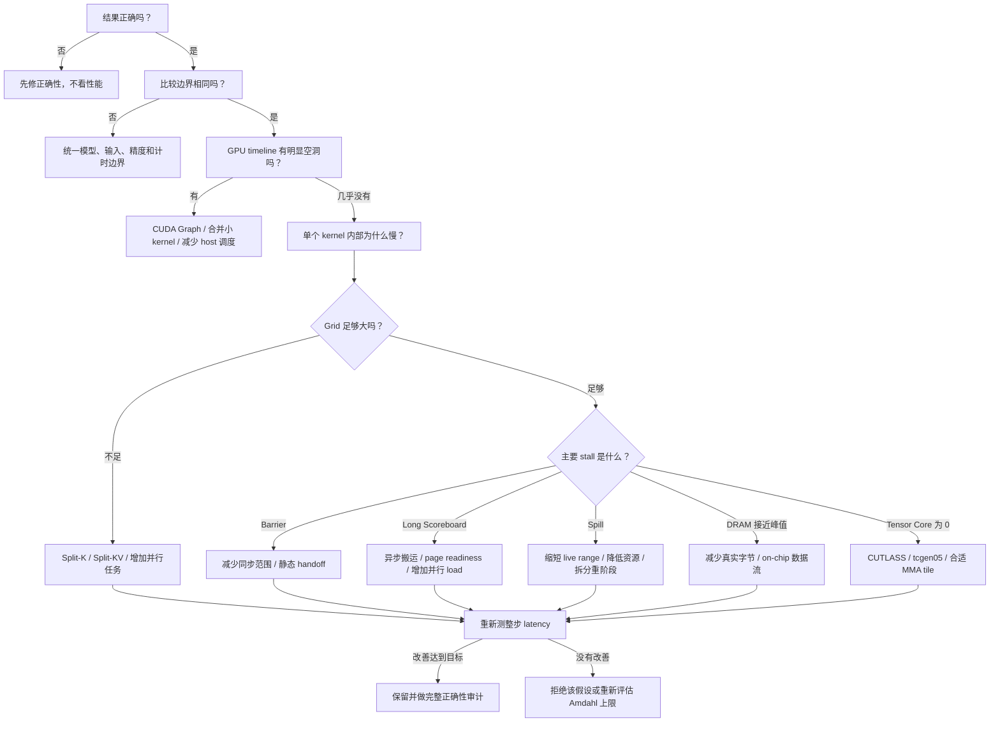

> **本课用词**：decision tree 是按观测结果选择下一项测量的流程；critical path 是决定总延迟的最长依赖链；A/A 用来估计基准噪声。

真正的优化不是“看到什么都融合”，而是：

```text
观察现象
  ↓
提出一个可证伪的原因
  ↓
只改一个关键机制
  ↓
检查指标是否按预期变化
  ↓
最后看整步 latency
```

“可证伪”就是提前说清楚：

> 如果改完没有出现哪些现象，我就承认原来的解释不对。

## 总决策树



---

## 第零步：先冻结实验合同

在改代码前，先固定：

```text
模型和权重
输入 token
batch 和 context
position 与 KV Cache
BF16/FP8 等精度
输出定义
计时边界
基线代码
```

否则很容易出现：

```text
A：只测 model-forward
B：测完整 generate

然后声称 A 比 B 快
```

这没有因果意义。

你后期采用的理想四臂对照是：

| 实验臂 | 用途 |
|---|---|
| A：生产 CUDA Graph | 当前实际水平 |
| B：相同算子 bodies 的 individual Graph | 隔离控制面 |
| C：resident/megakernel | 测设备常驻是否有价值 |
| D：SGLang 等 production frontier | 判断产品竞争力 |

其中 B 对 C 回答“架构是否有效”，A/D 回答“整体是否有用”。

---

## 分支一：GPU timeline 有很多空隙

现象类似：

```text
kernel ███
            空
kernel      ██
                空
kernel          ███
```

这时优先考虑：

- CUDA Graph；
- 减少 CPU dispatch；
- 合并几个很短的小 kernel；
- 移除同步和不必要 memcpy。

但是你的 B=16 Graph 已经约 98.3% GPU-busy：

```text
████████████████████░
```

所以继续减少 launch 的收益上限已经很低。

这就是 Qwen 微融合只得到约 1.4% 单次会话改善的背景。

## 对应原则

> Graph 还有明显空洞时，先处理 launch；Graph 已经很密时，转向 kernel 内部和数据流。

---

## 分支二：Grid 太小，SM 没活干

B200 有 148 个 SM。假设 attention 只有 8 个任务：

```text
8 个任务 → 8 个 SM 工作
         → 140 个 SM 空闲
```

这时即使每个任务本身写得很好，也不可能充分利用整张卡。

解决方法是拆分工作：

```text
8 KV heads
× 16 context partitions
= 128 个 attention partial jobs
```

这就是你的 split-KV。

## 代价

拆分后必须合并 partial results：

```text
更多并行度收益
-
额外 reduction 成本
```

上下文长时，原任务足够重，并行收益远大于 reduction：

- 4K 内部约 `2.85×`
- 8K 内部约 `4.31×`

上下文很短时，拆分可能不划算。因此 partition 数应该按 context 选择，不是永远固定为 16。

## 如何证明假设

如果假设是“SM 不足是主要瓶颈”，改完应看到：

- grid size 增大；
- 更多 SM active；
- kernel latency 明显下降；
- reduction 没有吃掉全部收益。

如果 grid 增大了但整步没快，就说明瓶颈不只是并行度。

---

## 分支三：Barrier stall 很高

Barrier 的含义是：

> 我做完了，但我必须等其他人。

全模型 megakernel 很容易写成：

```text
所有 CTA 做 QKV
        ↓
     grid.sync
        ↓
所有 CTA 做 Attention
        ↓
     grid.sync
        ↓
所有 CTA 做 O
```

问题在于：

- 有的 CTA 早就完成；
- 最慢 CTA 决定所有人的等待时间；
- 每个阶段都要 drain，再重新启动下一阶段；
- 与多个 kernel 的阶段边界很相似。

## 优化方向

从全局阶段同步改成局部数据依赖：

```text
Producer 生成 tile 7
        ↓
只通知需要 tile 7 的 Consumer
        ↓
Consumer 立即开始
```

但通知本身也有成本：

- atomic；
- semaphore；
- tag polling；
- release/acquire；
- proxy fence。

你的 Down→Norm tile DAG 就是反例：

- 删除了全局 barrier；
- 增加了大量细粒度 tag load；
- 最终回退约 1.79%。

因此优先级通常是：

```text
CTA-local 直接交接
    >
静态、粗粒度 all-ready
    >
少量 page-ready semaphore
    >
每个小 tile 动态 polling
```

---

## 分支四：Long Scoreboard 很高

Long scoreboard 的意思通常是：

> 当前指令依赖的数据还没回来。

常见错误写法：

```text
load page 0
等待 page 0
计算 page 0

load page 1
等待 page 1
计算 page 1
```

更好的流水线是：

```text
加载 page 0
        ↓
计算 page 0，同时加载 page 1
        ↓
计算 page 1，同时加载 page 2
```

你的 page-granular readiness 更进一步：

```text
每个 16 KiB weight page
都有独立 ready 状态

page 3 一到
负责 page 3 的 warps 就开工
不等待整个 weight stage
```

它的因果链比较完整：

```text
测量：
weight-ready 位置 long scoreboard 明显

假设：
等待粒度太粗

改动：
按 page 发布 readiness

预期：
eligible warps 上升
long scoreboard 下降
计算与 TMA 搬运更重叠

结果：
单层约 -14%～-16%
整模型约 -21.7%
```

这比“试试 prefetch 看会不会快”更像严谨实验。

---

## 分支五：Register/Shared Memory 太重

Megakernel 把许多阶段放在一个函数里：

```text
QKV 的状态
Attention 的状态
O 的状态
MLP 的状态
调度器状态
同步状态
```

它们会共同影响整个 kernel 的：

- registers/thread；
- shared memory/CTA；
- block size；
- occupancy；
- spills。

## 不要只减 registers

假设：

```text
Registers 限制：最多 1 CTA/SM
Shared memory 限制：最多 1 CTA/SM
```

将 register 从 196 降到 160 后：

```text
Registers 允许 2 CTA
Shared memory 仍只允许 1 CTA
```

occupancy 仍不会提高。

因此要查看所有 occupancy limit，而不是只看 register 数。

## 可选策略

- 缩短变量 live range；
- 将只属于某个 role 的状态限制在该 role；
- 重计算便宜值，少保存；
- 调小 tile；
- 减少 pipeline stage；
- 把资源极重、数据交接收益很低的阶段留在独立 kernel。

最后一项正是 selective megakernelization。

---

## 分支六：真实 DRAM 带宽接近峰值

如果 DRAM 已接近满载，说明卡车高速公路真的堵满了。

这时最有效的是减少真实字节：

```text
Producer 写 HBM
Consumer 再读 HBM
```

改成：

```text
Producer
   │ register / TMEM / shared
   ▼
Consumer
```

你的 Gate/Up→SwiGLU handoff 就属于这种优化。

它删除 32 层合计约 56 MiB 的中间流量，整步快约 1.3–1.5%。

为什么没有更大？

因为总时间还有：

- QKV；
- Attention；
- O；
- Down；
- Norm；
- 同步；
- LM head。

局部流量删除是有效的，但受 Amdahl 定律限制。

## 注意

“静态计算删除了 56 MiB”只是机制证据。

最终采用仍必须看到：

```text
paired whole-step latency 下降
```

你的 residual EVT 删除约 8 MiB 却回退，就是很好的警告。

---

## 分支七：矩阵乘没有使用 Tensor Core

如果一个 GEMM-like kernel 的 Tensor Core activity 为 0，先不要研究几个百分点的 cache policy。

这通常是数量级问题。

你的早期全模型 kernel 就经历过：

```text
单物理 kernel
但矩阵乘使用标量执行
```

于是尽管省掉了 launch，整体仍极慢。

正确优先级是：

1. 先让 QKV/O/MLP 使用接近 CUTLASS 水平的 Tensor Core executor；
2. 再讨论 persistent scheduling；
3. 最后优化局部 cache、ring、prefetch。

这解释了为什么嵌入 CUTLASS device body 后，性能可以从数百毫秒快速降到十几毫秒。

---

## 用 Amdahl 定律提前淘汰小优化

原 Qwen 目标：

```text
baseline = 2.80 ms
target   = 2.51 ms
必须减少 = 0.29 ms
```

36 层平均需要：

```text
0.29 ms / 36
≈ 8.1 µs/layer
```

所以在写候选前就应该问：

> 这条融合边每层即使完全消失，理论上能省 8.1 µs 吗？

如果物理上限只有 1–2 µs/layer，它不可能单独达到目标。它可以成为组合优化的一部分，但不能承担整个 10% 目标。

这叫 optimization budget。

---

## 一次合格实验应该怎样写

例如准备测试 page readiness：

```text
现象：
warps 在 weight-ready load 附近 long-scoreboard 很高

假设：
stage-wide readiness 让已到达的 page 无法提前计算

候选：
每个 weight page 独立发布 ready

预期指标：
eligible warps ↑
long scoreboard ↓
issue active ↑

正确性风险：
跨 CTA publication 的 release/acquire

否证条件：
指标没有按预期变化，或整步 latency 不下降

采用条件：
正确性通过，并在 balanced A/B 中稳定达到预定收益
```

这种写法可以防止事后编故事。

---

## 把你的实验放回决策树

| 观察 | 你的选择 | 结果 |
|---|---|---|
| Qwen 小 kernel 多 | QK Norm+RoPE 微融合 | 范围太小，约 1.4% |
| B=1 attention 只有少量任务 | Split-KV | 长上下文显著加速 |
| Weight stage 等待粒度太粗 | Page readiness | 单层与整模型均有强收益 |
| KV 被反复从全局内存读取 | Shared-KV/CTA-local handoff | 明显改善 |
| Gate/Up 大中间张量往返 | 双 TMEM→register SwiGLU | 整步约 1.3–1.5% |
| Down→Norm 有全局同步 | 细粒度 tile tag | polling 成本导致回退 |
| 全模型单 kernel 资源耦合 | 继续无限融合 | 仍慢于 Graph |
| Graph 中存在一条无效写回 | `out=` 缓冲复用 | 稳定约 3.07% |

由此得到的不是“megakernel 成功”或“megakernel 失败”，而是一张适用范围地图。

## 最简单的判断口诀

看到性能问题时，按这个顺序：

```text
先问对不对
再问比得公不公平

有空洞，处理 launch
SM 空闲，增加任务
Barrier 高，缩小同步
Long scoreboard 高，做流水和并发
DRAM 满，减少字节
Tensor Core 空，先修 executor
资源太重，考虑选择性拆分

最后只认整步 paired latency
```
