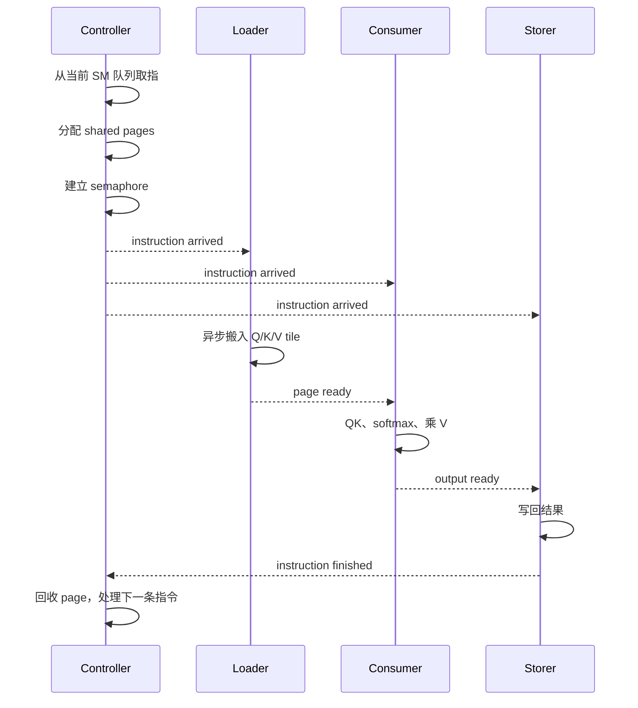

> **本课用词**：canonical 是当前 clean reference baseline；dispatcher 根据 instruction type 选择路径；GPU-VM 指设备端解释任务队列的执行模型。

读源码时不要先看项目名，而要问三个问题：

1. `for layer` 循环在哪里？
2. 谁启动 CUDA kernel？
3. 做完一个 token 后，kernel 是退出，还是继续读取任务队列？

这三个问题可以快速区分：

| 类型 | `for layer` 在哪里 | GPU 里有任务队列吗 | 一次 forward 后 |
|---|---|---|---|
| Micro-fusion + Graph | Python/C++ host 代码 | 没有 | Graph replay 结束 |
| Whole-model megakernel | 一个 `__global__` 内 | 不一定 | kernel 退出 |
| Persistent VM | scheduler 编译成指令 | 有 | 队列结束后退出或继续等待 |

---

## 第一站：当前 Qwen 代码

### 1. 一个小 fused op

当前代码中，这个函数调用一次 SGLang fused kernel：

```python
def fused_qk_norm_rope_sgl(...):
    sgl_kernel.fused_qk_norm_rope(...)
```

你可以直接看 model.py。

它只负责：

```text
Q Norm
K Norm
RoPE
```

它接收已经完成 QKV Projection 的 `qkv`，所以 QKV GEMM 本身不在里面。

### 2. Layer loop 仍然在 Python 模型代码里

再看 model.py：

```python
for i in range(self.n_layers):
    x = norm(...)
    qkv = linear(...)
    q, k, v = fused_qk_norm_rope_sgl(...)

    k_buf[i].index_copy_(...)
    v_buf[i].index_copy_(...)

    o = attention(...)
    attn_delta = o_projection(...)

    x, residual = add_norm(...)
    gate_up = linear(...)
    h_mlp = swiglu(...)
    delta = down_projection(...)
```

关键证据是：

```text
for layer 在 Python 方法中
每个 linear/attention/norm 仍可能启动自己的 kernel
```

所以这不是一层一个 CUDA kernel，更不是整模型一个 kernel。

### 3. CUDA Graph 只是记录这段执行

在 graph_decode.py 中：

```python
self.graph = torch.cuda.CUDAGraph()

with torch.cuda.graph(self.graph):
    self.static_logits = self._run_static()
```

生成 token 时：

```python
self.graph.replay()
```

可以把它理解成：

```text
第一次 capture：

Python 调 norm
Python 调 GEMM
Python 调 RoPE
Python 调 attention
...
        ↓
记录为多个 CUDA Graph 节点

以后：

graph.replay()
        ↓
GPU 重放所有 kernel 节点
```

因此：

> 一个 `graph.replay()` 调用，不等于一个 CUDA kernel。

---

## 第二站：oMoE 的全模型物理 Kernel

如果当前工作树没有 checkout 这份代码，但仓库仍保留对应 Git 历史对象，可以在仓库根目录这样查看：

```bash
git show \
  070022f97:native/llama_megakernel/src/llama_megakernel.cu
```

### 1. 唯一的 `__global__`

它的核心形状是：

```cpp
extern "C" __global__
void omoe_llama_full_forward_megakernel_bf16(KernelParams p) {
    cooperative_groups::grid_group grid =
        cooperative_groups::this_grid();

    // Embedding
    ...
    grid.sync();

    // 所有层都在 kernel 内
    for (int layer = 0; layer < num_layers; ++layer) {
        rmsnorm(...);
        qkv(...);
        rope_and_kv(...);
        attention(...);
        o_projection(...);
        mlp(...);

        grid.sync();
    }

    final_norm(...);
    lm_head(...);
    argmax(...);
}
```

判断它是 whole-model megakernel 的关键不是函数名，而是：

```text
Embedding 在 __global__ 里
for layer 在 __global__ 里
LM Head 和 argmax 也在 __global__ 里
```

### 2. Host 每次 forward 只 launch 一次

Host 侧调用：

```cpp
cudaLaunchCooperativeKernel(
    omoe_llama_full_forward_megakernel_bf16,
    grid,
    block,
    ...
);
```

所以单次 model-forward 的物理边界确实是一个 kernel。

### 3. 为什么它不是跨 token persistent engine

函数完成 LM Head 和 argmax 后会 return。

下一个 token 再次执行：

```cpp
cudaLaunchCooperativeKernel(...)
```

因此准确说法是：

> 148 个 CTA 在一次 forward 的全部模型阶段中保持 resident，但每个 token 仍重新 launch。

它是 per-forward resident whole-model megakernel，而不是永不退出的 GPU daemon。

---

## 第三站：真正的 Resident GPU VM

Persistent VM 不再把执行顺序完全写死在巨大函数里，而是把模型变成“应用级指令”。

注意，这里的 instruction 不是 PTX/SASS 机器指令，而是类似：

```text
opcode = QKV
layer  = 3
tile   = 17
input pages  = [...]
output pages = [...]
```

含义是：

> 请某支 resident CTA 小队，计算第三层 QKV 的第 17 个 tile。

整体数据流是：

```text
Python 模型/DAG
      │
      ▼
Scheduler 分配工作
      │
      ▼
每个 SM 一条指令队列
      │
      ▼
instructions[SM][slot][32 ints]
      │
      ▼
一次 resident __global__ launch
      │
      ▼
Controller + Loader + Consumer + Storer
```

### 1. DAG：先表示“谁依赖谁”

Scheduler 使用类似下面的结构：

```python
class DAG_Node:
    instruction
    dependencies
    children
```

例如：

```text
QKV tile
 ├── K/V tile ready ──→ Attention partial
 └── Q tile ready   ──→ Attention partial

所有 Attention partial
          ↓
     O Projection
          ↓
       Gate/Up
          ↓
         Down
```

DAG 只描述依赖，不决定具体由哪个 SM 执行。

Hazy 官方 scheduler 中，`DAG_Node` 保存 instruction 和 dependencies，然后 `assign_dag_to_sms()` 把 ready 工作分给预计最早空闲的 SM。[官方 scheduler.py](https://github.com/HazyResearch/Megakernels/blob/main/megakernels/scheduler.py)

### 2. Scheduler：把 DAG 派给 148 支小队

可以把 scheduler 想成工厂排班员：

```text
ready_heap：
    当前依赖已经满足的任务

sm_heap：
    哪个 SM 预计最早空闲
```

循环过程：

```python
while ready_tasks:
    task = 取出一个 ready task
    sm = 取出最早空闲的 SM

    sm.queue.append(task)

    如果 task 的 child 依赖全部满足：
        child 进入 ready_tasks
```

最后产生：

```text
SM 0：QKV tile 0 → Attn tile 8 → Down tile 3 ...
SM 1：QKV tile 1 → Attn tile 9 → Down tile 4 ...
...
SM 147：...
```

B200 配置显式使用 148 个 SM，并让 grid 大小等于 SM 数量。[官方 Llama 配置](https://github.com/HazyResearch/Megakernels/blob/main/demos/low-latency-llama/llama.cuh)

### 3. 序列化：把 Python 对象变成整数

GPU 不能直接理解 Python 的 `Instruction` 对象，所以 scheduler 将每条指令编码为固定长度整数：

```python
serialized = instruction.serialize()
serialized += padding

instructions.shape =
    [num_sms, queue_length, 32]
```

官方实现中每条指令固定为 32 个 `int32`，短队列用 `NoOp` 补齐。[官方 scheduler 序列化代码](https://raw.githubusercontent.com/HazyResearch/Megakernels/main/megakernels/scheduler.py)

类比：

```text
Instruction Python 对象 = 人类菜谱
serialize()             = 编成统一订单格式
32 个整数                = GPU 能直接读取的订单卡
```

---

## 第四站：唯一的 Resident `__global__`

官方核心入口大致是：

```cpp
template <typename config, typename globals, typename... ops>
__global__ void mk(globals g) {
    mk_internal<config, globals, ops...>(g);
}
```

Llama 的各种算子类型都作为模板参数注册进这一个 kernel：

```cpp
mk<
    config,
    globals,
    attention_partial,
    attention_reduction,
    rms_qkv_rope_append,
    downproj,
    o_proj,
    rms_upgate_silu,
    rms_lm_head
>
```

Python 最后看到的是一个 PyBind 函数 `mk_llama`，但它绑定的是同一个 `mk<...>`。[官方 Llama 绑定代码](https://github.com/HazyResearch/Megakernels/blob/main/demos/low-latency-llama/llama.cu)

官方入口中还能直接看到 shared instruction state、page 状态、semaphore 和唯一 `__global__ mk`。[官方 megakernel.cuh](https://github.com/HazyResearch/Megakernels/blob/main/include/megakernel.cuh)

---

## 第五站：CTA 内部为什么要分工

同一个 CTA 里，不是所有 warp 做同一件事。

典型分工是：

| 角色 | 工厂类比 | 工作 |
|---|---|---|
| Controller | 领班 | 取指、准备 page 和 semaphore |
| Loader | 搬运工 | 将权重/激活搬进 shared memory |
| Consumer | 计算工 | 执行 MMA、softmax、reduction |
| Storer | 出货员 | 将结果写回 |
| Launcher | 流水线协调员 | 触发算子内部异步阶段，不是启动子 kernel |

尤其要注意：

> `Launcher` 这个名字不表示它调用 `cudaLaunchKernel`。

它仍然是同一个 resident CTA 里的 warp role。

当前本地 ThunderKittens 的通用解释器骨架可以直接看到：

- 4 个 producer warps、8 个 consumer warps：interpreter.cuh
- 根据 opcode 分发具体算子：interpreter.cuh
- 唯一 `__global__ kernel`：interpreter.cuh
- consumer 逐条读指令：interpreter.cuh
- host 只启动这个 kernel：interpreter.cuh

这份通用骨架不是你的完整 canonical Llama runtime，但执行模式相近。

---

## 第六站：一条指令在 GPU 里的一生

假设当前指令是：

```text
opcode = AttentionPartial
layer = 5
kv_head = 2
context_partition = 7
```

执行过程是：



官方 controller 的真实顺序也是：

1. 等待 ring slot 上一条指令完成；
2. 取新指令；
3. 建立 physical page order；
4. 构造 semaphore；
5. 发布 `instruction_arrived`。[官方 controller.cuh](https://github.com/HazyResearch/Megakernels/blob/main/include/controller/controller.cuh)

---

## 第七站：为什么要做 Instruction Ring

如果只有一个 instruction buffer：

```text
执行指令 0
停止
加载指令 1
执行指令 1
停止
加载指令 2
```

会产生气泡。

双 buffer/ring 可以这样：

```text
执行 slot A 的指令 0
同时加载 slot B 的指令 1

执行 slot B 的指令 1
同时重用 slot A 加载指令 2
```

本地通用解释器中：

```cpp
instructions[2][...]
instruction_arrived[2]
instruction_finished[2]
```

consumer 使用 `task_iter % 2` 在两个槽之间切换。这是控制面的双缓冲。

---

## canonical mk-v2 又多做了什么

你 8 月的 canonical fork在这套 VM 思想上增加了编译器前端：

```text
用户写 PyTorch 函数
        ↓
Dynamo / FX 捕获算子图
        ↓
转换成 tensor/tile DAG
        ↓
自动建立复用和依赖 barrier
        ↓
Scheduler 生成指令
        ↓
Dispatcher 打包参数并 JIT 生成 opcode switch
        ↓
唯一 resident kernel
```

需要明确证据边界：这份 canonical checkout 当前不在本机，远端本轮也无法重连，因此这里是此前核验过的架构快照，不冒充当前本地源码。公开 Hazy legacy 版本则是手工构造 Llama DAG，并没有 FX 自动捕获。

### 最适合新手的源码阅读顺序

不要先打开巨大的 attention CUDA 文件。按下面顺序：

1. graph_decode.py：看 Graph 怎样 capture/replay。
2. model.py：看多-kernel layer loop。
3. [官方 scheduler.py](https://github.com/HazyResearch/Megakernels/blob/main/megakernels/scheduler.py)：看 DAG 如何变成每-SM队列。
4. [官方 llama.cuh](https://github.com/HazyResearch/Megakernels/blob/main/demos/low-latency-llama/llama.cuh)：看 opcode、模型参数和 148-SM grid。
5. [官方 llama.cu](https://github.com/HazyResearch/Megakernels/blob/main/demos/low-latency-llama/llama.cu)：看多个 op 如何注册到一个 kernel。
6. [官方 megakernel.cuh](https://github.com/HazyResearch/Megakernels/blob/main/include/megakernel.cuh)：看唯一 `__global__` 和角色分工。
7. [官方 controller.cuh](https://github.com/HazyResearch/Megakernels/blob/main/include/controller/controller.cuh)：最后看取指、page、semaphore。

读完后只需能回答：

```text
Python 如何生成队列？
每个 CTA 如何找到自己的队列？
opcode 如何选择算子？
数据什么时候算 ready？
谁通知下一条指令可以开始？
```
