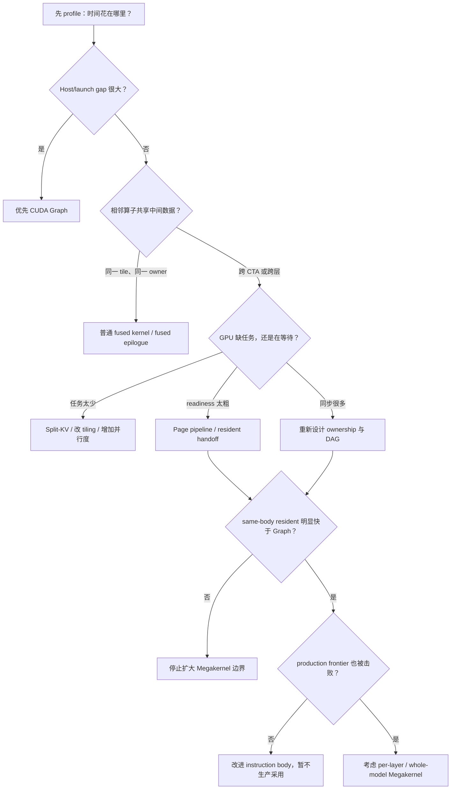

> **本课用词**：性能账本是按机制分类的延迟清单；executor 是实际执行数学的 kernel body；Amdahl 定律限制局部优化的整步收益。

这节课最重要的习惯是：

> 先回答“时间花在哪里”，再选择优化形式；不要先决定写 Megakernel，再去找理由。

---

## 1. 一次 decode 延迟由什么组成

可以把每 token 延迟写成：

\[
T_{\text{token}} =
T_{\text{host}}
+ T_{\text{launch}}
+ T_{\text{math}}
+ T_{\text{memory}}
+ T_{\text{sync}}
+ T_{\text{spill}}
+ T_{\text{runtime}}
\]

对应含义：

| 项目 | 含义 |
|---|---|
| Host | Python、框架调度、准备参数 |
| Launch | 提交 CUDA kernel、kernel 间空隙 |
| Math | GEMM、softmax、SiLU 等真实计算 |
| Memory | 权重、激活、KV Cache 搬运 |
| Sync | barrier、event、跨 CTA 等待 |
| Spill | 寄存器不够，数据落入 local memory |
| Runtime | Graph driver、allocator、barrier reset 等 |

不同技术攻击的是不同部分：

| 技术 | 主要减少 | 可能增加 |
|---|---|---|
| CUDA Graph | Host、launch gap | Graph driver、固定地址限制 |
| 普通 fused kernel | launch、激活显存流量 | registers、代码复杂度 |
| Persistent Megakernel | dispatch、跨 kernel 边界 | barrier、shared memory、spill |
| Split-KV | SM 空闲、并行度不足 | partial reduction |
| Page pipeline | 权重等待 | semaphore、shared page 管理 |

---

## 2. 第一本账：收益上限

假设当前 Qwen decode 是：

```text
2.80 ms/token
```

任务要求至少快 10%：

```text
目标 ≤ 2.51 ms/token
```

需要真正省掉：

```text
2.80 - 2.51 = 0.29 ms
                = 290 μs/token
```

Qwen3-4B 有 36 层，所以平均每层必须省：

```text
290 μs ÷ 36 ≈ 8.1 μs/layer
```

这产生一个非常有用的停止规则：

> 如果某条层内边界的理论上限明显小于 8.1 μs/layer，它不可能单独完成 10% 目标。

你的 Q/K Norm+RoPE 实验是：

```text
2.80 → 2.76 ms/token
约省 40 μs/token
约省 1.1 μs/layer
```

即使把它当作真实收益，也只达到所需层均收益的约七分之一。

所以正确结论不是“融合无效”，而是：

> 这条融合边太小，无法单独支撑 layer-megakernel 的目标。

本地报告可见 RESULT.md。

---

## 3. 为什么 launch 数少了很多，却只快一点

报告记录了：

```text
profiler events/token：1137 → 769
wall time：           2.80 → 2.76 ms
summed kernel time：  3.319 → 3.529 ms
```

首先，`1137/769` 更适合叫 profiler 统计到的 device-kernel events，不应未经原始 trace 复核就当成精确物理 launch 归因；归档中缺少原始 profile，且代码边界与 `-368` 的机械预期并不闭合。

但更稳健的结论很清楚：

```text
Graph 已经压缩大量 kernel 间 Host 空隙
            +
新的 fused kernel 本身并没有明显更便宜
            =
launch/event 数大幅下降，wall time 只小幅变化
```

因此：

> launch count 是解释变量，不是最终目标；最终目标始终是完整 token latency。

---

## 4. 第二本账：GPU 到底在等什么

看到 NCU 指标时，可以先用这张翻译表：

| 现象 | 通俗解释 | 优先方向 |
|---|---|---|
| DRAM 吞吐接近上限 | 仓库通道已经塞满 | 减少字节、提高复用 |
| DRAM 不高但 `long_scoreboard` 高 | 数据迟迟不到，warp 在等 | page pipeline、增加独立工作 |
| `barrier` stall 高 | 工人频繁集合等待 | 更细粒度 readiness |
| `no eligible` 高、active warp 少 | 没有足够任务 | Split-KV、增加 tile 数 |
| register 很高 | 每个工人随身工具太多 | 缩小融合边界、缩短 live range |
| 出现 `LDL/STL` | 工具袋装不下，东西掉到 local memory | 减寄存器、避免动态数组 |
| kernel 变快但端到端没变 | 优化的不是关键路径 | 检查 Host、reduce、其他算子 |
| stall 降了但总时间变长 | 一个指标改善，其他代价更大 | 看完整资源和时延账本 |

一个常见误区是：

```text
Occupancy 高 = GPU 利用率高
```

实际上 occupancy 只表示“理论上能驻留多少 warp”。

这些 warp 可能全部都在：

```text
等待权重
等待 barrier
等待前序 accumulator
等待跨 CTA event
```

所以还要看：

```text
eligible warps
issue active
stall 原因
实际 kernel duration
```

---

## 5. 你的几个实验分别说明什么

## Split-KV：并行度账本

原始状态：

```text
8 个 KV heads
→ 每层大约只有 8 个 attention jobs
→ 148 个 SM 吃不饱
```

改成 16 个 context partitions：

```text
8 × 16 ≈ 128 个 partial jobs
```

因此 4K/8K 长上下文出现约 2.85×/4.31× 的内部改进。

诊断是：

```text
Primary：grid-starved
Secondary：长 KV 读取延迟
```

最合适的改变是 Split-KV，而不是单纯融合更多算子。

## Page readiness：等待账本

基线并不是 DRAM 带宽完全跑满，而是：

- warp 等待权重；
- stage-wide readiness 太粗；
- issue active 偏低；
- long scoreboard 较高。

改成每 16 KiB page 独立 arrived/finished 后：

```text
某页到了 → 对应 warp 立即算
```

单层改善约 14%～16%，整模型内部约 21.7%。

诊断是：

```text
Primary：weight-load latency
Secondary：coarse readiness
```

## Gate/Up → SwiGLU：数据流账本

这里生产者和消费者共享同一个 MLP tile：

```text
Gate/Up accumulator → SiLU × Up
```

适合留在 TMEM、寄存器或 shared page。

诊断是：

```text
Primary：中间激活交接
Secondary：多余全局显存流量
```

它适合普通 fused epilogue，也适合 Megakernel 内的 true handoff。

## Whole-model monolith：资源与同步账本

你把完整模型放进一个物理 kernel 后，虽然 launch 数极少，但曾经仍比 Graph 慢约 1.568×。

原因不是一个单点，而是组合税：

```text
barrier
+ workspace
+ register live range
+ spill
+ executor body 不如成熟 GEMM
+ ownership 不够细
```

它证明：

> “物理边界更大”与“执行路径更短”不是同一回事。

---

## 6. 第三本账：比较对象必须拆成四条臂

严谨实验最好同时有：

| Arm | 内容 | 回答的问题 |
|---|---|---|
| A | 当前 production CUDA Graph | 能否真正上线 |
| B | 与 resident 相同计算 body 的 individual-op Graph | 执行模型本身是否有价值 |
| C | resident/per-layer Megakernel | Megakernel 调度是否有效 |
| D | 最新成熟系统前沿 | 是否真正有竞争力 |

关键比较：

```text
C vs B：
Megakernel 调度、page 生命周期和片上 handoff 有没有价值？

C vs A：
即使架构有效，是否比当前生产实现更快？

C vs D：
是否领先成熟系统？
```

可能出现：

```text
C 比 B 快 30%
C 仍比 A 慢 15%
```

这表示：

> Megakernel 架构成立，但你的 instruction bodies 还不如 production kernel。

不能把它写成“整体领先”。

---

## 7. 第四本账：正确性

Megakernel 的错误经常不是每次都出现。

例如缺少 release/acquire 时，可能：

```text
前 20 次正确
第 57 次错误
第 93 次正确
第 100 次又错误
```

因此至少要区分：

| 检查 | 能证明什么 |
|---|---|
| top-1 相同 | 最终最大 token 相同 |
| cosine 相似 | 整体方向接近 |
| max error | 最大元素偏差 |
| bitwise 相同 | 每个比特都一致 |
| self-replay | 同一个实现是否确定 |
| 100/100 repeated | 是否存在低概率 race |
| negative control | 测试是否真的能抓住错误 |

对于数据流、barrier、reduction 优化，推荐顺序是：

```text
self-replay deterministic
→ baseline/candidate bitwise 或严格数值
→ 100/100 重复
→ 多 position / 真实 KV Cache
→ 长 token gate
```

只做 20 次 top-1 不足以证明同步正确。

---

## 8. 第五本账：统计是否可信

推荐同一进程交错：

```text
ABBA
BAAB
ABBA
BAAB
……
```

而不是：

```text
先测 A 十分钟
过一小时再测 B
```

至少记录：

- 每个原始样本；
- median/p50；
- p10、p90；
- A/B 谁更快的次数；
- GPU clocks；
- warmup 和 replay 数；
- 相同 binary/cubin 哈希；
- 相同输入、位置、KV Cache；
- 相同同步和计时边界。

没有项目噪声门槛时，可粗略使用：

```text
<1%：通常先视为噪声
约1%～3%：观察或继续验证
>3% 且稳定配对胜出：值得考虑采用
```

但这不是自然定律，最终应由同一机器的负控和重复测试确定噪声。

---

## 9. 选择技术的决策树



简单记忆：

- Host 慢：Graph。
- 两个小算子共享数据：普通 fusion。
- 工作数量不够：Split。
- 数据到了一部分却全体等待：page readiness。
- 跨很多层的调度和 handoff 有收益：Megakernel。
- 只是想减少 kernel 数：先别写 Megakernel。

---

## 10. 一张可以反复使用的优化卡

以后每个候选都填写：

```text
Hypothesis：
    具体是什么瓶颈，为什么？

Evidence：
    wall time、kernel time、NCU、register、smem、spill、timeline。

Change：
    只改哪一个机制？

Expected signal：
    哪项指标应该怎样变化？

Risk：
    正确性、同步、数值、occupancy、可移植性风险。

Verification：
    如何做 correctness、ABBA timing、NCU 和 SASS 对照？

Decision：
    Merge / Conditional dispatch / Watch / Revert / Archive。
```

以 Gate/Up→SwiGLU 为例：

```text
Hypothesis：
    Gate/Up 输出被写入全局显存后又被 SwiGLU 读取。

Change：
    在相同 CTA 内直接从 accumulator/TMEM 执行 SwiGLU。

Expected：
    中间写读字节下降，wall latency 降低。

Risk：
    register/TMEM 生命周期增加，可能限制 occupancy。

Verification：
    100/100 correctness；
    same-body Graph vs resident；
    检查 ptxas registers/spills；
    配对端到端时延。

Decision：
    只有端到端稳定胜出才采用。
```

## 这一课最重要的结论

> Megakernel 是一个候选解，不是问题定义。问题定义永远是：在固定模型、硬件和 workload 下，哪种执行边界能以正确、稳定、可复现的方式得到最低端到端延迟？
