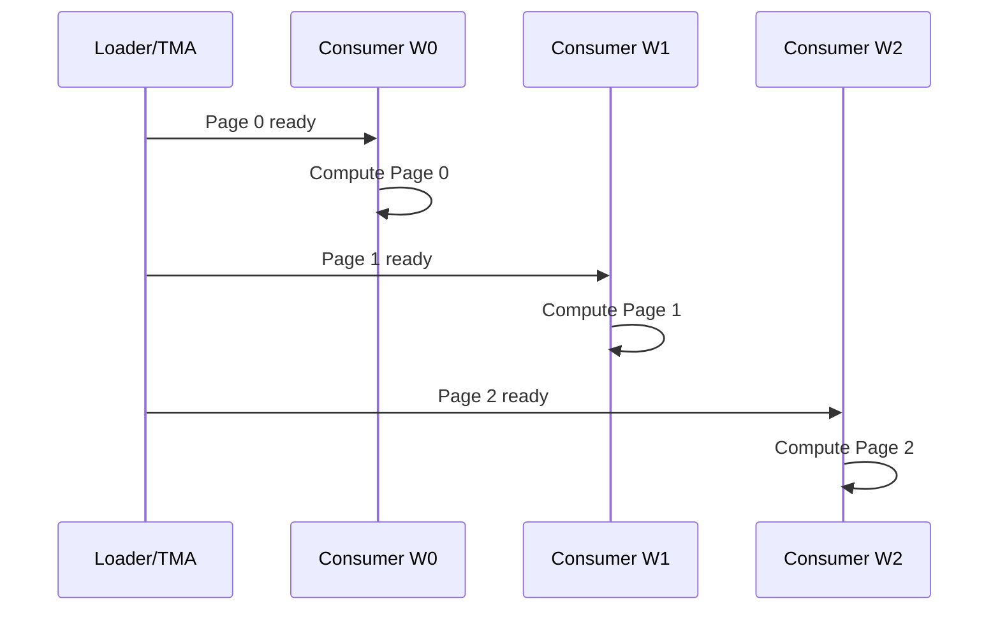

> **本课用词**：resident 表示已驻留；eligible 表示当前可以发射；issue 表示该周期真正发出指令；stall reason 是采样归因。

先说证据边界：课程整理时未保留远端实时连接，本地也没有复制原始 `.ncu-rep`。下面数字来自此前对 2026-08-09 远端报告的只读审计快照；原始课程记录同时核对了本地 Git 中保存的 VM 配置与旧 weight pipeline 源码。

读 NCU 最有效的顺序是：


不要打开报告后直接找一个红色指标。

---

## 1. 先确认正在看什么

你的 one-layer probe 对应的大致条件是：

```text
GPU：       NVIDIA B200 / sm_100
模型：      Llama 8B
模式：      B=1 BF16 decode
Grid：      148 CTA
Block：     640 threads
结构：      16 consumer warps + 4 个专用 role warps
```

4 个专用角色大致是：

```text
controller
loader
storer
launcher
```

每个 CTA 是一支长期驻留的 worker 小队。

如果没有先冻结模型、上下文长度、dtype、dispatch path，后面的指标无法比较。

---

## 2. 第一页：Duration

第一项永远先看：

```text
gpu__time_duration.sum
```

它回答的是：

> 这个被 profile 的物理 kernel 实际运行了多久？

不要先看百分比，因为：

```text
某个 stall 从 20% 降到 10%
```

可能是：

```text
stall 时间减少了
```

也可能是：

```text
其他部分变得更慢，所以 stall 占比下降
```

最终必须回到绝对 duration。

Page-granular v2 的 one-layer NCU 对照中：

```text
kernel duration：约 -17.34%
```

这是最终胜负指标。

---

## 3. 第二页：Launch Geometry 与片上资源

one-layer 基线的关键资源大致是：

| 项目 | 数值 |
|---|---:|
| Grid | 148 CTA |
| Threads/CTA | 640 |
| Registers/thread | 约 96 |
| Shared memory/CTA | 约 228,056 B |
| Resident CTA/SM | 1 |
| 编译器 stack/spill ledger | 存在约 304/520 B 级记录 |

## 228 KB shared memory 意味着什么

一个 CTA 几乎占用了一个 SM 可提供的全部 shared memory：

```text
一个 SM
└── 只能驻留一个 Megakernel CTA
```

因此不能通过“再驻留第二个 CTA”隐藏等待。

这并不一定是错误，因为设计目标本来就是：

```text
148 CTA ÷ 148 SM ≈ 每个 SM 一个 CTA
```

但它带来一个后果：

> CTA 内的 20 个 warp 如果一起等待，SM 没有第二个 CTA 可以切换执行。

所以 page readiness 和 warp-level pipeline 特别重要。

---

## 4. Occupancy、Active、Eligible、Issued 的区别

这是 NCU 最容易混淆的部分。

## Resident/Occupancy

表示 warp 已经住进 SM。

类比：

```text
工人已经进入工厂
```

## Active Warp

表示 warp 尚未完成。

```text
工人还没有下班
```

## Eligible Warp

表示 warp 当前所有依赖已经满足，可以立即发射下一条指令。

```text
材料已经到齐，工人现在可以干活
```

## Issued/Selected Warp

表示 scheduler 这一周期真的选中了它。

```text
工人正在使用机器
```

一个 warp 可以同时满足：

```text
Resident = 是
Active   = 是
Eligible = 否
```

因为它可能正在等待：

- HBM 权重；
- TMA 完成；
- shared-memory 数据；
- barrier；
- 另一个 CTA 的 event；
- 前一条计算指令结果。

所以：

> Occupancy 高不等于 GPU 正在有效计算。

---

## 5. 你的关键异常：Eligible Warp 很少

完整 32 层、4K context 的 NCU 快照中，曾记录：

```text
eligible warps ≈ 0.2556 / scheduler
```

通俗解释：

> 每个 scheduler 平均连一个随时可发射的 warp 都没有。

这时 scheduler 经常遇到：

```text
有很多 active warp
但没有任何一个能发射
```

这不是“CUDA core 数量不够”，而是数据依赖与流水问题。

因此继续增加数学吞吐或 MMA 理论峰值，不是第一优先级。

---

## 6. 看 Stall Reasons：warp 为什么不能发射

## Long Scoreboard

基线报告中，`long_scoreboard` 是重要等待项，one-layer 快照约为 14.25% 量级。

它通常表示：

```text
warp 发起了 global-memory load
       ↓
后面的指令需要这个数据
       ↓
数据还没有返回
       ↓
warp 停下来等待
```

常见来源：

- 权重从 HBM/L2 加载；
- KV Cache 读取；
- local-memory spill load；
- load 后立即使用，缺少独立指令；
- TMA/page readiness 太粗。

它叫 scoreboard，是因为硬件需要记录：

```text
寄存器 r42 的数据还没准备好
依赖 r42 的指令暂时不能执行
```

## Barrier

`barrier` stall 表示：

```text
当前 warp 已经完成
但必须等待同 CTA 的其他 warp
```

Megakernel 很容易出现放大效应：

```text
一个 warp 等权重
→ 其他 warp 在 barrier 等这个 warp
→ 整个 CTA 停住
→ 因为每 SM 只有一个 CTA
→ 整个 SM 停住
```

## Short Scoreboard

通常表示等待：

- shared-memory load；
- local-memory 短延迟访问；
- 较短的计算依赖链。

## Not Selected

这个反而不一定坏：

```text
warp 已准备好
但 scheduler 选择了另一个 warp
```

说明至少有多个 eligible warp，硬件有选择空间。

---

## 7. 为什么它不是简单的“DRAM 带宽打满”

完整 4K profile 曾记录：

```text
DRAM throughput ≈ 4.296 TB/s
```

这是很高的流量，但结合：

```text
eligible warps 极低
long scoreboard 明显
issue active 偏低
```

不能简单下结论：

```text
已经打满 HBM，只能压缩权重
```

更准确的判断是：

> 这是以权重流为主的 kernel，但瓶颈包含显著的加载延迟、依赖距离和同步粒度问题，而不仅是总带宽上限。

区别如下：

## 纯 bandwidth-bound

```text
大量 warp 持续发出请求
DRAM 长时间接近峰值
继续增加并发也没有用
```

## Memory-latency/pipeline-bound

```text
请求数量或提前量不足
warp 发一个请求后马上等待
DRAM 并非始终被持续填满
```

Page pipeline 改善的是第二种。

---

## 8. 从 NCU 回到源码：旧流水为什么会等

本地历史源码：

```text
ThunderKittens@origin/megakernels:
tests/vm/llama_official/matvec_pipeline.cuh
```

旧实现的结构是：

```cpp
for each stage:
    TMA load 4 个 weight pages
    发布 weights_arrived(stage)

consumer:
    wait(weights_arrived(stage))
    使用自己负责的 page
```

关键问题是 semaphore 属于整个 stage：

```text
page 0 已经到达
page 1 已经到达
page 2 仍在路上
page 3 仍在路上

→ 整个 stage 仍未 ready
→ 本来只需要 page 0 的 warp 也不能开始
```

这叫：

> stage-wide readiness

它制造了人为等待。

---

## 9. Page-granular readiness 改了什么

新设计为每个 16 KiB page 建立独立状态：

```text
page 0 arrived → 消费 page 0 的 warp 立即计算
page 1 arrived → 消费 page 1 的 warp 立即计算
page 2 arrived → 对应 warp 开始
page 3 arrived → 对应 warp 开始
```

Loader 同时继续搬下一页：



它没有：

- 减少模型参数；
- 减少 MatVec FLOPs；
- 提高理论 Tensor Core 峰值。

它只是让：

```text
数据准备好 → 更快转化为 issued instruction
```

---

## 10. 怎样证明优化机制判断正确

Page-v2 对照中的几个信号方向一致：

| 指标 | 变化 | 解释 |
|---|---:|---|
| one-layer duration | 约 -17.34% | 最终真的更快 |
| issue active | 约 +4.86 个百分点 | scheduler 更常发射指令 |
| long scoreboard | 相对约 -18.68% | 等待长延迟数据减少 |
| 端到端 32 层内部时延 | 约 -21.7% | 单层机制可以累积到模型 |

这形成了一条完整证据链：

```text
源码：
stage semaphore 太粗

        ↓ 假设

page 独立 ready 会让 warp 更早执行

        ↓ NCU

long scoreboard 下降
issue active 上升

        ↓ 最终指标

kernel duration 下降
full-model latency 下降
```

这比只说“NCU 某个指标变绿了”强得多。

---

## 11. Spill：第二个不能忽略的问题

完整 profile 曾记录约：

```text
7.406 million local-load instructions
```

B200 上应该查看：

```text
smsp__sass_inst_executed_op_local_ld.sum
smsp__sass_inst_executed_op_local_st.sum
```

这里的 local memory 不是 CTA 的 shared memory，而是：

> 编译器认为属于每个线程，但寄存器装不下而放到显存地址空间的数据。

它可能命中 L1/L2，但仍会增加：

- load/store 指令；
- 地址计算；
- scoreboard 依赖；
- cache 压力；
- 延迟。

因此源码写着一个局部变量，不代表它一定在寄存器里。最终要看 SASS 是否出现：

```text
LDL
STL
```

Page readiness 解决了“权重何时可用”，但不自动解决 spill。

---

## 12. 为什么 Dynamic Tail 只改善约 1.5%

Llama MLP 中间维度：

```text
14336 = 4096 + 4096 + 4096 + 2048
```

最后一个 tile 只有 2048，却可能仍让全部 warp/page 按 4096 的配置工作。

Dynamic tail 让最后一段只启用需要的 warp 和 page，删除冗余工作。

结果约改善 1.5%，说明：

```text
尾部浪费真实存在
但不是主要瓶颈
```

如果主瓶颈是：

```text
权重等待 + spill + barrier
```

优化最后一个 tail 不可能带来 20% 收益。

这是很好的“收益上限”例子。

---

## 13. 一句话诊断这份报告

按 NCU 报告规范，可以写成：

> 该 one-layer B200 Megakernel 由约 228 KB shared memory 限制为每 SM 一个 640-thread CTA；虽然有 20 个 resident warps，但 issue-active 仅约 18.13%，并出现显著 long-scoreboard 与 barrier 等待，说明主要问题是 stage-wide 权重 readiness 和加载依赖，而非缺少理论算力。Page-granular semaphore 让权重页到达后立即被对应 warp 消费，使 long-scoreboard 相对下降约 18.68%、issue-active 增加约 4.86 个百分点，并把 kernel duration 降低约 17.34%。剩余主要风险是大量 local loads/spill 和跨指令同步。

这里明确区分：

```text
Primary：权重加载延迟 + readiness 粒度
Secondary：spill/local memory + barrier
不是 Primary：Host launch
不是 Primary：纯计算吞吐
```

---

## 14. 新手读 NCU 的固定七问

以后拿到任何报告，依次问：

1. Profile 的确切 kernel、shape、dtype 是什么？
2. 绝对 duration 是多少？
3. Grid 能否覆盖所有 SM？
4. Register/shared memory 允许几个 CTA/SM？
5. Active warp 中有多少真正 eligible？
6. 最大 stall reason 是什么，集中在哪条源码/SASS？
7. 改动后 stall、issue 和最终 duration 是否同时按预测变化？

如果第 7 问没有成立，就不能声称机制被证明。
