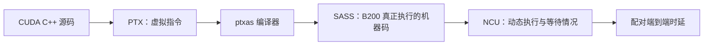

> **本课用词**：PTX 是虚拟指令表示；SASS 是目标 GPU 机器指令；CUBIN 保存机器码和资源元数据；spill 是寄存器值被放到 local memory。

先记住这条证据链：



判断优先级是：

```text
源码表达意图
PTX 表达编译中间结果
SASS 表达实际指令
NCU 表达实际运行行为
端到端 latency 决定最终胜负
```

---

## 1. 源码、PTX、SASS 分别是什么

## CUDA C++ 源码

例如：

```cpp
float value = input[index];
sum += value * weight;
```

它方便人理解，但不能直接告诉你 GPU 最终执行多少条指令。

## PTX

编译器可能先生成：

```ptx
ld.global.f32
fma.rn.f32
```

PTX 是一种虚拟 GPU ISA。它仍然可能被后续编译器：

- 合并；
- 删除；
- 重排；
- 展开；
- 改成其他指令。

## SASS

SASS 是针对具体 GPU 的最终机器码。

B200 上可能看到：

| SASS | 含义 |
|---|---|
| `LDG` | 从 global memory 读取 |
| `STG` | 写 global memory |
| `LDS` / `STS` | 读写 shared memory |
| `LDL` / `STL` | 读写线程 local/stack memory |
| `UTCHMMA` | Blackwell Tensor Core MMA |
| `BAR` | 同步 |
| `DEPBAR` | 异步操作依赖等待 |
| `IMAD` / `IADD3` | 地址与整数计算 |
| `BRA` | 分支 |
| `MUFU` | exp、倒数等特殊函数 |

所以：

> 想证明 GPU 真正使用了 Tensor Core，要看 SASS 中是否有 `UTCHMMA`，不能只看源码里调用了某个 GEMM 模板。

---

## 2. 你的 exact binary 保存得比较完整

成熟 oMoE whole-forward commit `070022f97` 保存了：

```text
目标架构：sm_100a
CUDA：13.2
编译参数：-O3 -lineinfo -Xptxas=-v
物理入口：cudaLaunchCooperativeKernel
artifact SHA-256：
7664abc264d712d7abf40e75d7f29665...
```

记录 source hash 和 binary hash 很重要，因为否则可能发生：

```text
benchmark 测的是 binary A
SASS 却来自后来重新编译的 binary B
```

那份 SASS 不能解释测量结果。

---

## 3. 成熟 whole-forward binary 的资源信息

保存的资源 census 显示：

```text
REG       = 169 registers/thread
STACK     = 544 bytes/thread
static LDL sites = 46
static STL sites = 63
UTCHMMA   = 存在
```

这说明：

- 编译器确实生成了 Blackwell Tensor Core 指令；
- kernel 很大，寄存器使用较高；
- 每线程有 544 字节 stack frame；
- 最终 SASS 中存在 local-memory 读写位置。

但还不能直接说：

```text
“这 109 个 LDL/STL 就是主要瓶颈”
```

因为这里的 `46/63` 是静态指令位置数量，不是运行次数。

---

## 4. 静态 site 和动态 count 的区别

假设 SASS 只有一条：

```text
LDL R8, [R1+0x20]
```

但它位于循环中：

```cpp
for (int layer = 0; layer < 32; ++layer) {
    for (int tile = 0; tile < 100; ++tile) {
        local_value = ...;
    }
}
```

那么：

```text
静态 LDL site：1
动态 LDL 执行次数：32 × 100 × threads
```

反过来，SASS 里即使有很多 `LDL` site，如果它们位于极少进入的错误处理分支，也可能几乎不执行。

因此需要两份证据：

```text
SASS：
有没有 LDL/STL，在哪些 PC？

NCU：
这些 PC 实际执行了多少次、产生多少 stall？
```

上一课提到的 Hazy 8B profile 中约 7.406M local loads，是另一条实现、另一个 binary 的动态计数，不能直接归因到这个 oMoE binary。

---

## 5. Local memory 不是真正的“本地片上内存”

CUDA 名字很容易误导：

```text
register       → SM 片上
shared memory  → SM 片上
local memory   → 每线程私有地址空间，但通常位于显存体系
```

Local memory 会经过 L1/L2 cache，但 cache miss 后仍需要访问更远的存储层。

因此 `LDL/STL` 会增加：

- 地址计算；
- load/store 指令；
- cache 压力；
- long/short-scoreboard；
- load-use 依赖；
- 显存流量。

---

## 6. 为什么源码局部变量会落进 local memory

## 原因一：寄存器不够

假设每个线程同时需要很多值：

```cpp
float q[8];
float scores[8];
float softmax_state[8];
float accum[16];
```

当 live set 超过编译器允许的寄存器预算，一部分值会被 spill。

## 原因二：动态索引数组

GPU 寄存器没有普通内存那样的动态地址。

例如：

```cpp
float values[16];
float x = values[runtime_index];
```

`runtime_index` 只有运行时才知道，编译器经常把 `values` 放进 local stack。

而：

```cpp
float v0, v1, v2, v3;
```

或者编译期完全展开的常量索引，更容易保留在寄存器中。

## 原因三：函数调用与 ABI

大型 `__noinline__` device function、递归式模板分派或必须保留的调用状态，可能需要 stack frame。

## 原因四：强制 register cap

例如：

```cpp
__maxnreg__(128)
```

如果代码实际需要 169 个寄存器，编译器可能：

```text
保留 128 个寄存器
其余值 spill 到 local memory
```

寄存器数看起来下降了，kernel 却可能更慢。

---

## 7. Stack、Local 和 Spill 不能完全画等号

要区分：

```text
ptxas:
spill stores / spill loads

cuobjdump:
STACK、LOCAL、REG

SASS:
LDL、STL
```

明确的 `spill loads/stores > 0` 表示寄存器值被溢出。

但：

```text
STACK > 0
LDL/STL > 0
spill counter = 0
```

仍可能来自：

- 显式线程局部数组；
- device function 调用 frame；
- ABI 保存区域；
- 编译器没有归类为 spill 的 local storage。

因此对当前成熟 binary 最准确的说法是：

> 存在 544-byte thread stack 与静态 LDL/STL 指令，说明有 local/stack traffic 风险；在没有把这些 PC 映射到动态 NCU hotspot 前，不能断言它们全部是 register spill，也不能断言它们是第一瓶颈。

---

## 8. 为什么不能盲目降低寄存器

你的 Megakernel 通常已经因为约 228～230 KB shared memory 而限制为：

```text
1 CTA / SM
```

假设把寄存器从 169 降到 128，但 shared memory 仍只允许一个 CTA：

```text
优化前：1 CTA/SM
优化后：1 CTA/SM
```

CTA residency 没有增加。

如果同时引入 `LDL/STL`：

```text
没有获得更多 CTA
却增加了 local-memory traffic
```

这通常是净亏损。

所以只有当下面关系成立时，register cap 才可能有意义：

```text
减少 registers
→ occupancy 限制跨过一个台阶
→ 真正增加 resident CTA/warps
→ 新增并发足以覆盖 spill 成本
```

你的 shared-memory-heavy Megakernel 通常跨不过这个台阶。

---

## 9. Tensor Core 指令存在，也不等于 Tensor Core 很忙

精确 SASS 中已经找到大量：

```text
UTCHMMA
```

它证明：

```text
“代码确实使用了 Tensor Core”
```

但不能证明：

```text
“Tensor Core 已经被持续喂饱”
```

Phase 6 NCU 的真实状态是：

```text
eligible warps / scheduler ≈ 0.08
92.67% scheduler cycles 没有 eligible warp
long scoreboard ≈ 43% / issued instruction
barrier ≈ 36.5% / issued instruction
DRAM utilization ≈ 20.81%
```

所以 GPU 有 Tensor Core 指令，却经常发不出去。

通俗类比：

```text
工厂里有很快的机器
但材料还没来，或者前一道工序没签收
```

这时继续优化 MMA 指令本身通常不是第一优先级。

---

## 10. Phase 6 的 SASS/NCU 共同结论

Phase 6 使用：

```text
148 CTA
256 threads/CTA
196 registers/thread
230,400 bytes shared memory/CTA
1 CTA/SM
12.5% theoretical occupancy
zero reported spill requests
```

最热的 long-scoreboard 位置是：

```text
Attention K load：约 92,656 samples
Attention V load：约 90,514 samples
```

最大 barrier 热点：

```text
一个 cooperative/CTA synchronization：约 68,100 samples
另一个 layer phase boundary：约 36,779 samples
```

因此当时的主要问题不是 spill，而是：

```text
Primary：Attention K/V load latency
Secondary：粗粒度 grid/CTA barrier
```

这说明：

> 看到一个大 kernel，就不能自动把“寄存器压力”当成第一解释；必须看对应 phase 的动态 PC samples。

---

## 11. Phase 8 是一条漂亮的机制证据链

Candidate 6 → Candidate 13：

| 指标 | 变化 |
|---|---:|
| instrumented duration | -8.64% |
| barrier samples | -14.28% |
| long-scoreboard samples | -7.70% |
| global-load instructions | -6.23% |
| global-store instructions | -17.20% |
| eligible warps/scheduler | +8.13% |
| issue-active | +7.76% |
| DRAM read bytes | 约 +0.008%，基本不变 |

实现做了：

- QKV scatter/RoPE 更紧密地融合；
- 删除每层两个 grid rendezvous；
- 减少中间 stores/reloads；
- 改善实际寄存器与调度 envelope。

结果方向完全一致：

```text
源码边界更紧
→ SASS/动态 load-store 工作减少
→ barrier 下降
→ eligible/issue 上升
→ duration 下降
```

而 DRAM 总字节没变，说明模型权重流量仍占主导；收益来自控制流和数据流，而不是减少模型权重。

---

## 12. 如何真正追踪一个 LDL hotspot

严谨流程是：

## 第一步：确定 exact binary

记录：

```text
source SHA
binary/cubin SHA
sm_100a
编译 flags
```

## 第二步：记录 ptxas

```text
REG
STACK
spill stores
spill loads
static/dynamic shared memory
```

## 第三步：dump SASS

找到：

```text
LDL
STL
```

并记录它们的 PC 地址。

## 第四步：用 NCU SourceCounters

回答：

```text
哪个 LDL/STL PC 实际执行最多？
哪个产生最多 long/short-scoreboard？
它对应哪条 CUDA 源码？
```

## 第五步：只改一个原因

例如将：

```cpp
float partial[16];
partial[runtime_index] = value;
```

改成：

- 编译期固定索引并展开；
- 缩短数组生命周期；
- 将跨 warp 共享的数据放到显式 shared page；
- 将大 accumulator 放进 TMEM；
- 用 warp-role specialization 分配寄存器。

## 第六步：预测结果

修改前就写下：

```text
Expected ptxas：
STACK 或 spill 降低

Expected SASS：
目标 LDL/STL site 消失或动态执行减少

Expected NCU：
local loads、scoreboard 下降
eligible/issue 上升

Expected latency：
hot kernel 和完整 token 同时下降
```

---

## 13. Blackwell 的 role-specialized register 方法

你的 probe SASS 中已经观察到：

```text
USETMAXREG.TRY_ALLOC.CTAPOOL
USETMAXREG.DEALLOC.CTAPOOL
```

它允许不同 warp role 使用不同寄存器预算。

例如：

```text
Loader warps：
只负责 TMA 和地址
需要较少寄存器

Consumer warps：
负责 MMA、accumulator、softmax
需要较多寄存器
```

相比让 640 个线程全部使用同样高的 register envelope，更合理的是：

```text
Loader 释放部分寄存器
→ Consumer 临时获得更多寄存器
→ 计算结束后归还
```

但它需要严格保证：

- 所有 warp 正确参与 permit 协议；
- 分配与释放只有预期次数；
- 不与 TMEM 生命周期冲突；
- exact SASS 中确实出现对应指令；
- correctness 与时延都通过。

---

## 14. 一张可执行的 Local-Traffic 优化卡

```text
Hypothesis：
    某个动态索引的 per-thread array 或 device-call frame，
    在 Attention/MLP 热循环中产生高频 LDL/STL。

现有证据：
    exact binary 有 STACK=544、46 LDL sites、63 STL sites。

缺失证据：
    尚未证明这些 site 位于动态 critical path。

最小下一步：
    对 exact binary 采 SourceCounters，
    将 LDL/STL PC 映射到源码并按动态 samples 排序。

候选修改：
    只重写排名第一的 local-memory 对象，
    不同时修改 tile、同步或数值顺序。

预期信号：
    stack/local 动态次数下降；
    对应 scoreboard 下降；
    duration 和端到端同时降低。

风险：
    scalarization 可能增加 registers；
    shared staging 可能增加 smem/barrier；
    kernel splitting 可能丢失数据流收益。

决定：
    只有 paired latency 超过噪声且 correctness 通过才采用。
```

## 这一课最重要的结论

> `LDL/STL` 是需要调查的线索，不是自动成立的根因。SASS 告诉你“有什么指令”，NCU 告诉你“哪些指令真的热”，配对时延才告诉你“改动是否值得”。
