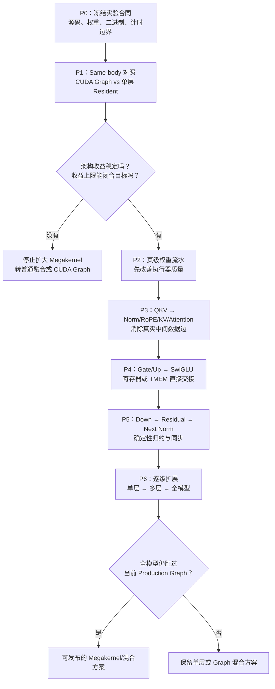

> **本课用词**：roadmap 是实验依赖顺序；gate 是进入下一阶段前必须满足的条件；negative control 是应当失败的对照。

先说结论：你下一步最值得做的，不是直接写 whole-model Megakernel，而是：

> 冻结可信基线 → 做 same-body 架构判决 → 做一个正确完整层 → 逐条打通真实数据流 → 最后才扩大到全模型。

这样能分清两个经常混在一起的问题：

1. Persistent/Megakernel 这种执行架构本身有没有价值？
2. 你写的 QKV、Attention、MLP 内核本体是否足够快？



## 先把目标算清楚

你的 Qwen3-4B 是：

- 36 层
- hidden size 2560
- intermediate size 9728
- 32 个 Q heads、8 个 KV heads
- head dimension 128

这些形状决定了每一层的 QKV、Attention 和 MLP 工作量。当前模型代码

历史任务使用约 `2.80 ms/token` 的基线，目标是 `2.51 ms/token`：

\[
2.80-2.51=0.29\text{ ms/token}
\]

平均到36层：

\[
0.29/36\approx8.1\ \mu s/layer
\]

所以历史 Q/K Norm+RoPE 微融合从 `2.80 → 2.76 ms`，平均只有约：

\[
0.04/36\approx1.1\ \mu s/layer
\]

它远远闭合不了目标。但这只能说明“这个微融合不够”，不能说明“单层 Megakernel 不成立”。历史结果

今天不能继续把 `2.51 ms` 当固定门槛，因为源码和运行环境已经变化。正确做法是：

\[
T_{target}=T_{current}/1.10
\]

也就是每次先测同一 session 的当前基线，再动态计算目标。当前指标合同

工程上仍可把“约 `7–8 µs/layer` 的可扩展收益”作为记忆目标。

---

## P0：先建立一把可信的尺子

这一阶段不优化代码，只解决“以后测到的数字能不能相信”。

需要冻结：

- 当前 clean Git SHA
- 模型配置、tokenizer、权重哈希
- B200 UUID、驱动、时钟、功耗状态
- CUDA、PyTorch、SGLang/SGL Kernel版本
- 完整编译命令和 cubin 哈希
- registers、shared memory、stack、spill
- TG@4K 和 TG@8K 两个 decode bucket
- 同进程交错 A/B，而不是隔几小时各跑一次
- 原始计时样本，而不只保存最终 median

还必须记录“实际运行到了哪个 backend”。这是当前代码尤其重要的一点：

> 仓库中存在 QKNorm+RoPE+KV-store 融合内核，不等于 B=1 Graph decode 已经调用它。

当前证据表明它主要接在 batched prefill 路径上；因此每次实验应打印 active backend 和实际调用次数。融合后端

P0 不通过，就不要讨论 1%、3% 甚至 10% 的收益。

---

## P1：最关键的 same-body 架构判决

设计四条实验臂：

| 实验臂 | 内容 | 回答的问题 |
|---|---|---|
| A | 当前 production CUDA Graph | 今天真正需要击败的对象 |
| B | 相同计算 body，拆成 individual-op Graph | 多 kernel 的matched基线 |
| C | 相同计算 body，放进单层 resident kernel | Resident架构本身是否有价值 |
| D | 当前成熟外部实现 | 是否具有真实竞争力 |

这里最关键的是 B 和 C。

“Same-body”可以理解成：

> 厨师、原料、菜谱完全相同，只改变厨房的组织方式。

因此：

- `C < B`：Resident调度、页面生命周期和局部交接确实有价值。
- `C < B`，但 `C > A`：研究架构成立，但你的计算body还不够好。
- `C ≥ B`：控制器、同步和资源压力已经吃掉收益，暂时不应扩大边界。
- `C < A、B`：才开始具备产品价值。

实验中的 C 必须是一个“roughly-full-layer kernel”，而不是只有 Q/K Norm+RoPE。至少应覆盖层内主要路径，才能诚实回答 single-layer Megakernel 是否成立。

建议的新研究门：

- 科学信号：matched paired p50 至少约3%，并稳定超过噪声。
- 产品信号：可保守扩展到约 `7–8 µs/layer`。
- 如果当前收益不足，但 trace 能明确指出剩余可删除的数据流成本，可以条件继续。
- 如果只减少 launch 数、wall time 不降，立即停止扩大边界。

其中 `baseline/1.10` 来自历史任务合同；“3%科学信号”和“约7–8µs/layer admission”是为下一轮提出的新门槛，应该在实验前明确登记，而不是测完再调整。

---

## P2：先让执行器足够好

第一个机制应当是 page-granular weight readiness。

普通阶段式执行：

```text
等待整块权重全部到达
→ 所有 warps 一起开始计算
```

页级流水：

```text
第一个16 KiB权重页到达
→ 对应的两个warps立即计算
→ loader同时继续搬下一页
```

你在 Llama8B/B200 上已经观察到：

- 单层约减少14–16%
- 32层内部实验约减少21.7%
- issue-active 上升
- long-scoreboard stall 下降

下一步不是直接照搬结果，而是用 Qwen 的 `2560/9728` 精确形状重新验证。

通过条件：

- kernel duration 实际下降
- issue-active 上升
- long-scoreboard下降
- 没有新增不可解释的 local load/store
- 自定义 matvec 与成熟 GEMM 的差距没有吞掉流水收益

如果 Megakernel 节省了5微秒控制成本，却让 GEMM body 慢了10微秒，整体仍然失败。

---

## P3：打通 QKV 到 Attention 的真实数据流

这是最值得融合的一条边：

```text
QKV accumulator
   ├─ Q → Q Norm → RoPE → Attention
   ├─ K → K Norm → RoPE → KV Cache
   └─ V ─────────────────→ KV Cache
```

目标不是简单地“把函数放进同一 kernel”，而是：

- Q 尽量留在寄存器/shared memory/TMEM
- 同一 GQA ownership 下完成 Q/K 处理
- K/V 只在必须持久保存时写入 KV cache
- Attention 在对应数据 ready 后立即开始
- 使用明确的 release/acquire 发布协议

判断它是否成功，要看：

- 删除了多少真实 global-memory 往返
- 删除了多少关键路径 rendezvous
- Attention 是否更早启动
- 是否为了修布局又产生等量甚至更多的数据搬运

---

## P4：Gate/Up 到 SwiGLU

目标数据流是：

```text
Gate accumulator ─┐
                  ├─ SiLU(gate) × up → Down
Up accumulator ───┘
```

理想情况下，两个结果不必先完整写到 global memory，再由 SwiGLU 读回来。

但这里必须先打败一个很强、很简单的基线：

> CUDA Graph 中的 fused epilogue 或 `out=` 输出缓冲区复用。

你已有的历史证据说明，这条边通常只有几微秒每层；它适合作为组合贡献，不太可能独自闭合10%目标。

如果普通融合已经获得同样收益，就采用普通融合，不必为了“Megakernel纯度”把它塞进resident runtime。

---

## P5：最后处理 Down → Residual → Next Norm

这是最困难的一段：

```text
9728维输入
→ Down projection归约
→ 2560维输出
→ Residual add
→ 下一层RMSNorm
```

困难来自：

- 多个 CTA/warp共同产生同一输出
- 下一层 Norm 需要完整的一行
- 浮点加法顺序变化会造成不确定性
- barrier/tag太细会让同步本身成为瓶颈

正确方向是：

- 明确唯一输出 ownership
- FP32 partials
- 固定顺序归约
- 只做一次 BF16 rounding/add
- release/acquire 发布

不要只删除 workspace 或增加数万个细粒度 tag。你以前的 Residual EVT 和 fine-grained tile DAG 已经说明：减少字节或缩小同步粒度，并不自动意味着更快。

---

## P6：按层级逐步扩大

扩展顺序应该是：

```text
单个projection harness
→ 一个正确层
→ 多次重复单层
→ per-layer resident
→ whole-model
```

whole-model 只有在下面条件同时满足时才值得做：

- 单层收益能闭合全token目标
- registers/shared memory/spill没有失控
- 多层后 barrier 和 instruction-cache 成本没有爆炸
- 完整模型仍胜过当前 production Graph
- TG@4K、TG@8K 都通过
- 同一计时边界下仍能击败成熟实现

如果单层快、全模型慢，正确结果不一定是继续硬做 whole-model。更合理的产品可能是：

```text
CUDA Graph
├─ QKV/Attention Megakernel island
├─ 普通 O projection
├─ Gate/Up/SwiGLU fused kernel
└─ deterministic Down/Norm kernel
```

这叫选择性 Megakernelization，通常比“一个物理 kernel 包打一切”更成熟。

---

## 正式停止条件

出现以下任一情况，就应该停止当前分支：

1. 100/100重复、KV canary或严格正确性失败。
2. 可回收关键路径上限小于目标，编码前就能证明闭合不了。
3. launch数量下降，但GPU关键路径和端到端时间不下降。
4. register/shared memory/barrier导致occupancy或issue能力恶化。
5. C胜过same-body Graph，却仍输production Graph——记录为架构正证据，转而优化body。
6. 连续三个正交机制都不能带来有意义的端到端收益。
7. 只有NCU指标变漂亮，paired wall time没有变快。
8. 实验无法由clean source和exact binary复现。

最重要的研究结论是：

> 你的目标不应是证明“Megakernel总是更快”，而是找到B200上哪些数据流值得进入persistent执行器、哪些部分应该继续交给成熟Graph/GEMM内核。
