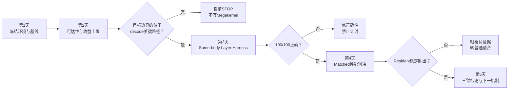

> **本课用词**：baseline 是未改动参考；artifact 是日志、binary 或报告工件；replay 是重复执行同一路径；rollback 是可恢复的回退点。

这周的目标不是完成全模型 Megakernel，而是得到一个可信结论：

> Qwen 单层 resident Megakernel 值不值得继续投入？

这里的“第几天”是阶段门。如果一天做不完，就停在该阶段，不要为了赶进度跳过正确性或证据。



---

## 第1天：冻结尺子

原始实验环境使用 `verda-b200x4`。复跑时应先在目标仓库根目录确认空闲 GPU，并把下面的历史命令与模型路径替换为当前环境的真实值：

```bash
nvidia-smi

export CUDA_VISIBLE_DEVICES=<确认空闲的GPU编号>
export ANE_MODEL_DIR=/mnt/OS-oKqEXySb/models/Qwen3-4B
export TMPDIR=/mnt/OS-oKqEXySb/home/qinhaiyan/ane-data/tmp

conda activate sglang
```

然后运行：

```bash
git status --short --branch
git rev-parse HEAD

python scripts/probe_vendor_env.py --require
python -m omoe.smoke
python -m omoe.gate 128
python -m omoe.gate 128 --negative-control
scripts/tip_board.sh --level L1 --cell 1
```

预期：

- `smoke`：`SMOKE PASS`
- 正常gate：`GATE PASS`
- 负控：`CONTROL PASS`
- `tip_board`：生成 TG@4K、TG@8K 的原始JSON、表格和日志

标准板的产物会进入：

```text
runs/tip-board/<时间戳>/
├── results.json
├── table.md
├── raw.log
└── ...
```

入口说明见 tip_board文档，正式decode合同见 METRIC-CONTRACT。

注意一个当前实现细节：

> `bench_pp_tg --warmup 2` 对Qwen3 prefill生效，但TG函数目前没有实际消费该warmup参数。

所以 `tip_board` 是当前项目标准板，但不能代替后面的严格matched A/B。TG实现

第1天通过条件：

- 工作树干净
- GPU无其他任务干扰
- gate和control都通过
- 保存全部原始样本
- 同一次运行的样本波动足够小

---

## 第2天：确认真正的decode瓶颈

运行：

```bash
python -m omoe.count_launches 128

python -m omoe.profile_ops \
  --regime decode \
  --n-prefill 4096 \
  --tag layer-mega-p0-4k

python -m omoe.profile_ops \
  --regime decode \
  --n-prefill 8192 \
  --tag layer-mega-p0-8k

python -m omoe.tools.native_fragment --reachability
```

它们分别回答：

- `count_launches`：Graph body里有多少profiler device events、summed GPU duration是多少
- `profile_ops`：QKV、O、Gate/Up、Down、Attention各占多少GPU时间
- `reachability`：仓库里的native/fused代码是否真的被Graph decode调用

两个重要限制：

1. `count_launches`不是NSYS物理launch trace，不能把它的数字包装成严格硬件launch数。实现说明
2. `profile_ops`归因的是GPU-busy，不包含完整wall gap。工具说明

## 计算继续实验所需的收益

假设当天TG基线为 \(A\)，沿用历史1.10×目标：

\[
T_{target}=A/1.10
\]

单层至少需要：

\[
\Delta_{\text{layer}}
=\frac{A-A/1.10}{36}
\]

换成微秒：

\[
\Delta_{\text{layer-us}}
=\frac{(A-A/1.10)\times1000}{36}
\]

例如 `A=2.80 ms`，需要约 `7.1 µs/layer`。考虑集成损失，工程上可以记成约 `7–8 µs/layer`。

第2天停止条件：

- 候选边在Graph decode中的实际调用次数为0
- 可回收关键路径明显不足7–8微秒每层
- 目标成本已经被现有Graph/fusion消除
- 只有“源码存在”，没有runtime reachability证据

此时提前STOP，是节约了数天CUDA开发，不是失败。

---

## 第3天：建立 Same-body Layer Harness

当前main没有现成的Qwen B=1单层resident harness。因此这应是首周最重要的代码产物。

需要三个实验臂：

| 臂 | 内容 |
|---|---|
| A | 当前production CUDA Graph |
| B | 相同计算body组成的individual-op Graph |
| C | 相同计算body组成的resident layer kernel |

B和C必须保持相同：

- 输入、权重、KV快照
- dtype和数学顺序
- GEMM/Attention实现
- tensor layout
- 输出和计时边界

只能改变：

> 多个Graph节点执行，还是由一组resident CTA在一个layer kernel中执行。

不要在这一步同时加入新GEMM、FP8、新layout和页级流水，否则即使C变快，也无法知道原因。

## 正确性门

至少验证：

- positions：128、1024、4096、8192
- 相同真实KV快照
- layer output
- 新写入的K/V
- residual
- 中间结果全为finite
- guard/canary没有越界
- 100/100 self-replay稳定

如果数学顺序宣称相同，优先要求bitwise；否则记录明确容差。

此外要故意破坏一次position或semaphore，确认harness确实能够把错误抓出来。

> 任何正确性失败都禁止进入性能测试。

---

## 第4天：Matched性能判决

建议采用至少六个顺序平衡block：

```text
ABBA
BAAB
ABBA
BAAB
ABBA
BAAB
```

每个样本内部执行数百次layer replay，避免单次几微秒测量被host噪声淹没。

必须保存：

- 每个原始样本
- 每个block的顺序
- p50、p90
- paired delta
- C胜B的block数
- 每层节省的微秒
- registers、shared memory、stack、spill
- exact binary SHA

一个良好的历史A/B证据格式可以参考 pp-ab-l1-rounds.json。

如果这一阶段编译了新CUDA kernel，构建必须增加：

```text
sm_100
-lineinfo
--ptxas-options=-v
```

并保存cubin/so哈希和SASS。当前main没有单层Megakernel构建脚本；SwiGLU build脚本只能作为设计参考，不应直接运行来假装完成Megakernel审计。

NCU也要等这个短小、正确的layer replay harness完成后再使用。当前仓库没有适配本任务的现成NCU入口，不能让NCU直接包住整个gate。

## 第4天判决

- `C < B`且稳定超过噪声：执行架构成立
- `C < B`但`C > A`：架构有价值，但计算body弱于production
- `C ≥ B`：停止扩大resident边界
- C的保守全模型收益能达到约7–8µs/layer：进入下一机制
- 只减少event/launch数量，wall不降：STOP

---

## 第5天：写结论，不急着写更多代码

最终至少形成下面的证据目录：

```text
runs/qwen3-4b-b200-layer-megakernel-v2/
├── TASK.md
├── .task-contract.json
├── .task-base
├── .task-started
├── META.md
├── RESULT.md
└── evidence/
    ├── provenance.txt
    ├── baseline/
    │   ├── smoke.log
    │   ├── gate.log
    │   ├── negative-control.log
    │   └── tg.raw.json
    ├── reachability/
    │   ├── reachability.json
    │   └── ceiling.csv
    ├── same-body/
    │   ├── CARD.md
    │   ├── correctness.json
    │   ├── ab.raw.jsonl
    │   └── ab.summary.json
    └── binary/
        ├── ptxas.txt
        ├── sha256.txt
        └── kernel.sass
```

最终决策只使用四种：

| 决策 | 含义 |
|---|---|
| `GO_NEXT_PHASE` | 值得进入页级流水或真实数据边实验 |
| `CONDITIONAL_GO` | 当前收益不够，但有独立测量的剩余headroom |
| `STOP_DIRECTION` | 假设被证伪，保存负证据 |
| `INVALID_RERUN` | GPU污染、二进制不匹配或计时边界错误，实验无效 |

特别注意：

> `GO_NEXT_PHASE`不等于产品WIN。

只有完整TG@4K/8K、gate、负控、rollback和production Graph对照全部通过，才可能谈最终 `WIN/ENABLE`。

---

## 这周不要做什么

- 不做36层whole-model cooperative kernel
- 不同时尝试三个融合机制
- 不在MPS并发租户下做基准
- 不让NCU包住完整模型
- 不把旧`2.51 ms`当今天的固定基线
- 不把event count当严格物理launch数
- 不因某个stall指标下降就宣布成功
- 不删除失败实验

首周真正的成功标准是：

> 无论结果是GO还是STOP，都能用当前源码、当前二进制和原始样本证明“为什么”。
