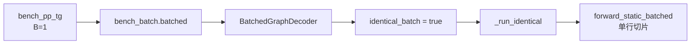
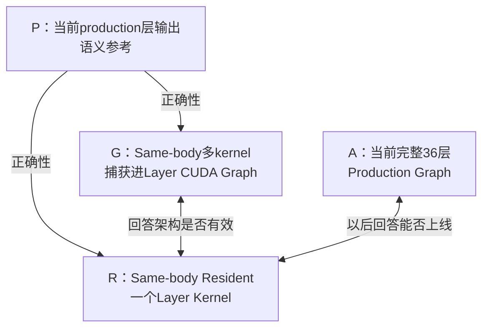

> **本课用词**：same-body 表示两臂使用相同数学实现；experiment card 冻结假设与合同；ABBA 交错运行两臂以降低时间漂移。

这张卡只回答一个问题：

> 相同计算body放进resident layer kernel，是否比相同body组成的CUDA Graph更快？

它暂时不测试页级流水、局部数据交接或新GEMM。一次只改变“执行组织方式”，结果才有因果解释。

## 先修正真实产品路径

当前TG@4K/8K的实际调用链是：



因此新Megakernel必须匹配当前 forward_static_batched，不能继续以历史`forward_static`为产品路径。

调用证据分别在：

- TG入口
- BatchedGraphDecoder调用
- identical capture分支
- 单行batched调用

这是实验卡里的第一条原则：

> 测量runtime真正走到的代码，而不是任务名暗示的代码。

---

# 实验卡

以下标记含义：

- `FACT`：当前源码已证明
- `PREREGISTERED`：运行前确定的规则
- `TBD`：必须到B200实测，不能提前填写

```yaml
card_id: Q3-B200-L18-SAMEBODY-GRAPH-vs-RESIDENT-v0
status: PREREGISTERED_NOT_RUN

planning_source:
  local_sha: 81c383bfc98b18a107b8d05fca6925a929248091
  local_worktree: clean
  measured_remote_sha: TBD
  note: "远端若不是同一SHA，必须重新生成卡或明确记录差异"

target:
  model: Qwen3-4B
  dtype: bf16
  hardware: 1x NVIDIA B200 sm_100
  sharing: exclusive GPU
  batch: 1
  layer_for_timing: 18
  contexts: [4096, 8192]
  production_path:
    status: FACT
    value: "BatchedGraphDecoder._run_identical → forward_static_batched"

goal:
  question: >
    相同tile数学、layout、精度、权重与workspace边界下，
    resident layer是否快于individual-stage CUDA Graph？
  product_win: false
  note: "本卡只判定执行架构；不能直接宣布完整模型WIN"
```

## 1. 层接口

当前实现并不是简单的：

```text
h → layer → h'
```

它把残差主干和待加入的projection结果分开携带：

```text
(delta_in, residual_in, KV, idx)
    ↓
一个内部transformer层
    ↓
(delta_out, residual_out, updated_KV)
```

原因是Down projection产生的`delta`，会在下一层开头通过fused add+RMSNorm加入残差。

实验卡中的精确接口：

```yaml
layer_contract:
  inputs:
    delta_in:       "[1, 2560] bf16"
    residual_in:    "[1, 2560] bf16"
    k_cache:        "[1, max_len, 8, 128] bf16"
    v_cache:        "[1, max_len, 8, 128] bf16"
    idx:            "device scalar"
    key_pos:        "[max_len]"
    layer_weights:  "layer 18 exact production weights"

  stages:
    - "add(delta_in, residual_in) + input RMSNorm"
    - "QKV projection"
    - "Q/K RMSNorm"
    - "NeoX RoPE"
    - "KV write"
    - "Attention"
    - "O projection"
    - "attention residual add + post-attention RMSNorm"
    - "Gate/Up projection"
    - "SwiGLU"
    - "Down projection"

  outputs:
    delta_out:      "[1, 2560] bf16"
    residual_out:   "[1, 2560] bf16"
    updated_k_slot: "[1, 8, 128] bf16"
    updated_v_slot: "[1, 8, 128] bf16"
```

主要中间形状：

| 对象 | 形状 |
|---|---|
| QKV | `[1,6144]` |
| Q | `[1,32,128]` |
| K/V | `[1,8,128]` |
| Attention输出 | `[1,4096]` |
| Gate/Up | `[1,19456]` |
| SwiGLU | `[1,9728]` |
| Down | `[1,2560]` |

四个projection合计约有192.5 MiB BF16权重。这只是形状分析，不是实测HBM流量。

---

## 2. 实验臂



```yaml
arms:
  P_semantic_reference:
    definition: "从当前forward_static_batched提取的层输入和输出"
    timed: false

  G_matched_graph:
    definition: >
      同一组source-visible device bodies分别作为多个kernel，
      捕获进一个layer CUDA Graph。
    timed: true

  R_resident:
    definition: >
      同一组device bodies由一个resident layer kernel调度执行，
      暂时保留与G相同的global workspace边界。
    timed: true

  A_full_production:
    definition: "当前完整36层production CUDA Graph"
    timed_in_this_card: false
    purpose: "后续产品集成比较"
```

## Same-body到底是什么意思？

G和R必须保持相同：

- tile大小和warp ownership
- 权重layout
- Attention算法
- 累加精度
- 归约顺序
- BF16舍入位置
- context长度
- 输入和KV快照

本卡只允许改变：

- 多个kernel还是一个resident kernel
- stage如何调度
- resident正确性所必需的同步

不能用cuBLAS组成G，再用完全不同的custom GEMV组成R，却称为same-body。

---

## 3. 假设和预期

```yaml
hypothesis:
  H1: >
    CUDA Graph中的多个stage kernel边界仍有可测成本；
    resident执行器删除的边界成本大于新增的dispatch/barrier成本，
    因此 T_R < T_G。
  H0: "T_R >= T_G，或差异落在harness噪声内"

expected_signals:
  wall:
    - "R的paired latency低于G"
  graph:
    - "host侧仍都是一次graph replay"
    - "G包含多个device kernel节点，R包含一个layer kernel节点"
  sass:
    - "主要数学指令结构保持一致"
    - "R新增controller、branch、barrier和fence"
    - "本卡不应声称删除大量stage global traffic"
  ptxas:
    - "R的register/shared可能上升"
    - "目标是0 spill load/store"
    - "不应出现无法解释的stack、LDL或STL"
  ncu:
    - "仅在paired wall出现信号后解释机制"
    - "检查barrier、eligible warps、issue active和instruction fetch"
```

重要区别：

> CUDA Graph已经把host提交折叠成一次graph launch，但Graph内部仍执行多个device kernel节点。

所以本实验不是简单重复“减少Python launch”。

---

## 4. 正确性合同

```yaml
correctness:
  layer_indices: [1, 18, 34]
  contexts: [4096, 8192]
  positions:
    - "depth"
    - "depth + 63"
    - "depth + 126"

  P_vs_G:
    required_outputs:
      - delta_out
      - residual_out
      - written_K
      - written_V
      - untouched_KV_regions
    rule: "若数学顺序相同则bitwise；否则必须运行前登记容差"

  G_vs_R:
    repetitions_per_snapshot: 100
    deterministic_self_replay: "100/100"
    finite_check: required
    guard_canary: required
    untouched_KV_bitwise: required

  negative_control:
    mutation: "RoPE position + 1"
    required_result: "验证器必须拒绝"

  performance_allowed_only_after: "所有正确性项通过"
```

总计：

```text
3层位置 × 2种context × 3个decode位置
= 18个真实快照
```

其中第18层用于正式计时；第1、34层是边界guardrail。

---

## 5. 计时边界

`fused_add_rmsnorm`可能原地修改输入，因此每次replay前必须恢复输入。

```yaml
timing:
  included:
    - "相同的D2D input reset"
    - "完整layer body"
    - "resident controller、semaphore、barrier、fence"
    - "所有输出publication"

  excluded:
    - prefill
    - embedding
    - final RMSNorm
    - LM head
    - argmax
    - graph capture
    - JIT compilation
    - model loading

  reset_control:
    rule: "G和R graph包含完全相同的reset prologue"
    separate_measurement: "reset-only graph"

  warmup:
    per_arm: 20
    included_in_timing: false

  retained_blocks: 12
  block_orders:
    - "G R R G"
    - "R G G R"
    - "两种顺序各6个，顺序运行前生成并保存"

  replays_per_segment: 512
  statistical_unit: "block，不是内部512次replay"
  outlier_policy: "不删除单个样本；污染时整block标INVALID"
```

ABBA结构中，两个臂的平均时间位置相同，可以抵消近似线性的升温和时钟漂移。

正式计时与NCU必须分开。NCU中的duration不能替代paired wall time。

---

## 6. 先标定harness自己的噪声

在比较G/R前，先做一个`G/G`假对照：

```yaml
null_control:
  arms: "G vs G，使用两个逻辑名称但调用相同binary"
  schedule: "同样12个balanced blocks"
  metric: "P95(abs(paired_delta))"
  output: "null_noise_floor_us"
```

如果G/G都经常差2微秒，就不能把G/R快1微秒写成Megakernel收益。

---

## 7. 判决规则

先根据当天完整模型基线计算closure预算：

\[
R_d=\frac{1000(A_d-A_d/1.10)}{36}
\]

其中 \(A_d\) 是当天TG@4K或TG@8K。

注意：

- `A/1.10`表示1.10×速度，即延迟下降9.09%
- `0.90A`表示延迟下降10%，相当于1.111×
- 两者不能混写

文档中的`2.671/2.805 ms`只能用于教学演算：

| 历史锚点 | `A/1.10` | 每层需省 |
|---:|---:|---:|
| 2.671 ms | 2.428 ms | 6.75 µs |
| 2.805 ms | 2.550 ms | 7.08 µs |

正式规则：

```yaml
decision_rules:
  INVALID_RERUN:
    any:
      - "P/G/R正确性或负控失败"
      - "G和R不是same-body"
      - "active path或binary SHA无法证明"
      - "GPU出现其他进程"
      - "capture/JIT混入计时"
      - "两臂reset、idx、context或KV不同"
      - "两种block顺序得出相反的大幅结果"

  NOISE:
    all:
      - "实验合同有效"
      - "paired gain不超过G/G null floor"
    action: "允许一次预注册确认性重跑"

  GO_ARCH:
    all:
      - "所有正确性门通过"
      - "R相对G paired p50至少快3%"
      - "至少10/12 blocks中R更快"
      - "paired区间不跨0"
      - "没有新spill/local-memory异常"
      - "机制证据与假设方向一致"

  GO_CLOSURE:
    all:
      - "GO_ARCH"
      - "4K和8K绝对收益均达到当天R_d"
    note: "仍然不是PRODUCT WIN，必须集成回36层实测"

  CONDITIONAL_GO:
    all:
      - "GO_ARCH"
      - "绝对收益未达到R_d"
      - "存在独立实测、未启用的数据边headroom可以保守闭合缺口"

  STOP_DIRECTION:
    any:
      - "R稳定慢于G"
      - "确认性重跑后仍处于噪声内"
      - "收益真实但远小于closure预算，且没有独立headroom"
      - "同步、register、spill或I-cache成本吃掉收益"
      - "只有NCU指标改善，paired latency不改善"
```

这里的3%是新实验建议门，不是Qwen/B200已经测出的物理常数。正式卡必须明确登记。

---

## 8. 运行后只填写这一部分

```yaml
actual:
  status: NOT_RUN

  runtime_attestation:
    remote_sha: TBD
    production_path_calls: TBD
    graph_body_calls: TBD
    resident_body_calls: TBD
    active_backends: TBD

  binaries:
    G_sha256: TBD
    R_sha256: TBD
    G_ptxas: TBD
    R_ptxas: TBD
    R_sass_path: TBD

  correctness:
    P_vs_G: TBD
    G_vs_R: TBD
    deterministic_100_of_100: TBD
    negative_control_convicted: TBD

  null_control:
    p95_abs_delta_us: TBD

  timing_4k:
    G_p50_us: TBD
    R_p50_us: TBD
    paired_gain_us: TBD
    paired_gain_pct: TBD
    faster_blocks: TBD
    paired_interval: TBD

  timing_8k:
    G_p50_us: TBD
    R_p50_us: TBD
    paired_gain_us: TBD
    paired_gain_pct: TBD
    faster_blocks: TBD
    paired_interval: TBD

  decision:
    architecture: TBD
    closure: TBD
    product: NOT_EVALUATED
    reason: TBD
    reopen_trigger: TBD
```

---

## 四种教学结果

以下全部是虚构数据，不是你的B200实测：

| 虚构结果 | 正确结论 |
|---|---|
| G=76.0µs，R=68.3µs，省7.7µs，11/12胜 | `GO_ARCH + GO_CLOSURE`，但仍需完整模型验证 |
| 稳定省4.5µs，另有独立测得3µs数据边 | `CONDITIONAL_GO` |
| 稳定省1.7µs，但离closure预算很远 | 机制真实但太小，`STOP_DIRECTION` |
| 总体看似省5µs，但两种顺序一正一负 | `INVALID_RERUN`，不是GO也不是STOP |
| R胜same-body G，却慢于production | `GO_ARCH / STOP_PRODUCT`，说明body不够强 |

最适合新手记住的是：

> G和R比较“resident架构是否有效”；R和production比较“能不能真正上线”。  
> SASS、NCU和launch数据负责解释，paired latency负责判决。
