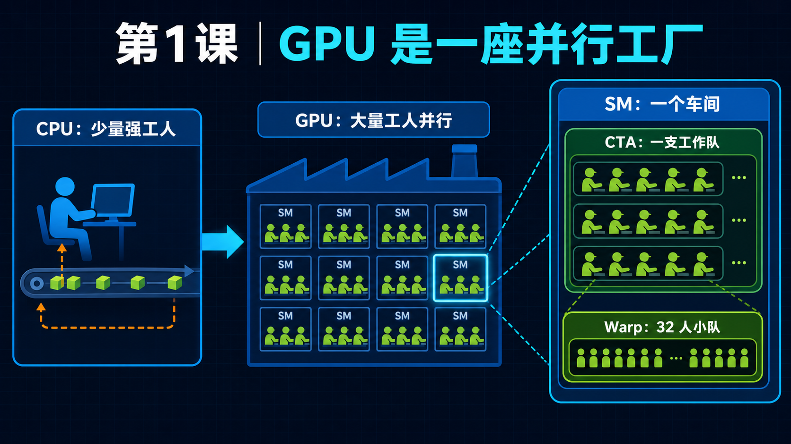

<!--
本文由 scripts/sync_lesson_readmes.rb 从对应的 _posts 文章确定性生成。
请编辑课程原文后重新运行同步脚本，不要单独修改本文件。
-->

# 第 1 课｜GPU 到底在做什么？从 Kernel 到 Megakernel



> 用厨房类比建立 GPU、SM、CTA、warp、kernel、CUDA Graph 与 Megakernel 的第一张心智地图。

## 零基础先看这里

- **它在解决什么：**GPU 为什么适合同时做许多计算？
- **把它想成：**GPU 像大厨房，SM 是工位，CTA 是被分到工位的小队。
- **这次先不用懂：**可先忽略 warp 调度与各级存储的精确参数。

## 本课结论与证据状态

- **一句话结论：**Megakernel 的价值来自减少真实边界成本，不来自 kernel 数量本身。
- **证据状态：**TEACHING SYNTHESIS · MIXED PROJECT EVIDENCE
- **怎么看这个标签：**它表示结论的来源与适用范围，不是课程难度；可查看[中文证据规则](../evidence.md)。

## 完整课程正文

> **本课用词**：CTA 与 CUDA thread block 同义；warp 通常包含 32 个线程；SM 是接纳 CTA 的处理器；kernel 是一次 GPU 程序入口。

把一张 B200 想象成一家巨型厨房：

| GPU 概念 | 厨房类比 | 实际含义 |
|---|---|---|
| GPU | 整家厨房 | 执行并行计算 |
| SM | 一个工作区 | B200 目标上有 148 个 |
| CTA / Block | 一支厨师小队 | 整队被分配到一个 SM |
| Warp | 32 名同步行动的厨师 | NVIDIA GPU 的基本执行单位 |
| Thread | 一名厨师 | 执行一份数据 |
| Register | 厨师手里的东西 | 最快、容量小、线程私有 |
| Shared Memory | 小队的工作台 | 同一 CTA 共享 |
| HBM / Global Memory | 大仓库 | 容量大，但搬运成本高 |
| Kernel | 一张工作订单 | GPU 执行的一段程序 |
| Kernel launch | CPU 下发订单 | 启动一次 GPU 程序 |

最重要的一点：

> Kernel 不是 GPU 本身，而是让 GPU 执行的一段程序。

## 一枚 token 需要经过什么

以 Llama-3.1-8B 的一层为例，可以先把复杂数学忽略，理解成下面的加工流水线：

```text
输入 hidden state
        │
        ▼
     RMSNorm            调整数值尺度
        │
        ▼
   QKV Projection       生成查询 Q、索引 K、内容 V
        │
        ▼
 Q/K Norm + RoPE        加入当前位置
        │
        ▼
   写入 KV Cache        保存历史信息
        │
        ▼
     Attention          从历史中寻找相关内容
        │
        ▼
 O Projection + Residual
        │
        ▼
      RMSNorm
        │
        ▼
 Gate/Up → SwiGLU       非线性特征加工
        │
        ▼
 Down + Residual
```

Llama-3.1-8B 要重复约 32 层，最后再做：

```text
Final Norm → LM Head → 所有词的分数 → 选择下一个 token
```

所以生成一个 token，并不是执行一次矩阵乘法，而是执行一长串操作。

---

## 普通多 Kernel 是怎样执行的

最直观的实现是一个操作对应一个或几个 kernel：

```text
CPU
 │ launch
 ▼
[RMSNorm kernel]
 │ 数据写到全局内存
 ▼
[QKV GEMM kernel]
 │
 ▼
[RoPE kernel]
 │
 ▼
[Attention kernel]
 │
 ▼
[O GEMM kernel]
 │
 ▼
...
```

每个 kernel 结束时：

- 它的 registers 消失；
- shared memory 里的数据消失；
- 要交给下一个 kernel 的数据通常必须放进全局内存；
- 后续 kernel 需要重新建立线程和数据流水线。

优点是每个操作都能使用最适合自己的实现，例如 CUTLASS、cuBLAS 或高度优化的 attention kernel。

缺点是边界多。

## CUDA Graph 做了什么

CUDA Graph 不是把这些 kernel 合并。

它更像是提前把所有订单装订成一本册子：

```text
第一次：记录整套订单和依赖关系

以后：
CPU ── replay graph ──► GPU 执行 K1 → K2 → K3 → K4
```

因此：

- CPU 不需要逐个 launch；
- host launch 开销大幅降低；
- 但 GPU 上依然是很多独立 kernel；
- registers/shared memory 仍然不能跨 kernel 保存。

一句话：

> CUDA Graph 优化的是“下订单”，不是把所有厨房工序变成一道工序。

你的 B=16 Graph 已经达到约 98.3% GPU-busy，所以 CPU launch 本来就不是最大的空洞。这也是为什么继续减少小 kernel，收益可能很有限。

---

## Megakernel 做了什么

Megakernel 是把许多操作放进同一个物理 kernel：

```text
CPU
 │ 只 launch 一次
 ▼
┌──────────────────────────────┐
│ QKV                          │
│   ↓                          │
│ RoPE / KV                    │
│   ↓                          │
│ Attention                    │
│   ↓                          │
│ O Projection                 │
│   ↓                          │
│ MLP                          │
│   ↓                          │
│ 下一层……                     │
└──────────────────────────────┘
```

这样有机会：

- 只启动一次；
- 让 CTA 保持存活；
- 数据直接从 producer 交给 consumer；
- 数据可能保留在 register、shared memory 或 TMEM；
- 一个数据分块准备好后，消费者立即开始，不必等待整个阶段完成。

但注意：把所有代码放进一个 `{}` 里，并不会自动获得这些收益。

如果内部仍然这样：

```text
做 QKV
grid.sync
写全局内存

读全局内存
做 Attention
grid.sync

写全局内存
读全局内存
做 O
grid.sync
```

那么只是把外部 kernel 边界变成了内部 `grid.sync`：

> 这是 launch fusion，不是真正的 dataflow fusion。

这正是你的早期全模型 megakernel 为什么只有一个 launch，却仍比 CUDA Graph 慢的主要原因之一。

## Persistent Kernel 又是什么

Persistent 描述的是 kernel 的“工作方式”：

```cpp
kernel 启动
    ↓
CTA 驻留在 GPU
    ↓
while (还有任务) {
    从队列获取指令
    执行指令
    发布完成状态
}
```

因此：

- Megakernel 描述“这个 kernel 覆盖多少工作”；
- Persistent 描述“CTA 是否长期驻留并持续取活”。

它们经常一起出现，但不等同：

```text
大但执行完就退出
    = megakernel，未必 persistent

长驻、不断处理许多小任务
    = persistent，未必是整模型 megakernel

整模型 + CTA 常驻取指令
    = persistent megakernel
```

你的 8B legacy 实现属于第三种。但它每生成一个 token 仍然重新 launch，所以准确叫：

> per-token persistent megakernel

而不是跨 token 永久运行的推理引擎。

---

## 为什么“kernel 少了”不一定更快

总时间可以粗略写成：

```text
总时间 =
    真正计算
  + 内存搬运
  + 同步等待
  + SM 空闲
  + 调度成本
  + launch 开销
```

Megakernel 主要尝试减少后面几项中的一部分，但它可能同时增加：

- `grid.sync`；
- atomic polling；
- 固定网格造成的 SM 空闲；
- register pressure；
- shared-memory 占用；
- spill 到 local memory；
- 自定义矩阵乘 executor 比 CUTLASS 慢。

所以判断胜负的公式其实是：

```text
省掉的 launch + 搬运 + 等待
                >
新增加的同步 + 空闲 + 资源压力 + executor 损失
```

只有这个不等式成立，megakernel 才会赢。

## 用这个模型看你的四阶段实验

## Qwen 微融合

你只合并了 Q/K Norm 和 RoPE。

类似于：

> 把“切菜、拌菜、装盘”合成一个小工序，但烧菜、炒菜和主食仍由其他厨房完成。

CUDA Graph 已经降低了下订单成本，因此最后只有约 1.43% 的单次会话改善。这不能否定 megakernel，只能说明融合边界太小。

## 全模型单 Kernel

你把整套菜单都塞进同一个厨房订单，物理 launch 确实只剩一个。

但是：

- 148 个 CTA 经常需要互相等待；
- 一个阶段的高 register/shared-memory 需求限制整个 kernel；
- 固定 148-CTA 网格未必适合每个矩阵；
- 中间结果仍大量经过全局内存。

所以从约 849.9 ms 优化到约 5.35 ms 是巨大的 executor 改进，但仍慢于约 3.41 ms 的 CUDA Graph。

## 真正的数据流交接

后来有效的实验更像：

> 上一道工序不把盘子送回仓库，而是直接递给旁边下一位厨师。

例如：

- weight page 一到，负责它的 warp 马上计算；
- QKV 结果直接交给 RoPE/KV/attention；
- Gate 和 Up 共用一次 activation 搬运；
- CTA 保留数据所有权；
- 使用正确的 release/acquire 发布完成状态。

这些才产生了 1.27×、1.34× 或单层 14–16% 这样的机制信号。

## 选择性 Megakernelization

最后更成熟的思路是：

- GEMM 继续使用强大的现成 kernel；
- attention 继续使用成熟实现；
- 只融合真正存在昂贵数据交接的局部；
- CUDA Graph 继续负责整体调度；
- 输出缓冲直接复用，避免无意义的中间搬运。

这就是你的核心结论：

> 不追求最大的 kernel，而是寻找最值得留在设备内的边。

## 现在只需牢牢记住四句话

1. Kernel 是 GPU 执行的一段程序。
2. CUDA Graph 是批量提交多个 kernel，不是单 kernel。
3. Persistent kernel 是 CTA 长驻取活。
4. Megakernel 是否有价值，取决于真实数据流和同步代价，而不是名字或 launch 数量。

## 读完自检

1. 先不看上文，用自己的话回答：GPU 为什么适合同时做许多计算？
2. 再对照本课结论：Megakernel 的价值来自减少真实边界成本，不来自 kernel 数量本身。
3. 根据 `TEACHING SYNTHESIS · MIXED PROJECT EVIDENCE`，说出这条结论能证明什么、不能外推什么。

## 继续学习

- [在线阅读本课](https://qhy991.github.io/gpu-megakernel-course-art/lessons/gpu-kernel-mental-model/)
- [下一课 · 第 2 课：一枚 Token 如何穿过 Llama →](../lesson02/)
