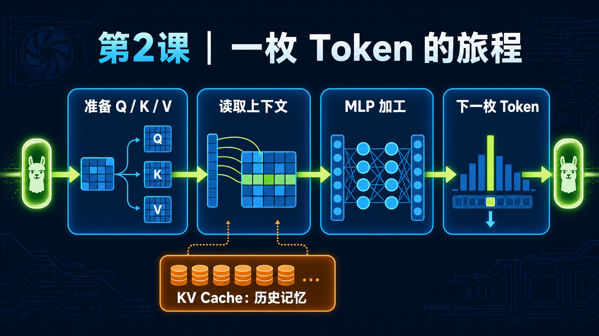

<!--
本文由 scripts/sync_lesson_readmes.rb 从对应的 _posts 文章确定性生成。
请编辑课程原文后重新运行同步脚本，不要单独修改本文件。
-->

# 第 2 课｜一枚 Token 如何穿过 Llama



> 沿 RMSNorm、QKV、RoPE、KV Cache、Attention 和 MLP 追踪 decode 数据流，找到真正昂贵的交接边。

## 零基础先看这里

- **它在解决什么：**模型生成一个字，数据要经过哪些步骤？
- **把它想成：**像包裹沿流水线经过验货、加工和封装，token 也逐层变换。
- **这次先不用懂：**可先忽略矩阵尺寸和每个算子的公式。

## 本课结论与证据状态

- **一句话结论：**先画清 token 的数据流，才知道哪些边值得融合。
- **证据状态：**TEACHING SYNTHESIS · PROJECT SHAPES
- **怎么看这个标签：**它表示结论的来源与适用范围，不是课程难度；可查看[中文证据规则](../evidence.md)。

## 完整课程正文

> **本课用词**：prefill 一次处理一段输入；decode 每轮生成一个新 token；GQA 让多个 Q head 共享较少的 K/V head；KV Cache 保存历史 K/V。

先区分两个阶段：

- Prefill：一次处理整段提示词，例如 4096 个 token。
- Decode：每轮只生成一个新 token。

你主要研究的是 decode。`B=16` 表示同时服务 16 条序列、每条各生成一个 token，不是给一条序列一次生成 16 个 token。

以 Llama-3.1-8B、B=16 为例，一层的输入大致是：

```text
X.shape = [16, 4096]
```

16 是 batch，4096 是每个 token 的隐藏特征数量。

```mermaid
flowchart LR
    X["输入 X<br/>16 × 4096"] --> N1["RMSNorm"]
    N1 --> QKV["QKV Projection"]
    QKV --> QR["Q/K Norm + RoPE"]
    QR --> KV["写 KV Cache"]
    KV --> A["Attention"]
    A --> O["O Projection"]
    O --> R1["Residual Add"]
    R1 --> N2["RMSNorm"]
    N2 --> GU["Gate + Up"]
    GU --> S["SwiGLU"]
    S --> D["Down Projection"]
    D --> R2["Residual Add"]
    R2 --> NEXT["下一层"]
```



## 1. RMSNorm：把数字调整到合适尺度

神经网络里的数值可能忽大忽小。RMSNorm 会计算一整行的均方根：

```text
rms = sqrt(mean(x²) + epsilon)
y   = x / rms × weight
```

直觉上，它把一个 token 的 4096 个特征调整到稳定尺度。

它有一个性能特点：

> 必须先看完整行，才能知道这一行的归一化系数。

所以 RMSNorm 内部存在 reduction，即多个线程先计算部分平方和，最后汇总。

潜在融合机会：

```text
RMSNorm → QKV GEMM
```

普通路径需要：

1. RMSNorm 读取 X；
2. 写出归一化后的 X；
3. QKV GEMM 再读一次。

理想 megakernel 希望让归一化后的数据直接进入 QKV。但困难是：成熟 GEMM 有自己的数据布局和流水线，强行融合可能破坏它的执行效率。

---

## 2. QKV：生成“问题、索引和内容”

QKV Projection 是三个矩阵乘：

```text
Q = X × Wq
K = X × Wk
V = X × Wv
```

可以把它们理解成：

- Q，Query：当前 token 想寻找什么；
- K，Key：历史 token 可以用什么标签被找到；
- V，Value：历史 token 真正携带的内容。

Llama-3.1-8B 使用 GQA：

```text
Q：32 个头
K： 8 个头
V： 8 个头
每个头：128 个元素
```

也就是每 4 个 Q 头共享一组 K/V 头。

这是为了减小 KV Cache，同时保留较多查询头。

## 3. Q/K Norm 和 RoPE：加入位置信息

Q/K Norm 再次调整 Q、K 的尺度。

RoPE 会根据 token 的位置旋转 Q 和 K 中成对的元素。它让模型知道：

- 当前 token 在哪里；
- 两个 token 相隔多远；
- 前后顺序是什么。

V 不需要 RoPE。

你 7 月的 Qwen 工作只融合了这一小段：

```text
Q Norm
K Norm       → fused_qk_norm_rope
RoPE
```

QKV、KV 写入、attention、O 和 MLP 都没有进入这个 kernel。因此它是 micro-fusion，不是 layer megakernel。

---

## 4. KV Cache：模型的短期记忆

生成第 1000 个 token 时，模型不能重新计算前 999 个 token 的 K/V。

因此每一层都保存：

```text
K Cache[position] = 当前 K
V Cache[position] = 当前 V
```

下一轮只生成新的 Q、K、V：

- 新 K/V 追加进缓存；
- 新 Q 查询整个历史 KV Cache。

上下文越长，attention 需要读取的 KV Cache 越大。

---

## 5. Attention：从历史里查资料

简化公式是：

```text
score  = Q × K_cache
weight = softmax(score)
output = weight × V_cache
```

可以把它想象成：

1. Q 给每个历史位置打相关性分数；
2. softmax 把分数变成权重；
3. 按权重混合历史 V。

#### 为什么你的 split-KV 很有效

在 legacy 8B、B=1 路径里只有 8 个 KV heads。如果每个 head 只有一个任务：

```text
8 个大任务 → 148 个 SM
```

绝大多数 SM 没活干。

你的 split-KV 把每个长上下文切成多段：

```text
8 个 KV heads × 16 个 partitions
= 128 个并行任务
```

就像原来让 8 个人各自读一本很长的书，现在把每本书拆成 16 章，让 128 个人同时查。

每个 partition 返回：

- 局部最大分数；
- 局部指数和；
- 局部加权 V。

最后再做一次稳定的 online-softmax reduction。

虽然多了一次归并，但大幅提高了并行度，因此：

- 4K 上下文：内部约 `2.85×`
- 8K 上下文：内部约 `4.31×`

这说明真正的问题不是 launch，而是原始 attention 没有喂饱 148 个 SM。

---

## 6. O Projection：把多个头混合回来

Attention 输出仍按多个 head 分开。O Projection 把它们重新混合到 4096 维：

```text
O = AttentionOutput × Wo
X = X + O
```

后面的 `X + O` 是 residual connection。

Residual 的作用可以理解为：

> 这一层只学习“应该在原信息上修改什么”，而不必从头重建全部信息。

潜在融合边：

```text
Attention → O Projection → Residual
```

但 O Projection 通常是高质量 GEMM。若 megakernel 中的自定义 GEMM 不如 CUTLASS，即使省掉一次中间写回，也可能得不偿失。

---

## 7. MLP：每层里最大的特征加工厂

Attention 后面是 MLP：

```text
Gate = X × Wgate
Up   = X × Wup

Hidden = SiLU(Gate) × Up

Down = Hidden × Wdown
X    = X + Down
```

Llama-3.1-8B 的中间维度是 14336：

```text
输入： [16, 4096]
Gate：[16, 14336]
Up：  [16, 14336]
输出： [16, 4096]
```

Gate 和 Up 是两块很大的中间数据。

普通实现可能这样运行：

```text
Gate GEMM → Gate 写全局内存
Up GEMM   → Up 写全局内存

SwiGLU 重新读取 Gate 和 Up
       → 写出 Hidden

Down GEMM 重新读取 Hidden
```

你的 Phase 13 做了真正的数据流融合：

```text
一次读取 activation
        │
        ├─ 计算 Gate
        └─ 计算 Up
              │
              ▼
      TMEM / Register 内完成 SwiGLU
              │
              ▼
       只写紧凑的 Hidden
```

它删除了 32 层合计约 56 MiB 的 Gate/Up 往返流量。

结果整模型只快约 1.3–1.5%。这并不是失败，而是在告诉你：

> 这一条边确实有效，但它只占整个模型时间的一部分。

这就是 Amdahl 定律：局部优化再强，整步收益也受它原来占比限制。

---

## 为什么 Down → RMSNorm 特别难融合

Down Projection 的一个输出元素，通常需要多个分块共同累加。

RMSNorm 又需要完整的 4096 维结果才能计算平方和：

```text
多个 CTA 计算 Down 的部分结果
              │
              ▼
      必须确认整行已经完成
              │
              ▼
          Residual Add
              │
              ▼
            RMSNorm
```

你的 tile-DAG 尝试让部分 tile 完成后提前启动消费者。

听起来很好，但消费者必须不断检查完成标签。最终产生每层至少约 32,768 次 tag load，整步反而回退 1.79%。

这个负例非常重要：

> “更细粒度地开始”并不是免费的；检查就绪状态本身也会成为工作。

---

## Persistent Megakernel 如何调度这些工作

你的 canonical runtime 可以想成 GPU 里的小型操作系统：

```text
Controller
   │
   ├─ 读取下一条 tile instruction
   ├─ 检查输入是否 ready
   ├─ 把任务交给对应 worker
   └─ 管理 page 和 semaphore

Workers
   ├─ QKV worker
   ├─ Attention worker
   ├─ O worker
   └─ MLP worker
```

每条小指令大致执行：

```cpp
while (还有指令) {
    instruction = 获取下一条指令();

    等待输入数据就绪();

    执行一个数据 tile;

    release 发布完成状态;
}
```

其中最容易出错的是最后一步。

如果 producer 先修改“完成计数器”，数据却还没真正对其他 SM 可见，consumer 可能看到：

```text
完成标志 = 已完成
数据      = 旧数据
```

这就是你 Phase 79–82 遇到的跨 CTA 可见性问题。最终使用 GPU-scope release/acquire 才保证：

```text
producer 写完数据
        ↓
release 发布完成
        ↓
consumer 看到完成
        ↓
acquire 后读取新数据
```

20 次测试没发现，100 次重复才暴露问题。这也是 persistent kernel 正确性比普通 kernel 更难的原因。

---

## 现在可以怎样理解你的主要实验

| 实验 | 真正解决的问题 |
|---|---|
| QK Norm + RoPE 微融合 | 减少几个小操作边界 |
| 全模型单 kernel | 证明整模型可以放进一个物理 launch |
| Split-KV | 让长上下文 attention 喂饱更多 SM |
| Page-granular readiness | 数据页到了就计算，重叠搬运与执行 |
| Gate/Up handoff | 避免大中间张量写回再读取 |
| Phase82 full overlap | 将规则 DAG 的安全 overlap 留在设备端 |
| Graph `out=` | 不扩大 kernel，只消除一条无效内存交接 |

其中最接近 megakernel 本质的是后三类，而不只是“全模型单 kernel”。

## 新手自测

如果下面三道题能答出来，这一课就掌握了：

1. CUDA Graph 里面还有没有多个 kernel？
   有。Graph 主要减少 CPU 提交开销。

2. 为什么 split-KV 明明增加了 reduction，反而更快？
   因为它把 8 个大任务变成约 128 个并行任务，显著提高 SM 利用率。

3. 为什么删除 56 MiB 流量，整模型只快约 1.4%？
   因为只优化了一条局部数据流，其他 GEMM、attention、同步仍占大部分时间。

## 读完自检

1. 先不看上文，用自己的话回答：模型生成一个字，数据要经过哪些步骤？
2. 再对照本课结论：先画清 token 的数据流，才知道哪些边值得融合。
3. 根据 `TEACHING SYNTHESIS · PROJECT SHAPES`，说出这条结论能证明什么、不能外推什么。

## 继续学习

- [在线阅读本课](https://qhy991.github.io/gpu-megakernel-course-art/lessons/token-through-llama/)
- [← 上一课 · 第 1 课：GPU 到底在做什么？从 Kernel 到 Megakernel](../lesson01/)
- [下一课 · 第 3 课：怎样读懂 GPU 性能报告 →](../lesson03/)
