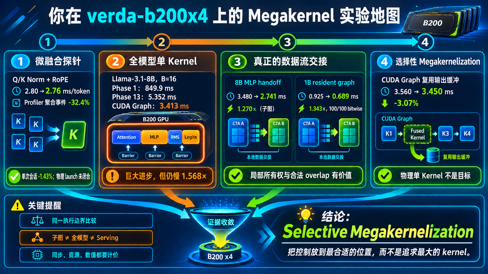

<!--
本文由 scripts/sync_lesson_readmes.rb 从对应的 _posts 文章确定性生成。
请编辑课程原文后重新运行同步脚本，不要单独修改本文件。
-->

# 第 5 课｜怎样准确介绍你的 Megakernel 工作



> 把研究成果整理成 30 秒版本、完整叙事、证据边界和常见追问，避免把局部结果说成全系统结论。

## 零基础先看这里

- **它在解决什么：**怎样把优化成果讲得可信又不夸大？
- **把它想成：**像汇报实验，既说哪里有效，也说哪里无效、结论适用于哪里。
- **这次先不用懂：**可先忽略报告排版和术语润色，先守住证据边界。

## 本课结论与证据状态

- **一句话结论：**最可信的叙事同时讲清正例、负例和不能外推的范围。
- **证据状态：**RESEARCH SYNTHESIS · MIXED EVIDENCE
- **怎么看这个标签：**它表示结论的来源与适用范围，不是课程难度；可查看[中文证据规则](../evidence.md)。

## 完整课程正文

> **本课用词**：selective megakernelization 指只融合有价值的数据流边；matched comparison 指两臂除预注册变量外保持一致；serving wall 是服务端端到端时间。

先记住最核心的一句话：

> 我研究的不是怎样把所有算子硬塞进一个大 kernel，而是 LLM decode 的执行控制应该放在 CPU、CUDA Graph 还是常驻 GPU kernel 中，以及哪些数据流值得留在设备内部。

## 30 秒介绍版

你可以这样讲：

> 传统 LLM 推理由很多高度优化的 GPU kernel 组成，CUDA Graph 可以降低 CPU 启动开销，但 kernel 之间仍然不能保留 registers 和 shared memory。Megakernel 尝试让 CTA 常驻 GPU，在一个更大的执行边界中完成多个算子，从而减少边界、数据写回和等待。不过单 kernel 也会带来 grid 同步、固定网格和资源耦合。我在 B200 上发现，全模型物理单 kernel 目前仍慢于优化后的 CUDA Graph；真正稳定的收益主要来自 split-KV、page-level readiness、CTA-local handoff 和局部缓冲复用。因此最终方向是 Selective Megakernelization：只把值得留在设备内的控制和数据流融合起来。

这段已经基本准确地覆盖了你的研究。

---

## 完整研究故事

## 1. 研究问题

一个 Llama decode step 包含：

```text
Norm
→ QKV
→ RoPE/KV
→ Attention
→ O
→ Norm
→ Gate/Up
→ SwiGLU
→ Down
→ 下一层
```

传统方案给每个阶段使用独立 kernel。

CUDA Graph 可以提前记录并批量重放这些 kernel，但每个 kernel 结束后：

- registers 消失；
- shared memory 消失；
- CTA 所有权消失；
- 中间数据通常必须变成全局可见状态。

于是你的问题是：

> 如果让 GPU 上的 CTA 常驻，并在设备内调度整条 DAG，能否超过 CUDA Graph？

## 2. 第一阶段：小范围融合探针

Qwen3-4B 实验只融合了：

```text
Q RMSNorm
K RMSNorm
RoPE
```

结果：

```text
2.80 → 2.76 ms/token
约 1.43% latency 改善
```

它没有达到约 10% 的目标。

正确结论不是：

> Layer megakernel 失败了。

而是：

> 在 CUDA Graph 已经压低启动开销时，只融合 Q/K Norm 和 RoPE，覆盖范围不足。

这是一次 micro-fusion 探针。

## 3. 第二阶段：真正的全模型物理 kernel

随后你构建了 Llama-3.1-8B、B=16 的 cooperative full-forward kernel：

```text
一个 __global__
    ├── 所有 decoder layers
    ├── Attention
    ├── MLP
    ├── Final Norm
    └── LM Head
```

演进大致是：

```text
初始标量证明：约 849.9 ms
加入 Tensor Core executor、CTA Norm、LM Head、
shared KV、QKV handoff、快速 softmax、Gate/Up handoff
                     ↓
Phase 13：约 5.352 ms

同期 CUDA Graph：约 3.413 ms
```

这证明了两件事：

1. 整模型确实可以装入一个物理 GPU kernel；
2. 只有一个 launch 并不自动更快。

它仍慢的主要结构原因包括：

- 大量内部阶段同步；
- 固定 148-CTA 网格并不适合所有算子；
- 一个阶段的寄存器和 shared memory 需求限制整个 kernel；
- 自定义 executor 必须同时追赶 CUTLASS、attention 和其他成熟实现；
- 部分“融合”仍通过全局 workspace 交接数据。

这让研究方向从 launch fusion 转向 dataflow fusion。

## 4. 第三阶段：寻找真正有效的机制

你后来发现，强正例通常满足三个条件：

```text
数据已经局部就绪
Producer/Consumer 所有权可以对齐
交接成本低于写回全局内存的成本
```

代表性结果包括：

- B=1 长上下文 split-KV：
  - 4K 内部约 `2.85×`
  - 8K 内部约 `4.31×`
- Weight page readiness：
  - 单层约快 14–16%
  - 32 层整模型约快 21.7%
- 8B MLP deterministic handoff：
  - `3.480→2.741 ms`
  - 子图 `1.270×`
- 1B Phase82 resident full-overlap：
  - `0.925→0.689 ms`
  - 保守 `1.343×`
  - 100/100 bitwise

这些数字来自不同模型、batch、边界和实验分支，不能相加成一个总 speedup。它们的意义是证明不同机制。

## 5. 第四阶段：选择性融合

最终 B=16 Graph 路线没有追求物理单 kernel，而是复用 SwiGLU 输出缓冲：

```text
原路径：
SwiGLU → 临时输出 → Down 再读取

新路径：
SwiGLU 直接写入 Down 的输入缓冲
```

结果：

```text
3.560 → 3.450 ms
约 -3.07%
```

Graph 节点数没有减少，但真实数据流改善了。

这正是 Selective Megakernelization：

> 不以 kernel 数量作为目标，以 critical path、数据所有权和局部交接作为目标。

---

## 你的研究可以用三个坐标理解

| 坐标 | 左端 | 右端 |
|---|---|---|
| 控制放在哪里 | CPU 调度 | GPU resident controller |
| 融合边界多大 | 单算子 | 整层/整模型 |
| 数据放在哪里 | HBM workspace | Shared/TMEM/Register |

“更靠右”并不自动更好。

例如：

- GPU 控制可以减少 host round trip，但会增加设备端调度；
- 边界更大可以保存数据，但会增加资源耦合；
- 数据留在片上更快，但容量有限、同步困难。

你的研究实际是在寻找这三个坐标的最佳组合，而不是全部推到最右边。

---

## 别人最可能问的问题

## “所以 Megakernel 到底赢了吗？”

最准确的回答：

> 在相同执行算子的受控实验中，resident overlap 和若干数据流机制赢了；但当前整模型实现还没有在所有上下文和完整 serving 边界上稳定超过成熟 CUDA Graph、Hazy upstream 或 SGLang。

也就是：

```text
机制成立
≠ 实验分支整体领先
≠ 生产系统领先
```

## “全模型 kernel 慢于 Graph，那工作是不是失败？”

不是。

研究价值在于确定：

- launch reduction 的真实上限；
- 哪些阶段会被固定网格拖累；
- 哪些数据流边值得融合；
- readiness 应该细到什么粒度；
- release/acquire 如何保证正确性；
- 哪些常见优化直觉实际上无效。

负结果把搜索空间缩小了。

## “最重要的正结果是什么？”

如果讲机制：

> Page-granular readiness 和 same-body resident overlap。

前者说明“数据一页到达就消费”可以显著减少等待；后者说明，在 executor 相同的情况下，把合法 overlap 和控制留在 GPU 内确实能获得收益。

如果讲工程：

> CUDA Graph 中的选择性缓冲复用。

它风险低、正确性边界清晰，并且给出了稳定整步收益。

## “为什么 CUDA Graph 这么强？”

因为它同时拥有：

- 很低的 host launch 开销；
- 每个算子最成熟的 executor；
- 不同 kernel 各自独立的资源配置；
- 不需要让最重 phase 限制整条程序；
- 更简单的正确性模型。

Megakernel 必须获得足够大的数据流收益，才能补偿这些优势。

## “这和 Persistent Kernel 是什么关系？”

你的 resident runtime 同时是 persistent kernel 和 megakernel：

- persistent：CTA 在一次 launch 内常驻并循环取指令；
- megakernel：一次执行覆盖很多算子甚至整模型。

但它每生成一个 token 仍然重新 launch，所以是 per-token persistent megakernel，不是跨 token 永驻的 serving engine。

## “这和 MPS 有什么关系？”

MPS 负责多进程共享 GPU。

Legacy megakernel 几乎占满全部 SM，并且早期还依赖物理 SM ID 映射队列，因此更接近独占 GPU 设计，不适合直接声称 MPS-safe。Canonical 使用 `blockIdx.x` 消除了这项正确性依赖，但资源占用问题仍然存在。

---

## 最容易夸大的五句话

不要说：

```text
1. kernel 数少了 32%，所以 GPU 快了。
2. occupancy 低，所以一定要减 registers。
3. 删除了 56 MiB，所以理论上一定更快。
4. 子图快 1.27×，所以整模型快 1.27×。
5. 一个 kernel 就是 persistent engine。
```

应该说：

```text
1. Profiler 聚合事件减少，但物理 launch 与整步收益需单独闭合。
2. Registers、shared memory、stall 和 eligible warps要一起看。
3. 删除字节是机制证据，整步 paired latency 才是采用证据。
4. 子图结果只证明该局部 handoff。
5. Persistent 描述驻留执行方式，不由 kernel 数决定。
```

## 一页式心智模型

```text
Megakernel 的潜在收益
├── 少一些 launch / ramp
├── 数据保留在片上
├── Producer/Consumer 直接交接
├── 更细粒度 readiness
└── 设备端调度与 overlap

Megakernel 的潜在代价
├── grid.sync / semaphore / polling
├── 固定网格与 SM 空闲
├── registers/shared-memory 耦合
├── spill 和低 eligible warps
├── 自定义 executor 落后成熟库
└── 更复杂的数值与内存可见性

最终判断
└── 节省的成本 > 新增加的成本
```

你可以把最终研究主张概括为：

> Megakernel 不是一个“越大越好”的 kernel，而是一种执行控制放置方案。B200 上最有效的设计，是保留成熟 executor，并选择性地将具有局部所有权、可证明 readiness 和高数据往返成本的边搬进 resident runtime。

## 读完自检

1. 先不看上文，用自己的话回答：怎样把优化成果讲得可信又不夸大？
2. 再对照本课结论：最可信的叙事同时讲清正例、负例和不能外推的范围。
3. 根据 `RESEARCH SYNTHESIS · MIXED EVIDENCE`，说出这条结论能证明什么、不能外推什么。

## 继续学习

- [在线阅读本课](https://qhy991.github.io/gpu-megakernel-course-art/lessons/explain-your-work/)
- [← 上一课 · 第 4 课：Megakernel 优化决策树](../lesson04/)
- [下一课 · 第 6 课：从源码识别三种融合 →](../lesson06/)
