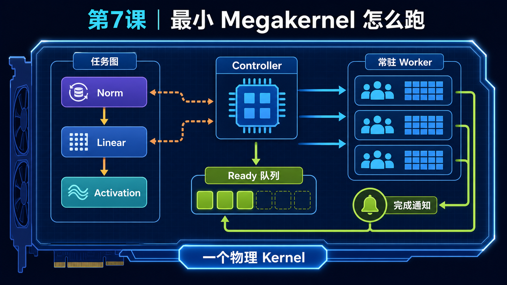
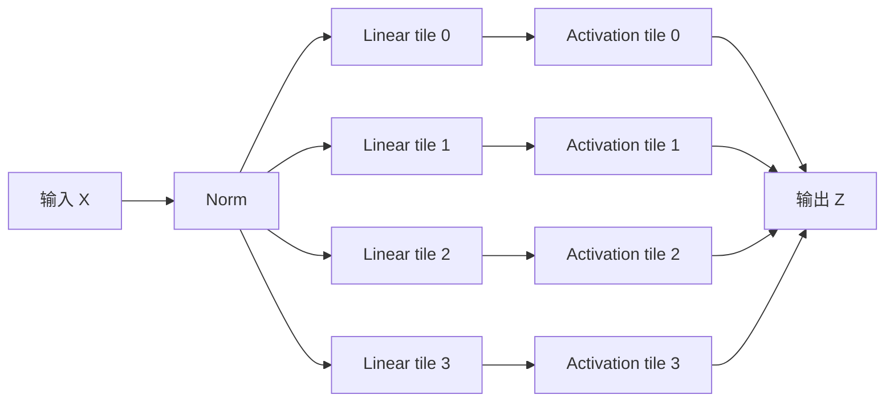

<!--
本文由 scripts/sync_lesson_readmes.rb 从对应的 _posts 文章确定性生成。
请编辑课程原文后重新运行同步脚本，不要单独修改本文件。
-->

# 第 7 课｜亲手搭一个最小 Megakernel



> 用 Norm→Linear→Activation 玩具 DAG 学习 per-SM queue、event、shared page 和 release/acquire 的连接方式。

## 零基础先看这里

- **它在解决什么：**一个最小 Megakernel 至少要管哪些事？
- **把它想成：**像小工厂的总调度员，要分派任务、等待前序完成并回收资源。
- **这次先不用懂：**可先忽略高性能矩阵乘实现和硬件极限。

## 本课结论与证据状态

- **一句话结论：**最小 Megakernel 也是一个带依赖、队列和生命周期的调度系统。
- **证据状态：**TEACHING PSEUDOCODE · NOT AN IMPLEMENTATION
- **怎么看这个标签：**它表示结论的来源与适用范围，不是课程难度；可查看[中文证据规则](../evidence.md)。

## 完整课程正文

> **本课用词**：DAG 是有向无环任务图；producer 产生数据；consumer 使用数据；event 表示依赖完成；伪代码用于解释合同而非直接编译。

这一课只用三个算子：

```text
X → Norm → Linear → Activation → Z
```

目标不是写出能编译的 CUDA，而是看懂一件事：

> Megakernel 怎样把计算图编译成 GPU 内部的任务队列，再由常驻 CTA 执行。

为方便理解，我们假设 GPU 只有 4 个 worker CTA。真实 B200 上，你的实现通常启动约 148 个 CTA，争取做到每个 SM 驻留一个。

## 1. 从计算图开始

把 Linear 沿输出维度切成 4 个 tile：



这个图叫 DAG，它只表达：

- Linear 必须等待 Norm；
- 每个 Activation tile 必须等待对应的 Linear tile；
- 4 个 Linear tile 彼此可以并行。

DAG 还没有决定哪个 CTA 执行什么。

---

## 2. Scheduler 把 DAG 变成队列

我们把任务分配给 4 个 worker CTA：

| Worker CTA | 指令队列 |
|---|---|
| CTA 0 | `NORM → LINEAR(0) → ACT(0) → STOP` |
| CTA 1 | `等待 NORM → LINEAR(1) → ACT(1) → STOP` |
| CTA 2 | `等待 NORM → LINEAR(2) → ACT(2) → STOP` |
| CTA 3 | `等待 NORM → LINEAR(3) → ACT(3) → STOP` |

这里有两种依赖。

#### 跨 CTA：Norm → Linear

Norm 在 CTA 0 执行，其他 CTA 也要读取结果。因此需要：

```text
CTA 0 写完 Xnorm
      ↓
release：发布 NORM_READY
      ↓
CTA 1/2/3 acquire：确认数据已经可见
      ↓
开始 Linear
```

#### 同 CTA：Linear → Activation

例如 `LINEAR(2)` 和 `ACT(2)` 都由 CTA 2 执行。

Linear 可以把结果放在该 CTA 自己的 shared-memory page 中，Activation 立即消费：

```text
LINEAR(2) → shared page → ACT(2)
```

这条边不需要全局 event，也不必把中间结果写回 HBM。

这才是很有价值的 dataflow handoff。

---

## 3. 一条“指令”长什么样

这里的指令不是 PTX 或 SASS，而是我们为 Megakernel 定义的应用层指令：

```cpp
enum Op {
    NORM,
    LINEAR_TILE,
    ACT_TILE,
    STOP
};

struct Instruction {
    Op  opcode;
    int tile_id;

    int wait_event;    // 执行前等待哪个事件，-1 表示不用等
    int signal_event;  // 执行后发布哪个事件，-1 表示不发布

    int shared_page;   // 使用哪块 shared-memory page
};
```

例如 CTA 1 的第一条有效指令可能是：

```cpp
{
    .opcode       = LINEAR_TILE,
    .tile_id      = 1,
    .wait_event   = NORM_READY,
    .signal_event = -1,
    .shared_page  = 0
}
```

意思是：

> 等待 Norm 完成，然后计算 Linear 的第 1 个 tile，把临时结果放进 shared page 0。

---

## 4. Host 只启动一个物理 kernel

Host 先构造队列，再一次性把权重、激活、队列和事件传给 GPU：

```cpp
queues[0] = {
    NORM(signal = NORM_READY),
    LINEAR_TILE(tile = 0, page = 0),
    ACT_TILE(tile = 0, page = 0),
    STOP
};

queues[1] = {
    LINEAR_TILE(tile = 1, wait = NORM_READY, page = 0),
    ACT_TILE(tile = 1, page = 0),
    STOP
};

// queues[2]、queues[3] 类似

copy_queues_to_gpu(queues);

resident_kernel<<<4, THREADS, SHARED_MEMORY>>>(globals);
```

传统方式可能启动：

```text
norm_kernel
linear_kernel
activation_kernel
```

Megakernel 方式只有：

```text
resident_kernel
```

三个算子的切换发生在 GPU 内部。

---

## 5. Resident kernel 的核心骨架

下面是教学版伪代码：

```cpp
__global__ void resident_kernel(Globals g) {
    __shared__ Instruction instruction_slots[2];
    __shared__ bf16 shared_page[PAGE_ELEMENTS];

    int worker_id = blockIdx.x;

    for (int pc = 0; ; ++pc) {
        // 1. 从该 worker 的队列读取下一条指令
        if (threadIdx.x == 0) {
            instruction_slots[pc & 1] =
                g.queues[worker_id][pc];
        }
        __syncthreads();

        Instruction inst = instruction_slots[pc & 1];

        // 2. STOP 让这个 resident CTA 退出
        if (inst.opcode == STOP) {
            break;
        }

        // 3. 等待跨 CTA 的数据依赖
        if (threadIdx.x == 0 && inst.wait_event >= 0) {
            wait_acquire(g.events[inst.wait_event]);
        }
        __syncthreads();

        // 4. 根据 opcode 执行不同计算
        switch (inst.opcode) {
            case NORM:
                norm(g.x, g.x_norm);
                break;

            case LINEAR_TILE:
                linear_tile(
                    g.x_norm,
                    g.weights,
                    inst.tile_id,
                    shared_page
                );
                break;

            case ACT_TILE:
                activation_from_shared(
                    shared_page,
                    g.output,
                    inst.tile_id
                );
                break;
        }

        __syncthreads();

        // 5. 向其他 CTA 发布完成事件
        if (threadIdx.x == 0 && inst.signal_event >= 0) {
            signal_release(g.events[inst.signal_event]);
        }
        __syncthreads();
    }
}
```

它有两个关键性质：

- 这是一个物理 `__global__` kernel，却能执行多种 opcode，所以是 Megakernel。
- CTA 不执行完一个算子就退出，而是继续读取下一条指令，所以具有 persistent/resident 执行方式。

但它遇到 `STOP` 还是会退出。因此它不是跨 token 永久运行的服务引擎。

---

## 6. 为什么必须是 release/acquire

一个常见错误是：

```cpp
write_result();
event = READY;
```

另一个 CTA 看到 `READY`，不一定意味着它已经能安全看到前面的数据写入。编译器、缓存和 GPU 内存系统都可能改变观察顺序。

正确抽象是：

```text
生产者：
    写数据
    release 发布 READY

消费者：
    acquire 等待 READY
    读取数据
```

可以把它想成快递：

- 数据是包裹；
- event 是“已送达”短信；
- release 保证先放好包裹，再发短信；
- acquire 保证收到短信后，能看到正确的包裹。

你早期 legacy 实现里，“先写 global memory，再用普通 atomic 计数通知”的地方就存在这种潜在风险。后来的 canonical 实现补上了明确的 release/acquire 语义。

---

## 7. 时间线上发生了什么

理想化执行过程：

```text
CTA 0:  [  NORM  ][LINEAR 0][ACT 0]
CTA 1:  [等待Norm][LINEAR 1][ACT 1]
CTA 2:  [等待Norm][LINEAR 2][ACT 2]
CTA 3:  [等待Norm][LINEAR 3][ACT 3]
```

更细粒度时，可能出现：

```text
CTA 0: [LINEAR 0][ACT 0................]
CTA 1: [....LINEAR 1][ACT 1............]
CTA 2: [........LINEAR 2][ACT 2........]
CTA 3: [............LINEAR 3][ACT 3....]
```

`ACT 0` 不需要等待整个 Linear 全部完成，只需要等待 tile 0。

这就是：

> tile readiness，而不是 phase readiness。

你的 page-granular weight pipeline 能取得 14%～22% 的内部收益，本质上也是同一个思想：某一页权重到了，就让负责它的 warp 立即计算，不等待整个大阶段全部准备好。

---

## 8. “融合”其实有三个等级

#### 第一级：调度融合

```text
Norm、Linear、Activation
都放进同一个 resident kernel
```

减少 kernel 边界，但中间数据仍可能经过 global memory。

#### 第二级：数据流 handoff

```text
Linear → shared-memory page → Activation
```

避免中间结果写回 HBM，并且允许 tile 级流水。

#### 第三级：计算融合

```text
LINEAR_ACT_TILE
```

Linear 的 accumulator 直接在寄存器或 TMEM 中完成 Activation：

```cpp
acc = matrix_multiply(...);
acc = activation(acc);
store(acc);
```

这是最强的局部性，但也最容易增加：

- 寄存器压力；
- shared memory 占用；
- spill；
- 指令体复杂度；
- 调度限制。

所以“融合得更多”不一定“跑得更快”。

---

## 9. 对应到你的真实 Llama Megakernel

玩具模型中的结构可以这样映射：

| 玩具模型 | Llama 中对应部分 |
|---|---|
| `Norm → Linear` | RMSNorm → QKV projection |
| Linear tile | Q/K/V head 或 MLP 输出 tile |
| Linear → Activation | Gate/Up → SwiGLU |
| shared page | activation page、weight page、KV workspace |
| event | arrived/finished semaphore |
| worker queue | 每 CTA 的 tile instruction queue |
| resident kernel | whole-model per-token Megakernel |

其中最容易受益的是：

```text
Gate/Up → SwiGLU
```

因为生产者和消费者可以拥有同一个 tile。

最难的是：

```text
Down → Residual → 下一层 Norm
```

因为 Down 往往由多个 CTA 共同产生同一行结果，而 Norm 又需要看到完整的一行。这里涉及 reduction、所有权和跨 CTA 发布，不能只靠“少写一次 workspace”解决。

---

## 10. 真实实现比玩具版多了什么

教学版中的简单结构，在真实系统里会升级为：

| 教学版本 | 真实 Megakernel |
|---|---|
| thread 0 取指令 | 专门的 controller/launcher warp |
| 同步读取指令 | 双缓冲 instruction slots |
| 普通 global load | loader warp + TMA |
| 一块 shared page | virtual page allocator |
| `__syncthreads()` | mbarrier、semaphore、release/acquire |
| 手写队列 | DAG scheduler 自动生成 |
| 简单 `switch` | 模板化/JIT opcode dispatch |
| 4 个 CTA | B200 上约 148 个 resident CTA |

你本地 ThunderKittens 的通用解释器骨架，可以从 interpreter.cuh 开始看：

- 顶层只有一个物理 kernel；
- consumer 持续读取指令；
- 根据 opcode 分派不同工作；
- producer/loader 与 consumer 分工。

它不是你 8 月 canonical Llama runtime 的完整源码，但很适合先看懂骨架。

## 这一课最重要的一句话

> Megakernel 的核心不只是“把很多算子塞进一个 kernel”，而是把算子之间的依赖编译成 GPU 内部的队列、所有权、page 和 event，让数据一准备好就被正确的 warp/CTA 消费。

下一课可以把这套玩具模型逐段替换成真实 Llama 层：

```text
RMSNorm
→ QKV
→ Q/K Norm + RoPE
→ KV append
→ Attention
→ O projection
→ Gate/Up + SwiGLU
→ Down + Residual
```

并分析每一条边究竟适合寄存器、TMEM、shared memory，还是必须经过 global memory。

## 读完自检

1. 先不看上文，用自己的话回答：一个最小 Megakernel 至少要管哪些事？
2. 再对照本课结论：最小 Megakernel 也是一个带依赖、队列和生命周期的调度系统。
3. 根据 `TEACHING PSEUDOCODE · NOT AN IMPLEMENTATION`，说出这条结论能证明什么、不能外推什么。

## 继续学习

- [在线阅读本课](https://qhy991.github.io/gpu-megakernel-course-art/lessons/build-minimal-megakernel/)
- [← 上一课 · 第 6 课：从源码识别三种融合](../lesson06/)
- [下一课 · 第 8 课：一层 Llama 在 Megakernel 里怎样流动 →](../lesson08/)
