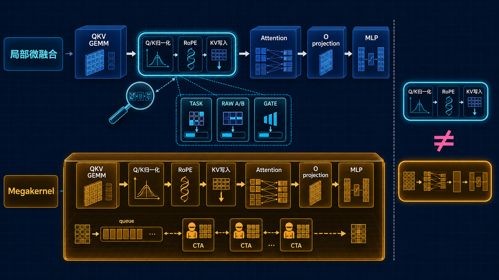

<!--
本文由 scripts/sync_lesson_readmes.rb 从对应的 _posts 文章确定性生成。
请编辑课程原文后重新运行同步脚本，不要单独修改本文件。
-->

# 第 16 课｜不先相信 RESULT.md：自己复算一次 B200 实验



> 从 TASK、raw JSON、gate 日志到 RESULT 逆向复算一次真实 B200 归档，检查 WIN 是否由原始数据支持。

## 零基础先看这里

- **它在解决什么：**为什么不能直接相信汇总报告里的数字？
- **把它想成：**像核对账单，要回看小票和计算过程，不能只看最后总额。
- **这次先不用懂：**可先忽略全部 profiler 指标，先核对原始计时和程序版本。

## 本课结论与证据状态

- **一句话结论：**报告是结论入口，原始工件才是裁判。
- **证据状态：**MEASURED ARCHIVE · RECOMPUTED
- **怎么看这个标签：**它表示结论的来源与适用范围，不是课程难度；可查看[中文证据规则](../evidence.md)。

## 完整课程正文

> **本课用词**：raw JSON 保存原始样本；gate log 记录验收判定；result summary 是派生结论；micro-fusion 只覆盖局部算子边界。

先给结论：

> 这项实验可以判为 `WIN_BY_TASK_CONTRACT / EVIDENCE_STRENGTH=MODERATE`：它基本证明了 BF16、B=1、长 prefill 下的局部融合值得默认开启；但它不是 Megakernel，也没有证明 persistent kernel 架构。

图中：

- 蓝色只融合 `Q/K归一化 → RoPE → KV写入`
- QKV GEMM、Attention、O projection、MLP 仍是独立 kernel
- 橙色 Megakernel 才跨越完整层，并由常驻 CTA 处理层内任务

## 1. 先看实验合同

审计对象是：

qk-fuse-salvage/TASK.md

它测试的是：

- Qwen3-4B
- B200
- batch=1
- BF16 prefill
- 上下文长度4K和8K
- OFF：Q/K Norm、RoPE、KV-store 分开
- ON：融合成一个 kernel

成功门槛是4K或8K至少降低 `1.0 ms`，同时正确性 gate 通过、FP8保持关闭、保留关闭开关。

注意：合同明确排除了 decode 和 batched prefill。

## 2. 独立复算性能

原始三轮结果保存在 pp-ab-l1-rounds.json。

| 长度 | OFF中位数 | ON中位数 | 两中位数之差 | 配对差值中位数 | ON胜出 |
|---|---:|---:|---:|---:|---:|
| 4K | 29.2ms | 27.5ms | 1.7ms | 1.8ms | 3/3 |
| 8K | 64.8ms | 62.1ms | 2.7ms | 2.7ms | 3/3 |

为什么4K会同时出现1.7和1.8？

```text
两组中位数之差：
29.2 - 27.5 = 1.7ms

每轮先做差，再取中位数：
median(1.1, 2.4, 1.8) = 1.8ms
```

这是两种不同统计量。RESULT.md 写成“29.2→27.5，降低1.8ms”，混用了口径。

不过1.7和1.8都超过1ms门槛，因此不改变任务判定。

证据仍不算很强，因为：

- 只有三轮配对
- 每轮内部五个原始样本没有保存
- 没有完整时钟、温度和kernel trace
- 只能称为方向稳定的中等强度证据

## 3. 一份看似更“raw”的A/B，实际上无效

归档还有一份九对样本：pp-ab.json。

复算结果很差：

| 长度 | OFF | ON | 改善 |
|---|---:|---:|---:|
| 4K | 24.561793ms | 24.567090ms | −0.005297ms |
| 8K | 54.961213ms | 54.555648ms | +0.405565ms |

但不能据此说融合没有效果，因为这个A/B很可能根本没有切换物理执行路径。

原因是：

1. 脚本只创建了一个 `GraphDecoder`：pp_ab_qk_fuse.py
2. 第一次调用把融合开关设为ON并捕获CUDA Graph：pp_ab_qk_fuse.py
3. Python分支在捕获时已经“录进录像”
4. 后面只改变Python布尔值，不会改变已经录好的CUDA Graph

可以把CUDA Graph理解成录像：

> 录像时选了ON，之后在录像机外面把开关改成OFF，回放内容仍然是ON。

除非进程明确使用 eager prefill，但归档没有保存足以证明这一点的环境证据。因此这份数据应标为：

```text
INVALID_AB
```

正确做法是分别创建ON和OFF两个decoder，各自捕获独立Graph，再按ABBA顺序交错回放。

## 4. 正确性证据

| 测试 | 结果 | 能证明什么 |
|---|---|---|
| BF16默认配置 | 126/128，PASS | 默认路径满足项目正确性门 |
| BF16显式ON | 126/128，PASS | 显式融合路径通过 |
| FP8默认/基准 | gate摘要相同，PASS | 功能级结果一致 |
| 故意破坏的负控 | 19/128，被拒绝 | gate确实能抓到严重错误 |

对应证据：

- BF16默认gate
- BF16显式ON
- FP8默认
- negative control

但不能把它写成“FP8 byte-identical”，因为归档没有保存逐张量hash或bitwise比较。准确说法是：

> FP8在源码中被强制关闭，并且功能gate摘要与基准一致。

## 5. 最终判词

| 主张 | 判定 |
|---|---|
| 长prefill性能改善≥1ms | 通过 |
| BF16默认开启且gate通过 | 基本通过 |
| FP8保持关闭 | 源码与功能gate支持 |
| FP8逐字节完全相同 | 未证明 |
| 同进程raw A/B有效 | 不成立 |
| 证明了Megakernel | 不成立 |
| 证明了persistent执行 | 不成立 |

最严谨的总结是：

> BF16 B=1 prefill 的 Q/K RMSNorm–NeoX RoPE–KV-store fused microkernel，在历史任务的宽松合同下取得中等证据强度的WIN。

## 6. 为什么它不是Megakernel

| 维度 | 本实验 | 真正Megakernel |
|---|---|---|
| 融合范围 | 三个局部步骤 | 完整层或完整模型 |
| QKV GEMM | 外部kernel | kernel内部 |
| Attention/MLP | 外部kernel | kernel内部 |
| CTA是否跨任务常驻 | 否 | 通常是 |
| 是否有层级任务队列 | 否 | 常见 |
| 是否覆盖decode step | 否，仅prefill | 可以覆盖 |

其精确融合契约也写在 sgl_fused_qknorm_rope_store.py。

所以这项工作应该放在Megakernel演进图的“局部微融合探针”阶段，而不是“Megakernel已经实现”阶段。

## 读完自检

1. 先不看上文，用自己的话回答：为什么不能直接相信汇总报告里的数字？
2. 再对照本课结论：报告是结论入口，原始工件才是裁判。
3. 根据 `MEASURED ARCHIVE · RECOMPUTED`，说出这条结论能证明什么、不能外推什么。

## 继续学习

- [在线阅读本课](https://qhy991.github.io/gpu-megakernel-course-art/lessons/recompute-b200-archive/)
- [← 上一课 · 第 15 课：完整填写一张 Same-body 实验卡](../lesson15/)
- [下一课 · 第 17 课：时间花在哪里，不等于时间能省多少 →](../lesson17/)
