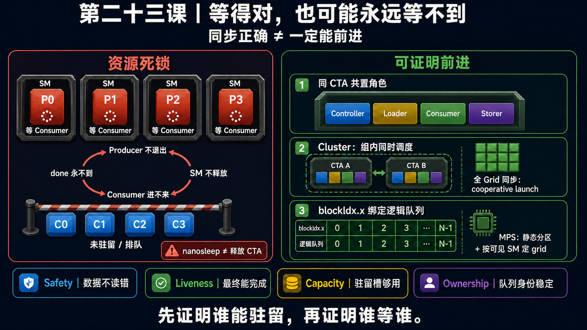

<!--
本文由 scripts/sync_lesson_readmes.rb 从对应的 _posts 文章确定性生成。
请编辑课程原文后重新运行同步脚本，不要单独修改本文件。
-->

# 第 23 课｜同步写对了，为什么程序还会卡死？



> 说明 CTA 驻留、claim-then-wait 与资源环如何让逻辑正确的同步协议产生调度死锁。

## 零基础先看这里

- **它在解决什么：**同步规则都写对了，任务为什么仍可能永远卡住？
- **把它想成：**等待卸货的卡车占满仓库入口，送货车进不来，双方就会一直等下去。
- **这次先不用懂：**可先忽略 occupancy 公式、寄存器配额和 MPS。

## 本课结论与证据状态

- **一句话结论：**不能让等待中的 consumer 占满 producer 入场所需的所有座位。
- **证据状态：**SOURCE + CUDA SCHEDULER CONTRACT
- **怎么看这个标签：**它表示结论的来源与适用范围，不是课程难度；可查看[中文证据规则](../evidence.md)。

## 完整课程正文

> **本课用词**：residency deadlock 是资源准入形成的等待环；claim-then-wait 指先领取任务再等待依赖；nanosleep 不会释放 CTA 驻留资源。

最重要的新结论是：

```text
正确的 Persistent Megakernel
= Safety（不会读错）
+ Liveness（最终能完成）
```

上一课的 release/acquire、phase 和 ACK，主要解决 Safety。它们能保证：

> 如果 producer 和 consumer 都实际运行了，consumer 不会读到错误的一代数据。

但它们不能保证：

> producer 和 consumer 都一定有机会运行。

## 1. 什么是资源死锁？

把 SM 惗成工作台，把 CTA 想成占用工作台的工作组。

假设 GPU 最多同时驻留 4 个 CTA：

1. 调度器先让 4 个 Producer CTA 驻留。
2. 它们把 ring 填满，然后等待 Consumer 发 ACK。
3. Consumer CTA 还在排队，因为没有空闲 SM。
4. Producer 收不到 ACK，所以不结束。
5. Producer 不结束，SM 就不释放。
6. Consumer 永远无法驻留。

形成闭环：

```text
Producer 等 Consumer
        ↓
Consumer 需要空闲 SM
        ↓
SM 被 Producer 占满
        ↓
Producer 不收到 ACK 就不退出
```

这叫 resource deadlock。锁、原子操作和内存序都可能完全正确，但解除等待的人没有运行机会。

CUDA 普通 kernel 不保证 block 的调度顺序；当 SM 没有足够资源时，后续 block 会等待已驻留 block 完成。因此程序不能把“另一个 block 很快会运行”当作正确性前提。[NVIDIA CUDA 调度与驻留说明](https://docs.nvidia.com/cuda/cuda-programming-guide/02-basics/writing-cuda-kernels.html#kernel-launch-and-occupancy)

## 2. `__nanosleep()` 为什么救不了这种死锁？

```cpp
while (!done) {
    __nanosleep(128);
}
```

它可以减少轮询造成的指令、load 和功耗压力，但 NVIDIA 对它的定义只是“暂停线程一段近似时间”。[NVIDIA `__nanosleep` 文档](https://docs.nvidia.com/cuda/cuda-programming-guide/05-appendices/cpp-language-extensions.html#nanosleep)

睡眠期间，CTA 仍然：

- 没有结束；
- 占用 CTA residency slot；
- 保留 registers；
- 保留 shared memory；
- 阻止排队 CTA 使用这些资源。

所以：

> Spin 是站在工作台旁不停催问；`nanosleep` 是坐在工作台旁安静等待。两者都没有归还工作台。

## 3. 映射到你的 legacy 8B Megakernel

你的历史 8B/B200 实现是：

- `148 CTAs × 640 threads`；
- 每个 CTA 包含 16 个 consumer warps，以及 loader、storer、launcher、controller；
- 实测 `96 registers/thread`；
- 约 `228,096 B shared memory/CTA`；
- 只能驻留 `1 CTA/SM`；
- grid 正好是 B200 的 148 个 SM。

证据见历史 8B 资源报告快照。

把各角色放在同一个 CTA 里是好设计：它避免了“loader CTA 已驻留，但 consumer CTA 还在门外”这一类局部死锁。

但它仍存在跨 CTA 的全局计数器等待，而且使用物理 `%smid` 作为 worker/队列编号：旧版 `%smid` 源码快照、跨 CTA 等待点。

这隐含了一个很强的合同：

```text
148 个 CTA 必须同时驻留
+ 每个物理 SM 恰好一个 CTA
+ 物理 SM ID 恰好对应稠密队列 0…147
```

独占、空闲 B200 上，这个布局确实成功完成了 32 层、LM head 和 22,804 条 VM 指令。因此不能说你已经观察到了死锁。

准确结论是：

> 独占 B200 路径实测可完成；但 `%smid` 和全 148-SM 驻留是未由 CUDA 编程模型保证的隐藏前提。

另外，`__launch_bounds__(640, 1)` 只是约束编译器的资源分配，不等于“运行时保证整个 grid 原子入驻”。

## 4. 为什么 MPS 会放大风险？

MPS 的 active-thread percentage 只是限制一个 client 可以使用多少资源，并不为它预留独占 SM；不同 client 的 kernel 仍可能运行在同一 SM 上。当前 context 实际看到的限制会反映到 `cudaDevAttrMultiProcessorCount`。[NVIDIA MPS 动态资源说明](https://docs.nvidia.com/deploy/mps/when-to-use-mps.html#dynamic-execution-resource-provisioning)

如果你的 kernel 仍然硬编码 148 CTA，而 MPS 环境只能让其中一部分同时驻留：

```text
已驻留 CTA：等待某个全局计数
排队 CTA：负责产生这个计数
每个 SM：已被一个等待 CTA 占满
```

就可能形成 occupancy-dependent deadlock。

这里必须严格区分：

- 已证明的事实：源码硬编码 148、使用 `%smid`、存在跨 CTA 自旋、1 CTA/SM。
- 尚未证明的风险：MPS 下死锁或队列错配。
- 历史证据中没有 MPS A/B 实验，所以不能称为“已复现 bug”。

MPS 静态 SM 分区可以提供空间隔离，但仍必须按照分区实际可见的 SM 数重新构造 grid；它不会自动修复内部等待环。[NVIDIA MPS 静态 SM 分区](https://docs.nvidia.com/deploy/mps/when-to-use-mps.html#static-sm-partitioning)

## 5. Canonical 版本改进了什么？

clean `c473de3` 快照做了几个关键改善：

- 用稳定的逻辑 `blockIdx.x` 选工作队列，不再用物理 `%smid`；
- grid 大小来自当前 context 的 SM 数；
- 每个 CTA 是 384 threads；
- CTA 内共置 8 个 consumer warps 和 controller/loader/launcher/storer；
- 默认两个 CTA 组成 cluster；
- 跨 CTA publication 使用 release/acquire global counters。

对应证据：canonical core、launch 配置、global barrier。

Cluster 内的 CTA 有同时调度保证，但这个保证只覆盖该 cluster，不覆盖整个 grid。[NVIDIA Thread Block Cluster](https://docs.nvidia.com/cuda/cuda-programming-guide/01-introduction/programming-model.html#thread-block-clusters)

因此 canonical 的准确评价是：

> 它解决了物理 SM 身份绑定，并加强了 cluster 内驻留与数据可见性；但源码快照中还没有 whole-grid cooperative admission 或任意 partial-residency/MPS 条件下的完整 liveness 证明。

如果算法确实要求整个 grid 同时协作，应使用 cooperative launch，并在启动前核对整个 grid 能否驻留；但 cooperative launch 也只提供协作与 admission 语义，不会自动消除逻辑循环等待。[NVIDIA Cooperative Grid](https://docs.nvidia.com/cuda/cuda-programming-guide/04-special-topics/cooperative-groups.html#large-scale-groups)

## 6. 三种“卡住”不要混淆

| 情况 | 含义 |
|---|---|
| Deadlock | 形成循环等待，没有参与者能够解除它 |
| Starvation | 系统整体仍在完成工作，但某个角色长期得不到服务 |
| Livelock | 大家不断检查、CAS、重试，但 completion counter 不增长 |

以后审计每一个 `wait()`，都问五个问题：

```text
我在等谁？
谁能把条件变为 true？
它现在一定 resident 吗？
我是否占着它运行所需的资源？
这个保证来自同 CTA、cluster、cooperative launch，还是仅仅来自“实测通常如此”？
```

你这项工作的阶段性结论可以概括为：

> Legacy Megakernel 已证明独占 B200 上的 one-wave whole-model execution 可行；canonical 又修掉了 `%smid` 身份依赖。但“任意并发与 MPS 环境下保证前进”仍是需要补上的正式合同，而不是当前已完成的能力。

## 读完自检

1. 先不看上文，用自己的话回答：同步规则都写对了，任务为什么仍可能永远卡住？
2. 再对照本课结论：不能让等待中的 consumer 占满 producer 入场所需的所有座位。
3. 根据 `SOURCE + CUDA SCHEDULER CONTRACT`，说出这条结论能证明什么、不能外推什么。

## 继续学习

- [在线阅读本课](https://qhy991.github.io/gpu-megakernel-course-art/lessons/residency-deadlock/)
- [← 上一课 · 第 22 课：为什么一个 Ready Bit 不够？](../lesson22/)
- [下一课 · 第 24 课：先算能住多少，再画谁等谁 →](../lesson24/)
