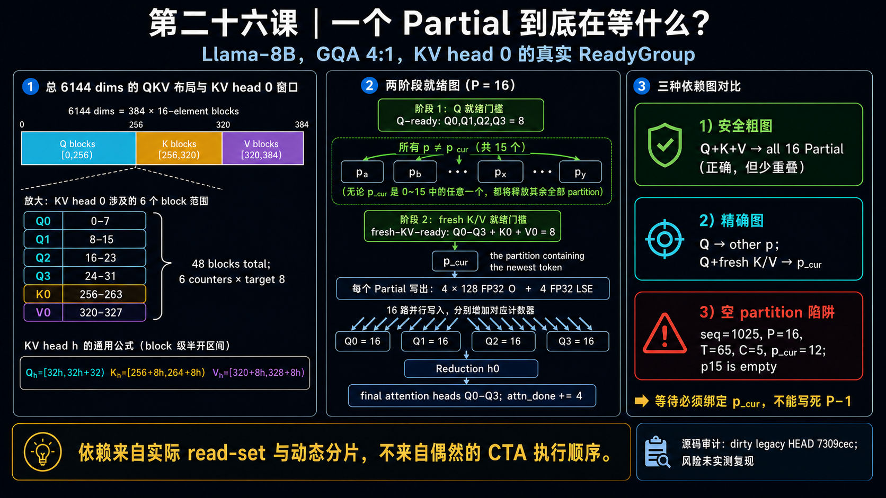

<!--
本文由 scripts/sync_lesson_readmes.rb 从对应的 _posts 文章确定性生成。
请编辑课程原文后重新运行同步脚本，不要单独修改本文件。
-->

# 第 26 课｜一个 Partial Attention 到底在等什么？



> 用 KV head 0 的真实 Q/K/V block 依赖构造 ReadyAtom 与 ReadyGroup。

## 零基础先看这里

- **它在解决什么：**一个小任务究竟要等哪些输入，才能安全开始？
- **把它想成：**像做一道菜要等齐指定食材，不能只看仓库里已经来了几个箱子。
- **这次先不用懂：**可先忽略 Q、K、V 的块编号和 KV head 映射。

## 本课结论与证据状态

- **一句话结论：**ReadyGroup 必须来自真实 producer 集合，而不是只看一个粗粒度计数器。
- **证据状态：**SOURCE-AUDITED · LEGACY SCHEDULE
- **怎么看这个标签：**它表示结论的来源与适用范围，不是课程难度；可查看[中文证据规则](../evidence.md)。

## 完整课程正文

> **本课用词**：ReadyAtom 表示一个可独立发布的依赖事实；ReadyGroup 是任务启动前必须同时满足的 atom 集；partial attention 处理一个 KV partition。

一句话结论：Partial Attention 的就绪条件必须来自它真正读取的数据区域，还要结合“当前 token 落在哪个 partition”，不能简单写成“永远等最后一个 partition”。

## 1. 先把 packed QKV 拆开

Llama-8B 的 QKV 输出共有：

- Q：32 heads × 128 = 4096
- K：8 heads × 128 = 1024
- V：8 heads × 128 = 1024
- 合计 6144 个元素，即 384 个 16-element blocks

对于 KV head `h`：

```text
Q_h = [32h,       32h+32)   # 4个Q head，共32块
K_h = [256+8h,   264+8h)    # 1个K head，共8块
V_h = [320+8h,   328+8h)    # 1个V head，共8块
```

以 `h=0` 为例，一个 Partial 逻辑上关联：

```text
Q0: blocks 0–7
Q1: blocks 8–15
Q2: blocks 16–23
Q3: blocks 24–31
K0: blocks 256–263
V0: blocks 320–327
```

也就是 6 个 head counter，每个目标值都是 8。

## 2. 精确 ReadyGroup 不是“所有 Partial 都等 Q+K+V”

每个 `Partial(h,p)` 都读取同一组四个 Q head，所以全部 Partial 都必须等：

```text
Q[4h : 4h+4] ready
```

但它们读取的是不同的历史 K/V 区间。之前 token 的 K/V 在本次 kernel 启动前就已存在；只有包含当前新 token 的那个 partition，需要等待本层刚写入的 K/V。

定义：

```text
T     = ceil(seq_len / 16)       # KV block 数
C     = ceil(T / P)              # 每个 partial 的 block 容量
p_cur = floor((T - 1) / C)       # 包含最新 KV block 的 partition
```

因此最精确的条件是：

```text
p != p_cur : 等 Q
p == p_cur : 等 Q + 本轮新写入的 K + V
```

把所有 16 个 Partial 都放在 `Q+K+V` 后面也正确，但会损失 QKV→Attention 的重叠机会。

## 3. Partial 如何汇合到 Reduction

P16 时，每个 KV head 有 16 个 Partial。每个 Partial 写出：

```text
4 × 128 个 FP32 O
4 个 FP32 LSE
```

并分别增加四个 Q-head completion counter。等四个 counter 都达到 16：

```text
Q0 = Q1 = Q2 = Q3 = 16
```

`Reduction h0` 才能合并 16 份 online-softmax 结果，产生最终 Q0–Q3 attention 输出，并执行：

```text
attn_done += 4
```

8 个 KV heads 全部完成后，聚合值为 32，O projection 才能开始。

## 4. 发现了一个真实的源码级竞态风险

当前 dirty legacy 源码把 K/V 等待写成了：

```text
partial_idx == P - 1
```

这隐含假设“最新 token 永远属于最后一个 partition”，但并不总成立。

例如：

```text
seq_len = 1025
P       = 16
T       = 65
C       = 5
p_cur   = floor(64 / 5) = 12
```

此时：

- `p12` 读取包含当前 token 的 KV block 64；
- `p13–p15` 都是空 partition；
- K/V 等待却写死在 `p15` 的循环内部；
- `p15` 循环不执行，因此根本不会等待；
- `p12` 可能在对应 K/V producer 发布前就开始 TMA load。

Q counter不能间接证明 K/V 已完成，因为这些数据来自不同 CTA。RR 队列也不提供跨 CTA happens-before。

这是源码可以确认的潜在 read-before-publish 竞态，但目前尚未通过 GPU 扰动实验复现。已有 4K/8K 正确性结果不会触发它，因为这两个长度下 `p_cur=p15`。

## 5. 正确修法

最小修正不是判断 `p==P-1`，而是判断：

```text
start_block <= T-1 < end_block
```

也就是“这个 Partial 是否真正包含最新 KV block”。

同时还需要：

- QKV 的 TMA store 完成后，以 device-scope release 发布 ready；
- Partial 以 acquire 观察 ready 后再读取；
- 跨 semantic group 的 QKV packet 必须向所有相关 ReadyGroup 发布，不能只归属于一个组；
- 用 `seq=1025、1281` 等边界长度，故意延迟 K/V producer 并预填 poison 数据，重复验证输出。

clean canonical `c473de3` 的 Llama1B 编译器已经显式声明 Q/K/V tensor regions，并能生成对应 barrier；但它的 K/V region仍是保守的整段范围，还没有表达这里的动态 `p_cur` 精度。

所以这一课真正重要的原则是：

> 依赖来自实际 read-set、数据版本和动态分片，不来自“通常哪个 CTA 会先跑完”。

## 读完自检

1. 先不看上文，用自己的话回答：一个小任务究竟要等哪些输入，才能安全开始？
2. 再对照本课结论：ReadyGroup 必须来自真实 producer 集合，而不是只看一个粗粒度计数器。
3. 根据 `SOURCE-AUDITED · LEGACY SCHEDULE`，说出这条结论能证明什么、不能外推什么。

## 继续学习

- [在线阅读本课](https://qhy991.github.io/gpu-megakernel-course-art/lessons/partial-attention-readygroup/)
- [← 上一课 · 第 25 课：Role-fluid 还不够，必须 Ready-aware](../lesson25/)
- [下一课 · 第 27 课：Ready 不是一个数字 →](../lesson27/)
