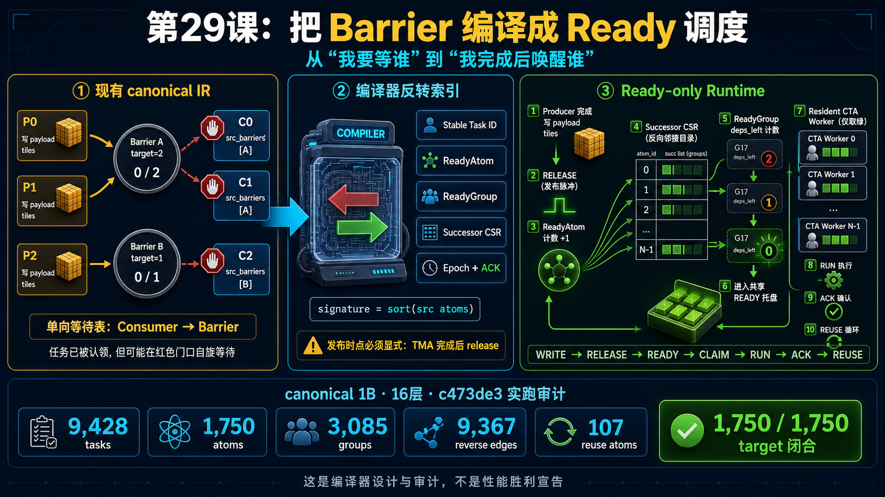

<!--
本文由 scripts/sync_lesson_readmes.rb 从对应的 _posts 文章确定性生成。
请编辑课程原文后重新运行同步脚本，不要单独修改本文件。
-->

# 第 29 课｜把 Barrier 编译成 Ready 调度



> 从 canonical 的 src_barriers 生成 ReadyAtom、ReadyGroup 与反向 successor 表，把运行时等待改成完成时唤醒。

## 零基础先看这里

- **它在解决什么：**怎样把反复等待，改成完成后主动通知？
- **把它想成：**后续工人不用一直追问；前序工作完成时，系统直接通知下一位开工。
- **这次先不用懂：**可先忽略编译器表结构和 barrier 的源码编号。

## 本课结论与证据状态

- **一句话结论：**把“我要等谁”反转为“我完成后唤醒谁”，才能生成 Ready 调度。
- **证据状态：**COMPILER PROPOSAL · SOURCE COUNTS AUDITED
- **怎么看这个标签：**它表示结论的来源与适用范围，不是课程难度；可查看[中文证据规则](../evidence.md)。

## 完整课程正文

> **本课用词**：src_barriers 是 consumer 的源码依赖集合；successor table 记录完成一个 atom 后要更新哪些候选任务；target 是期望 publisher 数。

一句话结论：

> 你的 canonical compiler 已经知道“每个任务要等谁”；下一步不是重写编译器，而是建立反向索引，让系统知道“某个条件完成后，应该唤醒谁”。

## 1. 当前执行方式为什么还不够

现在每条 instruction 携带：

- `src_barriers`：执行前等哪些条件
- `src_barrier_targets`：分别要等到多少
- `dst_barriers`：完成后通知哪些条件

但设备端流程仍然是：

```text
CTA 先领取任务
→ 进入算子
→ 在 src barrier 上自旋
→ 条件满足后运行
```

危险在于：CTA 已经占住寄存器、shared memory 和驻留位置。若它等待的 producer CTA 尚未获得运行机会，就可能形成资源死锁。

Ready-only 调度改成：

```text
依赖先闭合
→ 任务才出现在 Ready 队列
→ 任意 resident CTA 领取
→ 领取后直接执行
```

## 2. 三个新概念

ReadyAtom 是一个最小完成条件，例如：

```text
Atom Q:
需要 QKV-P0 和 QKV-P1 都写完
target = 2
```

ReadyGroup 是完整依赖完全相同的一组任务：

```text
Partial Group:
需要 {Q Ready, K Ready, V Ready}
```

Successor CSR 是反向电话簿：

```text
Atom Q 完成
→ 查表找到所有依赖 Q 的 ReadyGroup
→ 对这些 Group 执行 deps_left--
```

于是一个任务组只有在：

```text
deps_left == 0
```

时才能进入 Ready 队列。

## 3. 一个最小例子

假设 Partial 同时需要 Q 和 KV：

```text
P0、P1 写 Q  → Atom A，target=2
P2 写 KV     → Atom B，target=1

Partial Group 依赖 {A, B}
初始 deps_left = 2
```

执行过程：

```text
P0 完成：A=1/2
P1 完成：A=2/2 → deps_left 2→1
P2 完成：B=1/1 → deps_left 1→0
Partial Group 才进入 Ready 队列
```

worker 不再拿到一个红灯任务后等待，而是只领取绿灯任务。

## 4. canonical 真实审计结果

我在 clean `c473de3` 上实际运行了自动编译器的离线审计：

| 范围 | Tasks | ReadyAtoms | 保守 ReadyGroups |
|---|---:|---:|---:|
| 1 层 | 728 | 70 | 160 |
| 16 层 | 9,428 | 1,750 | 3,085 |

16 层还有：

- 9,367 条 `Atom → Group` 反向边
- 1,643 个数据依赖 atom
- 107 个内存复用 atom
- 1,750/1,750 个 atom 均满足 `target == publisher 数`
- 只有一个根 ReadyGroup
- 2,496 个 group 是单任务 group

最后一项很重要：精细依赖虽然保留了 overlap，但不会神奇地把所有任务压成几个大组，运行时开销仍需认真控制。

## 5. 数据依赖与复用依赖不能混淆

它们都表现成 barrier，但语义不同：

```text
Input Atom:
新 payload 已经生成，可以读取

Reuse Atom:
旧 payload 已无人读取，可以覆盖这块内存
```

Reuse Atom 本质上是 ACK/retirement。即使两个 atom 的 publisher 和 target 恰好一样，也不能合并，否则可能在旧 reader 尚未结束时覆盖 buffer。

## 6. 最大的编译器缺口：完成时点

`src/dst_barriers` 能表达“谁依赖谁”，却不总能表达：

> 数据究竟在 instruction 的哪个时刻真正完成？

例如 QKV instruction 可能跨越 Q、K 两个区域：

```text
Q 的 TMA store 完成 → 发布 Q Atom
稍后 K 的 TMA store 完成 → 发布 K Atom
```

不能在任务开始时一起发布；也不应该全部拖到 instruction 末尾，否则会损失 overlap。

因此每个 IType 需要新增显式合同：

```text
CompletionEvent {
    completion_port     // Q_STORE_DONE、K_STORE_DONE、TERMINAL…
    atom_id
    contribution_weight
    payload_region
}
```

还必须禁止把特殊 barrier 藏在 `indices[]` 里。当前手写 P16 Attention 路径就存在这种隐藏发布，单纯扫描 `dst_barriers` 会漏掉 Partial→Reduction 等边。

## 7. 推荐的编译流程

```text
access_regions
    ↓
稳定 Task ID
    ↓
ReadyAtom：producer、target、类型
    ↓
CompletionEvent：何时真正发布
    ↓
按完整依赖签名形成 ReadyGroup
    ↓
反转边，生成 Successor CSR
    ↓
静态可达性与闭合验证
    ↓
生成 Ready runtime side tables
```

不要扩大现有 256B instruction。建议保留原 instruction table，另外建立只读 side table：

```text
GroupRO       32B/group
AtomRO        16B/atom
SuccessorEdge  4B/edge
```

热状态单独存放：

```text
epoch
arrivals
deps_left
ready bitmap
task cursor
retire ACK
```

按本次16层真实数量估算：

- 一代 Ready metadata：约 222.6 KiB
- 两个 epoch slot：约 284.9 KiB
- 原 instruction table：2.30 MiB

所以 metadata 容量不是主要问题；更大的风险是原子热点、successor fan-out 和寄存器/栈回退。

## 8. Epoch 与 ACK 为什么必须同时存在

只有 epoch 不够：

```text
旧 worker 检查 epoch=e
→ 暂停
→ slot 被重置成 e+1
→ 旧 worker 恢复并修改新状态
```

这就是 check-then-act ABA。

安全复用要求：

```text
任务全部 DONE
+ queue 引用全部 ACK
+ TMA/异步访问结束
+ payload reader 全部退休
→ 才能把 slot 从 e 复用为 e+1
```

## 9. 最合理的第一版

不要立刻动态化全部 9,428 个 canonical 任务。

针对你的 8B/P16 路线，建议先只动态化：

```text
每层：
8 个 KV-head Partial groups
8 个 Reduction groups
```

QKV、O、MLP、LM Head 暂时维持静态路径。这样最容易验证：

- Ready-only 是否消除 claim-then-spin
- 只有部分 CTA 驻留时能否继续前进
- Attention 原子开销是否值得
- `seq_len=1025, P16, p_cur=12` 的新 KV 同步缺口是否被修复

## 10. 通过标准

先证明正确，再谈快：

1. CPU 随机调度 oracle：AND 依赖、fan-in、exactly-once、epoch。
2. Mutation tests：target 少1、AND改OR、遗漏Q、错误复用、NoOp计数、stale epoch。
3. B200 poison litmus：延迟最新KV写入，Ready版本不得读到 poison。
4. 驻留CTA数量从1扫到148，任何数量都不能挂死。
5. 检查 PTX/SASS 中的 release/acquire、TMA proxy 顺序。
6. ptxas 不得新增寄存器、stack 或 spill。
7. 最后才做 static、metadata-disabled、Attention-Ready 三臂ABBA性能对照。

这一步的真正意义是：

> 它把你的项目从“手工安排一张能在独占B200上跑通的静态时间表”，推进到“编译器生成依赖闭合、可证明前进的动态执行计划”。

但目前仍是编译器设计与离线闭合证据，不是已经实现的性能胜利。

## 读完自检

1. 先不看上文，用自己的话回答：怎样把反复等待，改成完成后主动通知？
2. 再对照本课结论：把“我要等谁”反转为“我完成后唤醒谁”，才能生成 Ready 调度。
3. 根据 `COMPILER PROPOSAL · SOURCE COUNTS AUDITED`，说出这条结论能证明什么、不能外推什么。

## 继续学习

- [在线阅读本课](https://qhy991.github.io/gpu-megakernel-course-art/lessons/compile-barrier-to-ready/)
- [← 上一课 · 第 28 课：先 Ready，再入队](../lesson28/)
- [下一课 · 第 30 课：一个 Worker 也能跑完整张 DAG →](../lesson30/)
