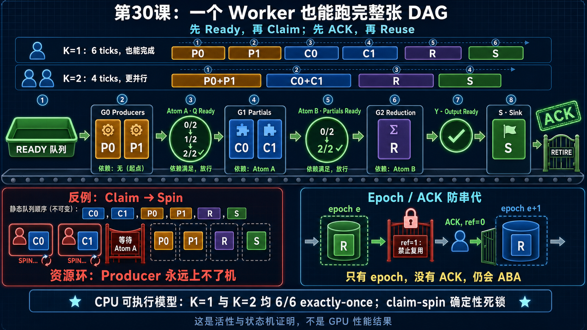

<!--
本文由 scripts/sync_lesson_readmes.rb 从对应的 _posts 文章确定性生成。
请编辑课程原文后重新运行同步脚本，不要单独修改本文件。
-->

# 第 30 课｜一个 Worker 也能跑完整张 DAG



> 用真实运行的 CPU 状态机证明 Ready-first 调度即使只有一个 worker 也能推进，而 claim-then-wait 会死锁。

## 零基础先看这里

- **它在解决什么：**只有一个执行者时，复杂任务为什么仍能向前推进？
- **把它想成：**一个厨师也能完成整桌菜，只要每次都选当前材料已齐的下一步。
- **这次先不用懂：**可先忽略 CPU 状态机代码和 CUDA 移植细节。

## 本课结论与证据状态

- **一句话结论：**活性来自始终调度 Ready 工作，不来自假设所有角色同时驻留。
- **证据状态：**CPU MODEL EXECUTED · CUDA PORT PROPOSED
- **怎么看这个标签：**它表示结论的来源与适用范围，不是课程难度；可查看[中文证据规则](../evidence.md)。

## 完整课程正文

> **本课用词**：liveness 表示系统最终能推进；safety 表示不会产生错误结果；CPU model 是协议模型，不是 GPU 性能实现。

这节最重要的结论是：

> `K=1` 能完成，证明调度器不会依赖“所有 CTA 必须同时驻留”；`K` 增大只是提高并行度，而不应改变能否完成。

## 1. 我们实际运行的小模型

任务图是：

```text
P0 ─┐
    ├─ Atom A，target=2 ─→ C0 ─┐
P1 ─┘                          ├─ Atom B，target=2 ─→ R → S/ACK
                               C1 ─┘
```

含义：

- `P0/P1`：生产两部分数据
- `Atom A`：两部分都写完，数据才可读
- `C0/C1`：消费数据并产生两个 partial
- `Atom B`：两个 partial 都完成
- `R`：执行归约并写最终输出
- `S/ACK`：确认输出已消费，本代可以退休

## 2. 一个 Worker 的真实时序

CPU 模型实际得到：

```text
t0  P0 完成 → A=1/2
t1  P1 完成 → A=2/2 → C组 Ready
t2  C0 完成 → B=1/2
t3  C1 完成 → B=2/2 → R组 Ready
t4  R 完成  → Output Ready
t5  S 完成  → ACK → RETIRE
```

结果：

```text
6/6 tasks exactly once
refs=0
epoch 可以安全退休
```

两个 Worker 时则是：

```text
t0  P0 + P1
t1  C0 + C1
t2  R
t3  S/ACK
```

同一张图从6个时刻缩短到4个时刻，但正确性没有变化。

## 3. Claim-then-spin 为什么会死锁

假设只有两个驻留位置，静态任务顺序却是：

```text
C0, C1, P0, P1, R, S
```

两个 worker 先领取：

```text
W0 → C0 → 等待 Atom A
W1 → C1 → 等待 Atom A
```

此时：

- C0/C1 占着两个驻留位置
- Atom A 需要 P0/P1 才能完成
- P0/P1 还在队列中，无法上机

形成资源环：

```text
C 等 A
A 等 P
P 等驻留位置
驻留位置被 C 占住
```

Ready-only 的区别只有一句：

> Atom A 变绿之前，C0/C1 根本不允许被领取。

初始 Ready 队列中只有 P0/P1，所以即使只有一个 worker，也一定能沿拓扑顺序前进。

这证明的是调度机制；不是说当前 canonical 已经在普通运行中复现了这个死锁。

## 4. ACK 解决的不是“数据何时产生”

三个词可以这样记：

```text
Claim    解决“谁来做”
Acquire  解决“现在能不能读”
ACK      解决“什么时候可以覆盖”
```

仅有 epoch 仍不安全：

```text
旧worker检查 epoch=e
→ 暂停

系统错误地把slot重置为e+1
→ 旧worker恢复
→ 把e的完成写进e+1
```

这就是 ABA。

安全复用必须同时满足：

```text
终点 ACK(e) 已到
所有 task 已 DONE
refs(e) == 0
所有 TMA/异步访问已结束
slot 状态 OPEN → RETIRING → RETIRED
```

进入 `RETIRING` 后还要禁止新的 claim，否则可能刚看到 `refs=0`，马上又进来一个 worker。

## 5. 原始审计中的代码与设计边界

原始课程审计在以下冻结版本上记录：

```text
HEAD  c473de3d5c90b5ab61d808852a2e01f03d602236
状态  clean
```

该版本已经具备：

- `scheduler.py:154-311`：从访问区域计算 producer/consumer barrier
- `Instruction`：保存 `src_barriers`、target和`dst_barriers`
- `utils.cuh:25-43`：release publication和acquire wait
- 每次 kernel launch 前清零 barrier
- CTA 内的双级 instruction ring及完成 ACK

该版本尚未具备：

- 只公开 root/Ready task
- `Atom → Group` 反向 successor 表
- `deps_left`
- Ready bitmap和group cursor
- exactly-once task CAS
- 跨 token epoch/refcount/retired ACK

该版本 controller 的实际顺序仍是：

```text
先获取 instruction
→ 广播到 CTA 内 worker
→ 进入具体 operator
→ operator 内部等待 src barrier
```

所以 CLC/global queue 也不是 Ready queue。

## 6. 映射到 B200

新 controller 的领取路径应是：

```text
relaxed 读取 Ready bitmap       // 只是路标
→ acquire 检查 ready_epoch      // 真正通行证
→ lane0 fetch_add group cursor  // 取得唯一任务
→ 搬运现有256B instruction
→ CTA执行
→ TMA完成
→ release DONE/Atom
→ refs--
```

这里的 `K=1` 表示一个逻辑进度单元：

- 本次 canonical 实跑采用 `cluster_size=1`，即一个 CTA
- 若采用 `cluster_size=2`，一次 claim 必须领取一个完整2-CTA bundle；此时一个进度单元是一个 cluster

不能让cluster的两个rank各自领取无关任务。

## 7. 为什么还不能直接替换当前 Attention

真实 Attention 不是简单地“任务开始前把所有条件等完”：

- Q 在加载Q之前等待
- 新K/V可能延迟到最后一个KV block前才等待
- 这样可以先计算旧KV prefix，与新KV生产重叠

若Ready调度粗暴地要求完整Q/K/V都到齐才公开整个Partial，会更安全，却可能损失这段重叠。

因此后续需要选择：

```text
保守版：整个Partial等Q/K/V
性能版：拆成prefix task + p_cur tail task
或支持可挂起、重新入队的continuation
```

第一版应先做保守版，证明活性和正确性，再测是否值得恢复细粒度重叠。

## 8. 本课证明了什么

已经证明：

- CPU Ready模型在 `K=1` 和 `K=2` 下均完成
- 所有6个任务恰好执行一次
- fan-in target不会提前放行
- claim-then-spin反例会确定性形成资源环
- 只有epoch、没有ACK仍存在ABA

尚未证明：

- CUDA/PTX内存顺序
- TMA async-proxy可见性
- B200上的实际活性
- Ready调度比静态调度更快

GPU版本仍需 poison测试、`K=1…148` 驻留扫描、最终SASS审计和配对性能实验。

## 读完自检

1. 先不看上文，用自己的话回答：只有一个执行者时，复杂任务为什么仍能向前推进？
2. 再对照本课结论：活性来自始终调度 Ready 工作，不来自假设所有角色同时驻留。
3. 根据 `CPU MODEL EXECUTED · CUDA PORT PROPOSED`，说出这条结论能证明什么、不能外推什么。

## 继续学习

- [在线阅读本课](https://qhy991.github.io/gpu-megakernel-course-art/lessons/one-worker-dag/)
- [← 上一课 · 第 29 课：把 Barrier 编译成 Ready 调度](../lesson29/)
- [下一课 · 第 31 课：把 CPU Ready 模型翻译成 CUDA Controller →](../lesson31/)
