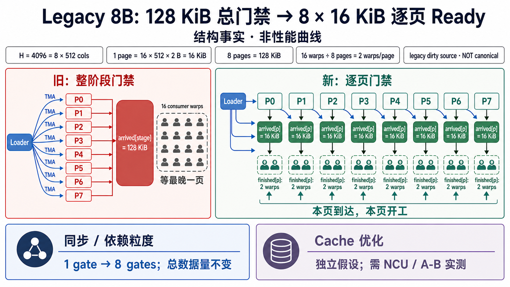

<!--
本文由 scripts/sync_lesson_readmes.rb 从对应的 _posts 文章确定性生成。
请编辑课程原文后重新运行同步脚本，不要单独修改本文件。
-->

# 第 36 课｜Page-ready：为什么 128 KiB 大门会让 Megakernel 空等？

> 把一个 128 KiB stage-wide 门拆成八个 16 KiB page-ready 门，理解“数据总量没变，等待却缩短”的原因。

## 零基础先看这里

- **它在解决什么：**为什么一部分数据到了，GPU 还不能马上开工？
- **把它想成：**八箱材料共用一个门铃，第一箱先到也得等八箱齐；给每箱单独门铃，就能先做先到的。
- **这次先不用懂：**可先忽略 TMA、mbarrier 和页大小等具体参数。

## 本课结论与证据状态

- **一句话结论：**优化的不是搬运字节数，而是谁必须等谁。
- **证据状态：**MEASURED · LEGACY DIRTY SOURCE
- **怎么看这个标签：**它表示结论的来源与适用范围，不是课程难度；可查看[中文证据规则](../evidence.md)。

## 完整课程正文

> **本课用词**：Legacy Llama-8B 指历史实验分支中的 8B 模型实现，不是当前 clean canonical 基线；`matvec` 是矩阵向量乘；TMA 是把权重 tile 异步搬进 shared memory 的 Tensor Memory Accelerator；这里的 page 是 shared-memory 缓冲区的一段。

## 先从仓库里的真实形状开始

Legacy Llama-8B 的 hidden dimension 是 4096。一次 matvec 权重输入可以看成 `16 × 4096 × BF16`，总计 **128 KiB**。

源码把它切成八页：

- 每页 `16 × 512 × 2 B = 16 KiB`；
- 16 个 consumer warp 分到八页，每页 2 个 warp；
- 每个 warp 消费半页，也就是 8 KiB。

旧协议只有一把 stage-wide 的 `arrived` 门。八笔 16 KiB TMA 全部完成后，16 个 warp 才能一起开始。于是 page0 即使早已到达，负责 page0 的 warp 仍在等 page7。

## Page-ready 改了什么

新协议为每页建立独立的 `arrived/finished` semaphore：

1. loader 发出 page0 的 TMA；
2. page0 到达后，只唤醒它的两个 warp；
3. loader 继续提交 page1、page2；
4. 每页的两个 consumer 完成后，分别归还自己的 page token。

总 TMA 次数、tile 大小、数学运算和权重字节数都没有变化。变化的是**依赖粒度**：从“所有人等所有页”变成“每组人只等自己的页”。

## 为什么这不是 Cache 优化

报告显示的是 issue active 上升、long scoreboard 和 MIO throttle 下降。源码仍然发相同的 16 KiB TMA，也没有一组匹配的 cache hit 或 DRAM-byte A/B 可以证明缓存命中改善。

所以准确说法是：

> page-ready 缩短了 load-to-use 的假依赖，让搬运和计算重叠得更早；它不是“少读了权重”。

## 已测到什么

历史 B200 A/B/A 中，单层和完整 32 层 forward 都出现了稳定正向差异；NCU 的 one-layer replay 也同向。不过这些工件来自 Legacy 8B dirty worktree，不是 clean canonical Llama-1B。

这组数据可以证明“Legacy 8B 的 stage-wide 等待过粗”，不能直接证明后续 canonical 三页方案也会获得同样幅度。

## 新手检查表

- 画清楚每页由几个 TMA 填满。
- 画清楚每个 warp 读取哪一段字节。
- 区分 `arrived`、`finished` 与跨 instruction 的 page release。
- 只在总工作保持不变时，把差异归因于 readiness 粒度。

## 把时间线完整走一遍

假设八笔 TMA 的完成时刻依次为 `t0...t7`，每页计算需要时间 `C`。旧协议中，所有 consumer 的最早开工时刻都是 `t7`，理想完成时刻约为 `t7 + C`。逐页协议中，第 `i` 页对应 warp 的最早开工时刻是 `ti`；如果 loader 与 consumer 能并行，前几页的计算会隐藏在后几页搬运之后。

这并不保证最终延迟一定减少。若八页几乎同时到达、计算极短，拆成八套 semaphore 的控制成本可能抵消收益；若某页消费者成为长尾，复用同一物理页前仍必须等待该页所有读取结束。真正要测的是“被删除的等待”减去新增协议成本后的 whole-boundary 净收益。

## 三层生命周期不能合并

一页数据至少经历三种状态：

1. **本轮可读**：TMA 完成，READY 发布；
2. **本轮读完**：该页所有 consumer 发出 FINISHED；
3. **跨指令可复用**：拥有该物理页的 instruction 完成 page release。

READY 过早会读到旧数据；FINISHED 过早会在 consumer 尚未读完时被 loader 覆写；page release 过早会让下一条 instruction 抢走仍在使用的物理页。三者保护的对象不同，不能用一个计数器含糊替代。

## 练习：自己判断是否值得拆门

画一条包含两页的时间线，设 page0 在 2 μs 到达、page1 在 7 μs 到达，每页计算 4 μs。分别计算 stage-wide 与 page-ready 的理想完成时刻，再加入 0.4 μs 的额外协议成本。最后注明：这是理想调度估算，不是 B200 实测值。

## 读完自检

1. 先不看上文，用自己的话回答：为什么一部分数据到了，GPU 还不能马上开工？
2. 再对照本课结论：优化的不是搬运字节数，而是谁必须等谁。
3. 根据 `MEASURED · LEGACY DIRTY SOURCE`，说出这条结论能证明什么、不能外推什么。

## 继续学习

- [在线阅读本课](https://qhy991.github.io/gpu-megakernel-course-art/lessons/lesson-36-page-ready/)
- [← 上一课 · 第 35 课：实验档案袋：怎样保存一个可复核结论](../lesson35/)
- [下一课 · 第 37 课：Split-KV：把长上下文注意力摊到更多 SM →](../lesson37/)
