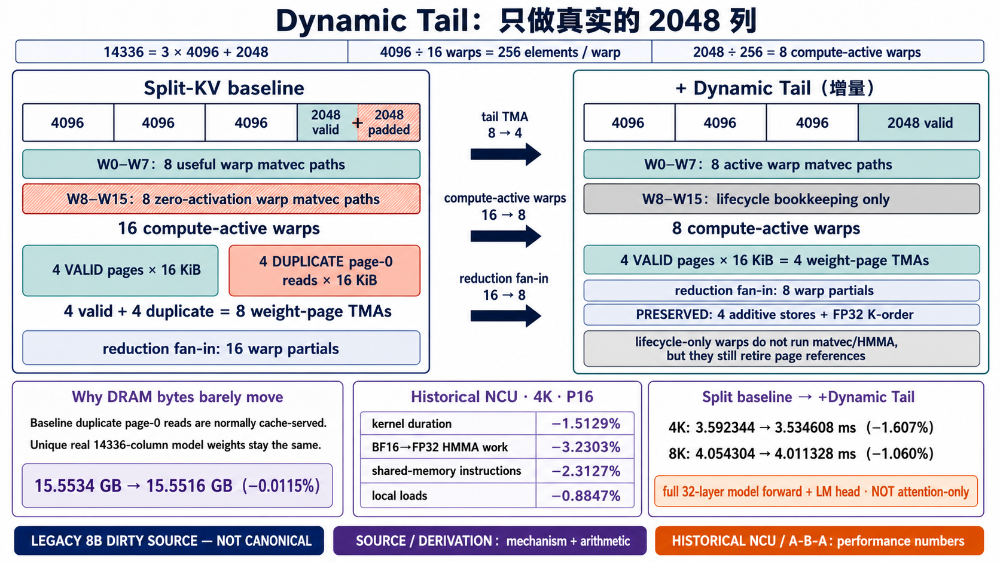

<!--
本文由 scripts/sync_lesson_readmes.rb 从对应的 _posts 文章确定性生成。
请编辑课程原文后重新运行同步脚本，不要单独修改本文件。
-->

# 第 38 课｜Dynamic Tail：最后 2048 维为什么不该让 16 个 warp 都工作？



> DownProj 的最后一个 K-slice 只有正常切片一半，动态关闭重复 TMA、HMMA 与归约工作。

## 零基础先看这里

- **它在解决什么：**任务只剩一半时，为什么不能还派全部线程？
- **把它想成：**最后只剩半车货，却仍叫来整队搬运工；多出的人不搬货，也会增加协调成本。
- **这次先不用懂：**可先忽略 HMMA 指令、warp 数量和归约细节。

## 本课结论与证据状态

- **一句话结论：**尾块变短后，线程几何也应该跟着变。
- **证据状态：**MEASURED · INCREMENTAL WIN
- **怎么看这个标签：**它表示结论的来源与适用范围，不是课程难度；可查看[中文证据规则](../evidence.md)。

## 完整课程正文

> **本课用词**：DownProj 是 MLP 把扩展维度投回 hidden dimension 的下投影；K-slice 是 reduction 维的一段；HMMA 是 Tensor Core 矩阵乘累加指令；bookkeeping 指不做数学运算、但必须完成的 barrier、semaphore 和资源归还工作。

## 先看切片

Llama-8B 的 DownProj 默认 reduction split 是：

```text
[4096, 4096, 4096, 2048]
```

前三个切片是完整 K=4096，最后一个只有 K=2048。旧实现仍按完整形状调度 16 个 consumer warp、8 个 page TMA 与 16 路 reduction，后半部分实际是重复或无效工作。

## Dynamic Tail 做了什么

当 `reduction_elements == 2048` 时：

- page TMA 从 8 个有效/重复请求缩成 4 个有效请求；
- compute-active warp 从 16 个缩成 8 个；
- reduction fan-in 从 16 路缩成 8 路；
- 另外 8 个 warp 仍执行必要的 semaphore/page 生命周期收尾。

最后一点很重要。它们不是完全“消失”，而是跳过 TMA、HMMA 和输出归约，同时继续参加协议 bookkeeping。

## 为什么收益只有 1–2%

Dynamic Tail 只优化完整模型中的一个局部尾块。最终 4K CUDA Event 是 `3.592344 → 3.534608 ms`，减少约 57.7 μs；NCU 完整 megakernel duration 是 `3.610560 → 3.555936 ms`，减少约 54.6 μs。

两种计时合同的绝对节省接近，是很好的交叉证据。但它们都覆盖 32 层 + LM head，不是 isolated DownProj timer。

## NCU 告诉我们的机制

DRAM bytes 几乎不变，而 active cycles、HMMA、shared instruction 和 instruction/scheduler 都下降。因此更准确的归因是：

> 删除片上冗余 work，而不是减少 HBM 流量。

## 泛化边界

当前地址与归约逻辑只对默认 `[4096,4096,4096,2048]` 成立。scheduler 虽能构造其他字段组合，但没有 CUDA 地址/归约集成验证。

所以它是 **Llama-8B 默认形状特化**，不能包装成通用 dynamic K-tail 算法。

## 为什么空闲 Warp 仍要参与协议

Tensor Core 工作可以按 `K=2048` 减半，但 CTA 内的资源所有权没有自动变化。被关闭计算的 8 个 warp 仍可能要到达 CTA 级 barrier、维持完成计数、参与固定同步点，或让下一轮安全复用缓冲区。

若只在数学分支中 `return`，其余 warp 可能永久等待一个不会到达的 participant。正确路径是：所有 warp 进入共同控制流，active warp 执行 TMA 消费与 HMMA，inactive warp 跳过数学但履行同步合同，最后在协议允许的位置重新汇合。

## 用 Amdahl 定律预估上限

若最后半块占 whole-model 时间比例为 `f`，局部加速 `s` 倍，整体上限为 `1 / ((1-f)+f/s)`。尾块自身即使减半，若只占总时间 3%，整步理论提升也只有约 1.5%。这与测到的量级相容，但不能反过来证明机制；仍需 instruction、HMMA 和 active-cycle 证据。

## 练习：为新形状设计 Tail

把 reduction 切片改成 `[4096,4096,1024]`。重新推导有效 page 数、active consumer warp、每 warp K 范围、reduction fan-in 和 barrier expected count。任何一项仍硬编码为默认形状，都说明它还不是通用实现。

## 读完自检

1. 先不看上文，用自己的话回答：任务只剩一半时，为什么不能还派全部线程？
2. 再对照本课结论：尾块变短后，线程几何也应该跟着变。
3. 根据 `MEASURED · INCREMENTAL WIN`，说出这条结论能证明什么、不能外推什么。

## 继续学习

- [在线阅读本课](https://qhy991.github.io/gpu-megakernel-course-art/lessons/lesson-38-dynamic-tail/)
- [← 上一课 · 第 37 课：Split-KV：把长上下文注意力摊到更多 SM](../lesson37/)
- [下一课 · 第 39 课：Resident、Eligible、Issue：31.25% occupancy 到底说明什么？ →](../lesson39/)
