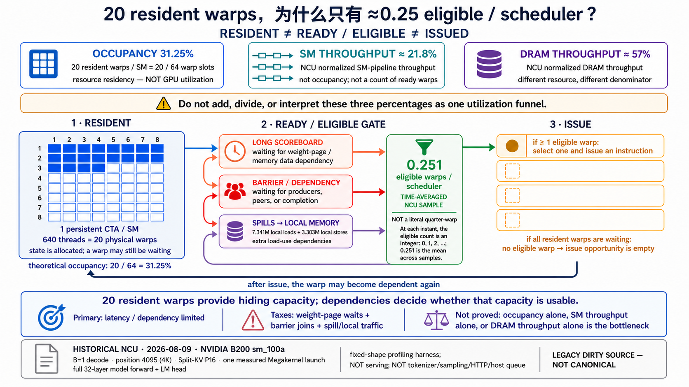

<!--
本文由 scripts/sync_lesson_readmes.rb 从对应的 _posts 文章确定性生成。
请编辑课程原文后重新运行同步脚本，不要单独修改本文件。
-->

# 第 39 课｜Resident、Eligible、Issue：31.25% occupancy 到底说明什么？

> 把“住在 SM 上”“现在可以发射”“这一拍真的发射”分开，避免误读 NCU。

## 零基础先看这里

- **它在解决什么：**工位都坐了人，为什么机器仍可能没在干活？
- **把它想成：**员工到了办公室只是“在场”；材料齐了才“能做”；真正拿到工具才算“开工”。
- **这次先不用懂：**可先忽略 occupancy、NCU 等待项和 warp 上限。

## 本课结论与证据状态

- **一句话结论：**驻留只是入场券，eligible 才是随时能跑，issue 才是真正干活。
- **证据状态：**MEASURED · WHOLE MEGAKERNEL
- **怎么看这个标签：**它表示结论的来源与适用范围，不是课程难度；可查看[中文证据规则](../evidence.md)。

## 完整课程正文

> **本课用词**：NCU 指 Nsight Compute；resident 是“已经住进 SM”，eligible 是“当前没有等待、可以被选”，issue 是“这一拍真的发出指令”；long scoreboard 与 MIO throttle 是 NCU 报告的等待原因，不是利用率百分比。

## 三个词不要混在一起

1. **Resident**：warp 的 CTA 已被调度到 SM，寄存器和 shared memory 都已分配。
2. **Eligible**：warp 当前没有被依赖、barrier 或内存等待挡住，可以选择发射。
3. **Issue**：scheduler 这一拍真的选中了它并发出指令。

因此 occupancy 31.25% 并不等于“GPU 只使用了 31.25%”。它只说每个 SM 最多驻留约 20 个 warp，而 B200 的硬件上限是 64 个。

## 为什么驻留 20 个 warp，却平均只有 0.251 eligible

Legacy 8B P16 的 NCU 中，一个 640-thread CTA 占据一个 SM。20 个 warp 都 resident，但大量时间花在：

- long scoreboard：等待内存或异步数据；
- barrier：等待其他角色或任务完成；
- local memory：stack/spill 形成额外 load/store；
- MIO throttle：共享内存/特殊管线压力。

`0.251 eligible warps/scheduler` 是 NCU 的时间平均采样，不是“真实存在四分之一个 warp”。

## 三个百分比也不是同一个分母

- theoretical occupancy：资源模型允许多少 active warp；
- SM throughput：相对峰值的整体 SM 管线利用；
- DRAM throughput：相对内存峰值的吞吐比例。

它们来自不同资源和分母，不能相加，也不能用一个推导另一个。

## 初学者最常见误判

“occupancy 低，所以降寄存器一定更快”并不成立。降低寄存器可能提高 resident CTA 数，也可能破坏 ILP、增加 spill，最终变慢。

正确问题是：当前关键路径是在等更多 resident warp，还是在等数据、barrier 或单条长依赖？

## 从一拍 Scheduler 的视角理解

一个 warp resident 后，每周期都可能因数据依赖、memory scoreboard、barrier、执行管线占用或指令尚未取到而不可发射。只有条件全部满足时，它才进入 eligible 集合；scheduler 再从 eligible 集合选一个 issue。

- resident 少、eligible 比例高：可能缺少并行工作；
- resident 多、eligible 少：很多 warp 住着，但都在等待；
- eligible 多、issue 仍低：可能受 scheduler、目标管线或前端吞吐限制。

第一种才可能优先考虑 occupancy；第二种要追等待链；第三种要看 instruction mix 与管线利用。

## 报告阅读顺序

先确认 exact kernel、shape 与 duration；再查看 CTA/SM、register、shared 和理论 occupancy；然后比较 active、eligible 与 issued warps，定位主要 stall reason；最后回到源码/PTX/SASS，并用单变量实验验证。摘要页的一个百分比只能提供线索，不能提供因果结论。

## 练习：给三个优化建议判刑

分别评价“把寄存器从 168 降到 96”“增加 prefetch”“把 barrier 拆细”。写出它针对哪种等待、可能新增什么成本，以及需要哪组 NCU 与无 profiler 计时才能验收。

## 读完自检

1. 先不看上文，用自己的话回答：工位都坐了人，为什么机器仍可能没在干活？
2. 再对照本课结论：驻留只是入场券，eligible 才是随时能跑，issue 才是真正干活。
3. 根据 `MEASURED · WHOLE MEGAKERNEL`，说出这条结论能证明什么、不能外推什么。

## 继续学习

- [在线阅读本课](https://qhy991.github.io/gpu-megakernel-course-art/lessons/lesson-39-resident-eligible-issue/)
- [← 上一课 · 第 38 课：Dynamic Tail：最后 2048 维为什么不该让 16 个 warp 都工作？](../lesson38/)
- [下一课 · 第 40 课：最大融合一定最好吗？从 Megakernel 到 Island →](../lesson40/)
