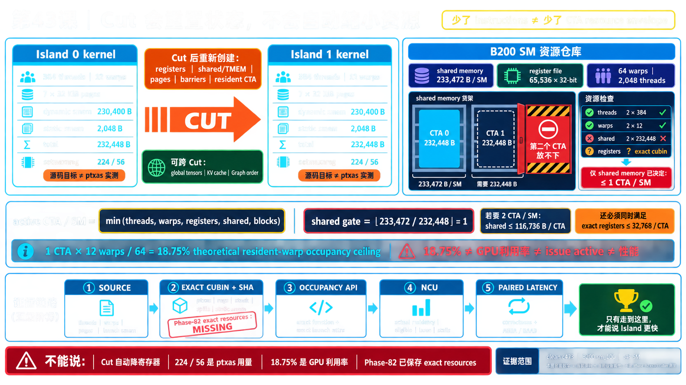

<!--
本文由 scripts/sync_lesson_readmes.rb 从对应的 _posts 文章确定性生成。
请编辑课程原文后重新运行同步脚本，不要单独修改本文件。
-->

# 第 43 课｜切一刀，会自动降低寄存器和 Shared Memory 吗？



> 物理 cut 会释放上一 kernel 的资源，但下一 kernel 若继承同一 Config，仍会重新申请同样的大包络。

## 零基础先看这里

- **它在解决什么：**切成两个 kernel，资源占用就会自动减半吗？
- **把它想成：**把旅程分成两段，不代表行李自动变少；若两段都按同一清单订车，仍会预留同样空间。
- **这次先不用懂：**可先忽略 shared、寄存器字节数和 occupancy API。

## 本课结论与证据状态

- **一句话结论：**切开会重置状态，不会自动 right-size 资源。
- **证据状态：**SOURCE-PROVEN · EXACT REBUILD SIDECAR
- **怎么看这个标签：**它表示结论的来源与适用范围，不是课程难度；可查看[中文证据规则](../evidence.md)。

## 完整课程正文

> **本课用词**：resource envelope 是一个 CTA 入场时必须一次满足的 shared memory、register、thread 与 TMEM 资源合同；exact CUBIN 是真正被测试的 GPU binary；occupancy API 只计算“资源上允许驻留几个 CTA”，不观察运行时行为。

## 当前 canonical 的资源包络

clean c473（课程使用的一份 canonical source snapshot 标识）的默认 kernel 是 384 threads、12 warps，其中 8 个 consumer 与 4 个 service warp。源码配置推导：

- 7 个 32 KiB page；
- dynamic shared `230400 B`；
- source-modeled static 约 `2048 B`；
- 总计约 227 KiB/CTA。

B200 每 SM 约 228 KiB shared memory，并为每 block 保留额外空间。因此 shared memory 单项已经把上限钉在 1 CTA/SM。

## Cut 前后发生什么

物理 kernel 结束时，上一 CTA 的 registers、shared memory 与 TMEM 生命周期结束。下一 kernel 启动时会重新准入。

但是，如果两个 island 都继承 `default_config`，dispatcher 仍会给每个 kernel 传同一个 `230400 B` dynamic shared，warp 角色也仍使用 224/56 的 register target。

所以图上看到的是：

```text
Island A：占满 → 退出 → 释放
Island B：再次占满 → 退出 → 释放
```

不是两个较小 CTA 自动同时驻留。

## 2 CTA 的必要门

若想让一张 B200 的同一 SM 同时容纳两个 CTA，至少要同时满足：

- 每 CTA 总 shared ≤ 约一半 SM 容量；
- 每 CTA exact registers ≤ 32768；
- thread/warp/block 限额允许；
- TMEM/cluster metadata 不阻挡；
- exact occupancy query 返回 2；
- launch 真的提供第二批独立工作。

资源门是 AND，不是 OR。

## 证据层级

源码公式只能给上界。真正的链条应是：

`source geometry → exact CUBIN attrs → occupancy API → NCU/timeline → paired latency`

Phase82 没有冻结 timed exact CUBIN、ptxas、SASS 与 NCU，因此不能拿后验重建物的资源数字冒充原实验制品。

## 资源按什么粒度分配

register 与 shared memory 通常在 CTA 驻留期间按整个 kernel/CTA 包络分配，不会因当前 instruction 暂时不用就归还给 SM。源码删除分支也不保证 ptxas 降低 register；动态 shared 上限若仍按通用 Dispatcher 配置，专用 island 仍可能申请同样大小。

资源审计必须沿 `source → compile flags/ptxas → exact CUBIN → occupancy API → observed residency` 前进。前一层只说明可能性，后一层才说明实际发生。

## 为什么不能把百分比相加

register、shared、TMEM、thread/warp 与 block slot 是独立约束。CTA/SM 上限取各资源计算结果的最小值，而不是几个占用百分比之和。shared 不再是瓶颈后，register 仍可能把上限锁在 1；这意味着下一把锁被暴露，不等于前一步无价值。

## 练习：做准入账本

为 whole、Attention island、MLP island 三个 exact binary 记录 threads/CTA、registers/thread、static/dynamic shared、TMEM columns、grid blocks 与 occupancy query，并注明哪个字段不变会否定“切分释放资源”的假设。

## 读完自检

1. 先不看上文，用自己的话回答：切成两个 kernel，资源占用就会自动减半吗？
2. 再对照本课结论：切开会重置状态，不会自动 right-size 资源。
3. 根据 `SOURCE-PROVEN · EXACT REBUILD SIDECAR`，说出这条结论能证明什么、不能外推什么。

## 继续学习

- [在线阅读本课](https://qhy991.github.io/gpu-megakernel-course-art/lessons/lesson-43-cut-resource-envelope/)
- [← 上一课 · 第 42 课：四臂实验：怎样给 Island 一个公平位置？](../lesson42/)
- [下一课 · 第 44 课：把 7 页改成 3 页，为什么 Shared Memory 可能一字节没降？ →](../lesson44/)
