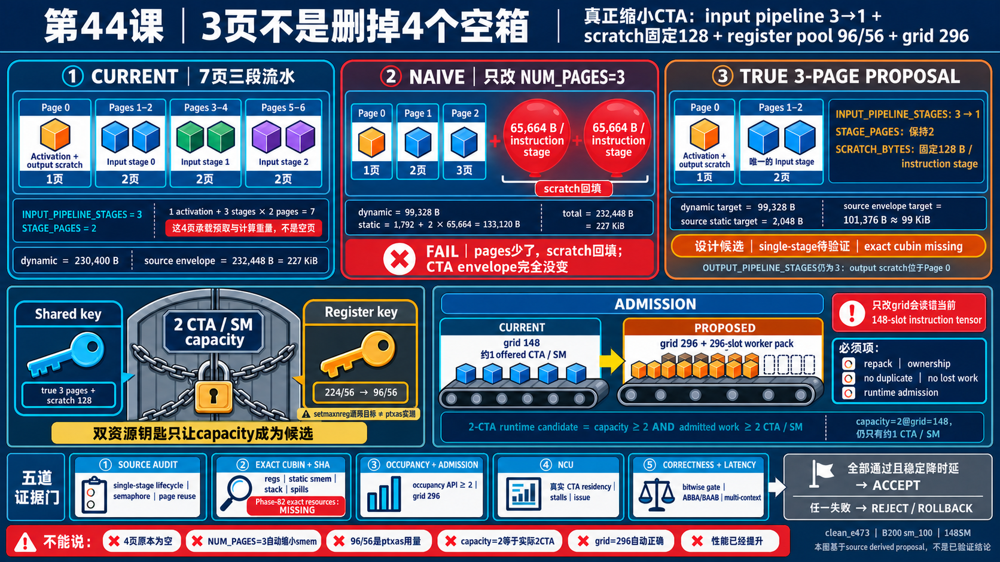

<!--
本文由 scripts/sync_lesson_readmes.rb 从对应的 _posts 文章确定性生成。
请编辑课程原文后重新运行同步脚本，不要单独修改本文件。
-->

# 第 44 课｜把 7 页改成 3 页，为什么 Shared Memory 可能一字节没降？



> canonical 的 scratch 会吃掉删页留下的空间；真正三页必须同时缩短 input pipeline 并固定 scratch budget。

## 零基础先看这里

- **它在解决什么：**从七页减到三页，为什么内存可能没减少？
- **把它想成：**撤掉几层货架后，杂物可能摊满空地；只有同时限制杂物区，房间才真的腾出来。
- **这次先不用懂：**可先忽略 LID 编号、页偏移和 scratch 字节数。

## 本课结论与证据状态

- **一句话结论：**删掉对象不等于缩小 allocation envelope。
- **证据状态：**SOURCE-PROVEN · ABLATION UNMEASURED
- **怎么看这个标签：**它表示结论的来源与适用范围，不是课程难度；可查看[中文证据规则](../evidence.md)。

## 完整课程正文

> **本课用词**：LID 是 physical shared-memory page 的本地编号；input pipeline 保存轮转的权重输入，output pipeline 保存轮转的 partial 输出；scratch 是未归入主 page 的辅助 shared-memory 空间。

## 七页到底用在哪里

canonical Llama-1B matvec 使用：

- LID0：activation/aux/output scratch ownership page；
- input stage0：LID1、2；
- input stage1：LID3、4；
- input stage2：LID5、6。

也就是 `1 + 3 × 2 = 7` 页。output pipeline 的三个 scratch slot 放在 LID0 内部，不再额外占三页。

## 直接 NUM_PAGES=3 的陷阱

schema 中的 `SCRATCH_BYTES` 由“最大 shared memory 减去 pages 和控制区”反推。只把 page 数从 7 改成 3，空出来的空间会被 scratch 自动回填。

结果可能变成：

- dynamic pages 下降；
- per-stage scratch 从 128 B 膨胀到约 65.7 KiB；
- static + dynamic 总包络仍约 227 KiB。

occupancy 一点没变，实验却被错误命名为“3-page arm”。

## 真正的三页方案

需要两个配套改动：

1. matvec `INPUT_PIPELINE_STAGES` 从 3 降到 1，只保留两页权重；
2. `SCRATCH_BYTES` 固定为 128 B/stage，不允许回填。

这样概念源模型约为：

```text
3 × 32 KiB pages + control/alignment ≈ 99 KiB/CTA
```

它才真正跨过双 CTA 的 shared-memory 必要门。

## 但这还不是 2 CTA

当前 exact CUBIN 是 168 registers/thread，384 threads 合计 64512 registers/CTA。即使 shared memory 降到 99 KiB，register gate 仍只允许 1 CTA/SM。

所以“3 页”只打开第一把锁，后面还有 register、TMEM、grid supply 与正确性协议。

## 必须先做 R1a

为了分离“pipeline depth 变浅”的性能代价和“page 数变少”的资源收益，实验应先做 depth1 但仍保留 7 页的 R1a，再做真正 3 页的 R1b。直接从 7页/3级跳到 3页/1级，无法知道差异来自哪一个变量。

## 三页方案的内存账本

不能只把 `7 × page_size` 改成 `3 × page_size`。必须逐项重算 activation、两页 weight、output scratch、semaphore、alignment padding 与 driver reserved。scratch 若仍按旧上界放进 dynamic shared，表面删掉的四页会被另一块缓冲重新填满。

## 正确性风险在哪里

depth3 允许 loader 在 consumer 处理 stage0 时预取 stage1/2；depth1 改成同一对 weight page 反复覆写。每次覆写前必须等 FINISHED，每次读取前必须等 READY，最后一轮还要按新的 page ownership 顺序释放。任何旧的 `i % 3` 或 parity 逻辑残留都可能产生跨轮覆盖。

## 练习：画出 R1a 与 R1b

对 `iters=4` 分别画 depth3/7page、depth1/7page、depth1/3page 的 page 使用表。标出每轮 READY、FINISHED 和最终 page release，再说明 R1a、R1b 各自只改变了哪个变量。

## 读完自检

1. 先不看上文，用自己的话回答：从七页减到三页，为什么内存可能没减少？
2. 再对照本课结论：删掉对象不等于缩小 allocation envelope。
3. 根据 `SOURCE-PROVEN · ABLATION UNMEASURED`，说出这条结论能证明什么、不能外推什么。

## 继续学习

- [在线阅读本课](https://qhy991.github.io/gpu-megakernel-course-art/lessons/lesson-44-three-pages/)
- [← 上一课 · 第 43 课：切一刀，会自动降低寄存器和 Shared Memory 吗？](../lesson43/)
- [下一课 · 第 45 课：第三把锁：TMEM 为什么能让 occupancy 从 2 变 1？ →](../lesson45/)
