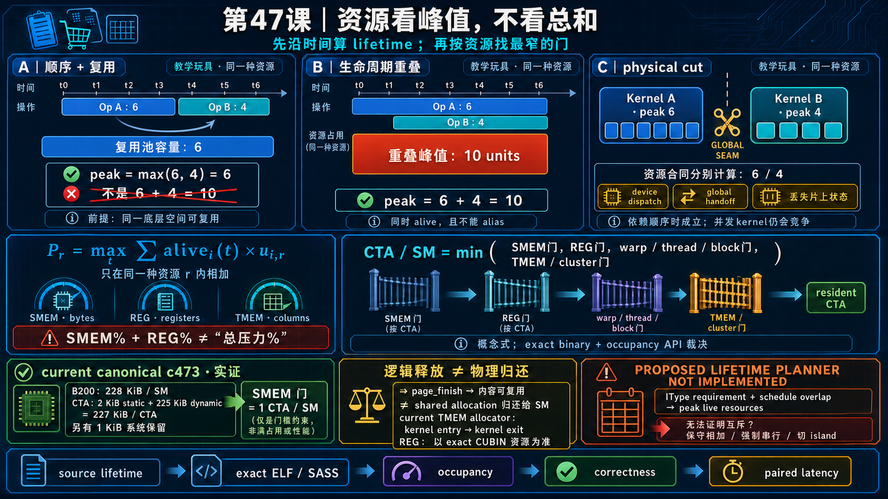

<!--
本文由 scripts/sync_lesson_readmes.rb 从对应的 _posts 文章确定性生成。
请编辑课程原文后重新运行同步脚本，不要单独修改本文件。
-->

# 第 47 课｜Peak-live：为什么资源不能把百分比相加？



> 用时间线计算每种资源的峰值存活量，区分内容复用与 CUDA 准入配额。

## 零基础先看这里

- **它在解决什么：**为什么不同资源的占用百分比不能直接相加？
- **把它想成：**教室的座位和电力是两种限制，不能把各自百分比相加；哪项先耗尽，哪项就卡住入场。
- **这次先不用懂：**可先忽略 peak-live 公式和 setmaxnreg 指令。

## 本课结论与证据状态

- **一句话结论：**资源是向量；同一种资源取时间峰值，不同资源取各自的 floor。
- **证据状态：**SOURCE-PROVEN · CONCEPTUAL FORMULA
- **怎么看这个标签：**它表示结论的来源与适用范围，不是课程难度；可查看[中文证据规则](../evidence.md)。

## 完整课程正文

> **本课用词**：peak-live 是同一资源在时间轴上的最大同时存活量；content token 只允许复用缓冲区内容，admission quota 才决定新 CTA 能否进入 SM；`setmaxnreg` 在 CTA 内调整 warpgroup 的寄存器预算，不是向 SM 动态归还寄存器。

## Peak-live 的公式

对单一资源 `r`，物理 kernel 的峰值需求是：

```text
P_r = max_t Σ alive_i(t) × usage(i, r)
```

若两个阶段严格顺序并复用同一资源，峰值接近 `max(A,B)`；若允许重叠，则可能接近 `A+B`。

但 shared memory、register、TMEM 是不同坐标，不能把“shared 80% + register 60%”相加成 140%。CTA/SM 是各资源上限取 floor 后再取最小值。

## Page finish 释放了什么

`page_finish` 只表示某个物理 page 的内容所有权可以交给下一 instruction。页仍位于同一个 CTA 在 launch 时申请的 `extern __shared__` blob 中。

所以它降低冲突与等待，却不会在 kernel 中途把 shared-memory quota 还给 SM，也不会让第二 CTA 临时入住。

## Register 也不会按 instruction 归还给 SM

consumer warpgroup 在 persistent loop 前执行 `setmaxnreg.inc`，service warp 执行 `dec`。它们是在同一 CTA 的 register pool 内重新分配预算，不是向整个 SM 动态释放 CTA 准入容量。

编译器会复用 dead local value 的 register slot，但 occupancy 看到的是整个 entry 的资源合同。

## TMEM 为何不同又相同

硬件上 TMEM 可以显式中途 alloc/dealloc；但当前 allocator 在 kernel 入口构造、出口析构，因此实际生命周期仍覆盖整个 CTA。

这再次说明：硬件能力和这份代码的作用域必须分开描述。

## 新手时间线

`CTA 入场 → 一次拿到 shared/register/TMEM envelope → instruction0/1 内容交错复用 → page token 循环 → 所有 instruction 完成 → CTA 退出 → 资源真正归还`

理解这条时间线后，就不会把“page 已 free”误写成“occupancy 已提高”。

## 内容复用与驻留复用

page FINISHED 允许 loader 覆写 shared 中一段内容；instruction ACK 允许 ring slot 进入下一 epoch；CTA 退出才把该 CTA 的 register/shared 配额交还给 SM。三者发生在完全不同的时间尺度。优化内容复用可以减少所需 page 数，却只有在重新编译后降低 CTA envelope，才可能改变 occupancy。

## Peak-live 的正确算法

对同一种资源画生命周期区间，取任一时刻同时存活量的最大值；不同资源分别计算，再把各自上限送入 occupancy 约束。不能把 register 70%、shared 45%、TMEM 10% 相加成 125%，因为它们没有共同分母。

## 练习：画资源甘特图

画 controller、loader、consumer、storer 在三条 instruction 上的 register live range、shared page ownership 和 TMEM lifetime。圈出各资源峰值，再指出哪些 token release 只缩短内容生命周期，哪些变化会真正缩小 exact binary envelope。

## 读完自检

1. 先不看上文，用自己的话回答：为什么不同资源的占用百分比不能直接相加？
2. 再对照本课结论：资源是向量；同一种资源取时间峰值，不同资源取各自的 floor。
3. 根据 `SOURCE-PROVEN · CONCEPTUAL FORMULA`，说出这条结论能证明什么、不能外推什么。

## 继续学习

- [在线阅读本课](https://qhy991.github.io/gpu-megakernel-course-art/lessons/lesson-47-peak-live-resources/)
- [← 上一课 · 第 46 课：怎样让只有真正需要的 IType 才申请 TMEM？](../lesson46/)
- [下一课 · 第 48 课：什么时候应该切开 Megakernel？ →](../lesson48/)
