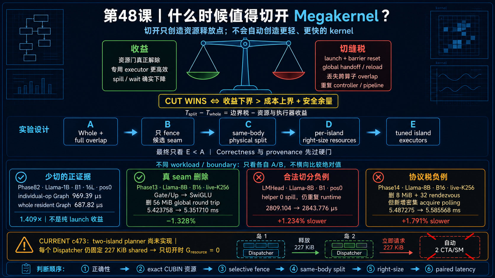

<!--
本文由 scripts/sync_lesson_readmes.rb 从对应的 _posts 文章确定性生成。
请编辑课程原文后重新运行同步脚本，不要单独修改本文件。
-->

# 第 48 课｜什么时候应该切开 Megakernel？

> 把资源收益、global seam、launch 成本、调度 overlap 和正确性协议放进同一个决策框架。

## 零基础先看这里

- **它在解决什么：**什么时候值得把一个 Megakernel 切开？
- **把它想成：**拆开流水线能减少拥挤，却要多一次搬运；省下的等待必须大于新增的交接成本。
- **这次先不用懂：**可先忽略评分权重和 release/acquire 细节。

## 本课结论与证据状态

- **一句话结论：**只有暴露成本小于可回收成本时，cut 才成立。
- **证据状态：**DECISION FRAMEWORK · MIXED MEASURED CONTROLS
- **怎么看这个标签：**它表示结论的来源与适用范围，不是课程难度；可查看[中文证据规则](../evidence.md)。

## 完整课程正文

> **本课用词**：whole-boundary A/B 测量完整父路径，而不是只测被修改的小算子；global seam 是两个 kernel 通过全局内存交接状态的边界；release/acquire 是保证“先写数据、后发布完成信号”的内存序关系。

## Cut 的收益端

物理切分可能带来：

- 每个 CUBIN 更小的 register/live range；
- 更少 shared pages 或不同 warp geometry；
- 不需要 TMEM 的 island 移除 allocator；
- specialized block size 与 occupancy；
- 更容易独立回滚、profile 和验证。

## Cut 的成本端

它也会增加：

- CUDA/Graph kernel 边界；
- global tensor materialization；
- barrier reset、参数绑定与同步；
- 跨 island 的 release/acquire；
- 失去 resident role overlap 与 page reuse。

## 真实实验给出的三个方向

GateUp→SwiGLU 真正删除了大中间量，whole parent A/B 为正，是保留融合的强例子。

Down→Norm 虽删除 global 流量和 grid rendezvous，却新增大量强 acquire poll，最终慢约 1.79%，说明“删边界”也可能换来更贵的控制路径。

LMHead helper 看起来资源更干净，但完整 forward 仍慢；后续还发现 worker identity 错误，提醒我们必须先证明“谁在做什么”。

## 一条实用判据

只有同时满足以下条件，才进入性能资格赛：

1. cut 后 exact resource envelope 确实改变；
2. 至少一个中间量或等待边真正消失；
3. 新 global seam 有完整 publication 协议；
4. whole-boundary correctness 通过；
5. 双顺序 A/B 跨过噪声门；
6. 生产 workload buckets 没有不可接受回退。

否则它应被标成 source proposal、research-positive 或 archive，而不是 winner。

## 把判据写成决策流程

先问 seam 是否已有 global payload；若没有，切分会新增 materialization。再问 exact resource 是否能 right-size；若不能，资源收益为零。随后验证 publication/ACK 和工作量闭合，最后才进入 paired whole-boundary A/B。任一步失败都应停止扩大实现范围。

## 维护性收益要单独记账

即使 latency 持平，island 也可能带来更容易 profile、回滚、选择 workload-specific body 的工程收益。但这应单独标成 maintainability verdict，不能写成性能 winner。反之，微小速度收益若引入复杂跨 kernel 协议，也可能不值得上线。

## 练习：给三个 Seam 打分

对 QKV→Attention、OProj→UpGate、UpGate→Down 分别填写 payload 大小、自然 publication、可释放资源、丢失 overlap、新增 launch 和证据等级。只选择一条进入 P0，并写出为什么另外两条暂缓。

## 读完自检

1. 先不看上文，用自己的话回答：什么时候值得把一个 Megakernel 切开？
2. 再对照本课结论：只有暴露成本小于可回收成本时，cut 才成立。
3. 根据 `DECISION FRAMEWORK · MIXED MEASURED CONTROLS`，说出这条结论能证明什么、不能外推什么。

## 继续学习

- [在线阅读本课](https://qhy991.github.io/gpu-megakernel-course-art/lessons/lesson-48-when-to-split/)
- [← 上一课 · 第 47 课：Peak-live：为什么资源不能把百分比相加？](../lesson47/)
- [下一课 · 第 49 课：两岛 P0：怎样把一个想法变成可证伪候选？ →](../lesson49/)
