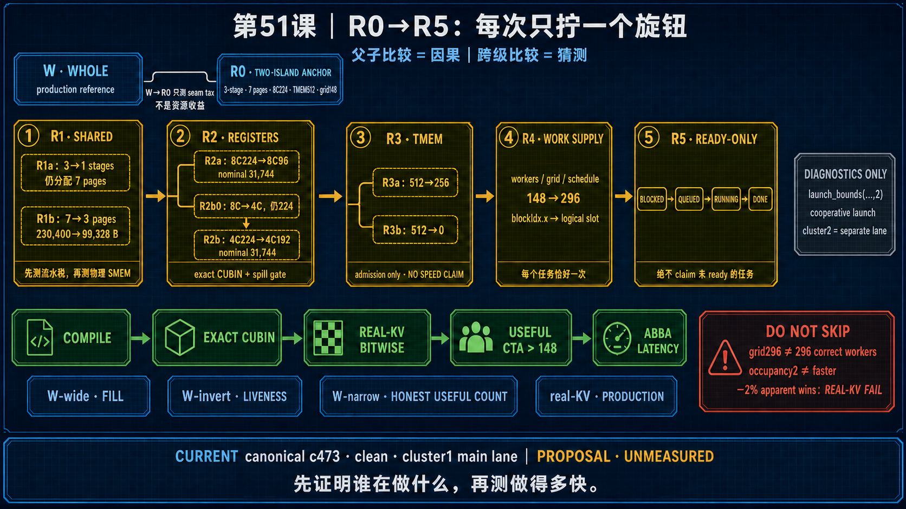

<!--
本文由 scripts/sync_lesson_readmes.rb 从对应的 _posts 文章确定性生成。
请编辑课程原文后重新运行同步脚本，不要单独修改本文件。
-->

# 第 51 课｜R0–R5：五个实验臂为什么不能跳级？

> 把专用 CUBIN、输入深度、物理页、寄存器、TMEM 与 worker supply 拆成单变量桥接实验。

## 零基础先看这里

- **它在解决什么：**为什么优化实验不能一步改完所有东西？
- **把它想成：**同时换发动机、轮胎和燃料，即使车更快，也不知道是谁起作用；一次只改一项才可归因。
- **这次先不用懂：**可先忽略 R0–R5 编号和每个配置的具体数值。

## 本课结论与证据状态

- **一句话结论：**每个 arm 只回答一个问题，结论才有因果含义。
- **证据状态：**EXPERIMENT PLAN · NOT YET RUN
- **怎么看这个标签：**它表示结论的来源与适用范围，不是课程难度；可查看[中文证据规则](../evidence.md)。

## 完整课程正文

> **本课用词**：R0–R5 是一系列桥接实验的编号，不是软件版本；每个 arm 只改变一个预注册变量；portfolio 是一组可比较配置；real-KV 表示使用真实 KV cache 内容和生命周期，而不是只跑空缓存或合成输入。

## 为什么不能一步跳到 2 CTA

从当前 7页/3级/224寄存器/512列TMEM/grid148，一步跳到 3页/1级/低寄存器/noTMEM/grid296，会同时改变太多变量。即使更快，也不知道是哪个机制；如果错了，也不知道哪里坏。

## 一条可审计的实验树

### R0：专用 CUBIN

只删除另一半 dispatch case，检查 code size、register、stack、spill 和 shared 是否真的变化。此臂不宣布性能胜负。

### R1a：Input depth 3 → 1，仍保留 7 页

隔离流水深度损失。它可能变慢，但这是理解后续三页 arm 的必要桥。

### R1b：7 页 → 3 页

保持 depth1，固定 scratch128，只改变物理页和 dynamic shared。若 occupancy 仍为1，它仍成功隔离出“shared 已不是瓶颈”。

### R2：TMEM capability

分别编译 256-column 与 0-column，验证 ELF/PTX/SASS marker 与 occupancy；real-KV 前禁止性能结论。

### R3：Register portfolio

比较 8C96 和 4C192。必须记录 exact registers、stack、spill、local transaction 与数学覆盖。

### R4：Supply 与 identity

把 grid 提供到 296，并证明每个 `blockIdx.x` 获取独立、完整工作。此时才检查实际双驻留。

### R5：完整资格赛

真实 KV、多个 context、100 replay、双顺序 paired latency、NCU 与 serving 合同。

## 两个容易漏掉的桥

- 8 consumer → 4 consumer 与 register224 → 192 也应拆成两步，否则不知道差异来自 warp 数还是寄存器目标。
- cluster1 的 296 CTA 和 cluster2 的 148 bundle 是不同执行合同，不能混在同一 A/B。

## 每个 Arm 的输入与输出

R0 输出 exact binary 资源差异；R1a 输出 depth 代价；R1b 输出 page/SMEM 变化；R2 输出 TMEM capability；R3 输出 register/spill portfolio；R4 输出 supply、identity 与 observed residency；R5 才输出 end-to-end 性能 verdict。前一臂的工件是后一臂资格输入。

若某臂没有改变目标机制，也是一条有价值的负结果。例如 R0 专用 CUBIN register 不降，就应停止用“删 dispatcher case 会释放寄存器”解释后续变化。

## 防止组合爆炸

不要把全部选项做笛卡尔积。每一阶段先用资格门淘汰明显失败者，只把 1–2 个合法候选带入下一层。所有淘汰都保存原因和 hash，避免未来重复测试同一无效配置。

## 练习：画因果图

把 shared、register、TMEM、supply、identity、correctness 与 latency 画成有向图，并把 R0–R5 标到它们直接干预的边上。若一个 arm 同时指向三条机制边，就继续拆分。

## 读完自检

1. 先不看上文，用自己的话回答：为什么优化实验不能一步改完所有东西？
2. 再对照本课结论：每个 arm 只回答一个问题，结论才有因果含义。
3. 根据 `EXPERIMENT PLAN · NOT YET RUN`，说出这条结论能证明什么、不能外推什么。

## 继续学习

- [在线阅读本课](https://qhy991.github.io/gpu-megakernel-course-art/lessons/lesson-51-r0-r5-tree/)
- [← 上一课 · 第 50 课：2 CTA/SM 要打开哪五把锁？](../lesson50/)
- [下一课 · 第 52 课：三种 Pipeline：为什么一个数字 3 会指三件不同的事？ →](../lesson52/)
