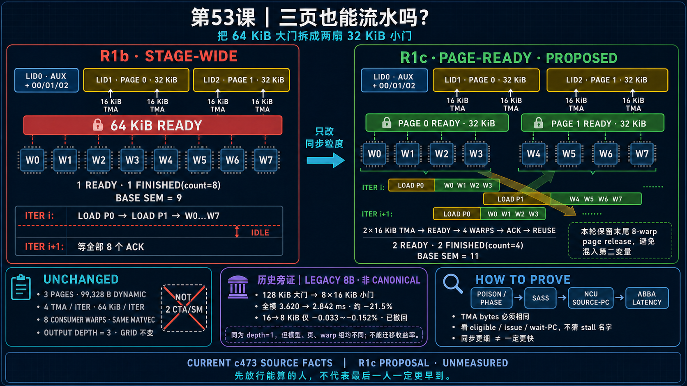

<!--
本文由 scripts/sync_lesson_readmes.rb 从对应的 _posts 文章确定性生成。
请编辑课程原文后重新运行同步脚本，不要单独修改本文件。
-->

# 第 53 课｜三页以后还能流水吗？把 64 KiB 大门拆成两扇



> R1c 在 depth1/3page 基线上，仅把每轮 stage-wide arrived/finished 拆成两个 page-local 门。

## 零基础先看这里

- **它在解决什么：**只有一组缓冲区，还能让搬运和计算重叠吗？
- **把它想成：**同一张工作台分成左右两格；左边材料先到就先做，做完确认后才允许覆盖。
- **这次先不用懂：**可先忽略三页布局、shared 字节数和 barrier phase。

## 本课结论与证据状态

- **一句话结论：**一组 buffer 也能做页内流水，只要每页有独立 ready 与 reuse ACK。
- **证据状态：**PROPOSED · UNMEASURED
- **怎么看这个标签：**它表示结论的来源与适用范围，不是课程难度；可查看[中文证据规则](../evidence.md)。

## 完整课程正文

> **本课用词**：R1b 是已经把 input pipeline 缩为一层、物理 page 缩为三页的基线；R1c 只进一步拆细 READY/FINISHED；page-local 表示每个 32 KiB page 有自己的信号；ACK 是 consumer 完成读取后的复用确认。

## R1c 的唯一变量

R1c-P0 必须相对正确的 R1b 比较，并保持：

- input depth1；
- 3 个 physical page；
- dynamic shared 99328 B；
- output pipeline3；
- 8 consumer；
- 最后 iteration 的 8-warp 共同 page release。

唯一变化是把一把 64 KiB stage-wide `weights_arrived/finished`，拆成两套 32 KiB page-local semaphore。

## 每页怎样工作

一个 32 KiB page 由两笔 `16 × 512 × BF16 = 16 KiB` TMA 填满，供 4 个 warp 消费。

loader 对每页执行：

```text
wait FINISHED(page)
expect READY(page, 32768 bytes)
issue 2 × 16 KiB TMA
```

consumer 只等待自己的页，读完后 4 个 warp 分别 release-arrive 到该页 FINISHED。

于是 page0 的四个 warp 全部完成后，loader 可以开始下一 iteration 的 page0，不再等待 page1 的慢 warp。

## 什么没有变化

- 每轮仍是四笔 16 KiB TMA；
- 总 weight bytes 仍是 64 KiB；
- 数学和 output reduction 不变；
- 动态 semaphore 数量虽从9变11，但底层固定32槽，SMEM 不变；
- 跨 instruction 仍等8个 consumer 汇合后一起归还两页。

最后一点把 P0 与未来的 page-local cross-instruction release 分开。后者是第二变量，应叫 R1c+ P1。

## Phase 怎样算

软件 iteration epoch 记为 `e`，mbarrier parity 是 `e & 1`。每页独立翻相：

- loader 覆写前等 `!(e & 1)`；
- consumer 等 READY 的 `e & 1`；
- 四个 ACK 完成该页 FINISHED 当前 phase。

output scratch 仍按 `i % 3` 选择槽，跨 instruction page token 又使用外层 instruction epoch。三种 phase 不应混用。

## 为什么 Lesson 36 只能作旁证

Legacy 8B 的正结果也是 depth1，但它拆的是 `8 × 16 KiB / 2 warps`；R1c 是 `2 × 32 KiB / 4 warps`，TMA 聚合和消费者分组不同。因此它支持“readiness 粒度值得测”，不能迁移收益幅度。

## R1c 的完整状态机

每页从 FINISHED 进入 loader ownership；loader 设置本轮 expected bytes 并发两笔 TMA；硬件完成后 READY 翻相；四个 consumer acquire READY、读取各自 8 KiB，再各自 ACK；第四个 ACK 让页回到 FINISHED。下一轮 loader 只能从这里重新开始。

状态机需要 epoch，因为 READY/FINISHED 的比特会循环复用；还需要跨 instruction page token，因为某页即使本 instruction 读完，也不代表下一条 instruction 已合法取得所有权。

## 怎样判断它真的形成 Overlap

除了延迟，还要记录 page0/page1 的 TMA complete、consumer first issue、last ACK 与下一 iteration issue 时间。若 page0 下一轮 issue 始终等到 page1 ACK 之后，说明实现仍有隐藏的 stage-wide 门，源码看起来 page-local 也没有产生真实 overlap。

## 练习：构造慢 Page1

只给 page1 consumer 增加受控延迟。预测 stage-wide 与 page-local 下 page0 下一轮的最早 issue 时刻，并写出应观察的 timeline signature。该 debug 变体只验证机制，不参与性能排名。

## 读完自检

1. 先不看上文，用自己的话回答：只有一组缓冲区，还能让搬运和计算重叠吗？
2. 再对照本课结论：一组 buffer 也能做页内流水，只要每页有独立 ready 与 reuse ACK。
3. 根据 `PROPOSED · UNMEASURED`，说出这条结论能证明什么、不能外推什么。

## 继续学习

- [在线阅读本课](https://qhy991.github.io/gpu-megakernel-course-art/lessons/lesson-53-page-ready-r1c/)
- [← 上一课 · 第 52 课：三种 Pipeline：为什么一个数字 3 会指三件不同的事？](../lesson52/)
- [下一课 · 第 54 课：怎样证明 READY/ACK 协议真的安全？ →](../lesson54/)
